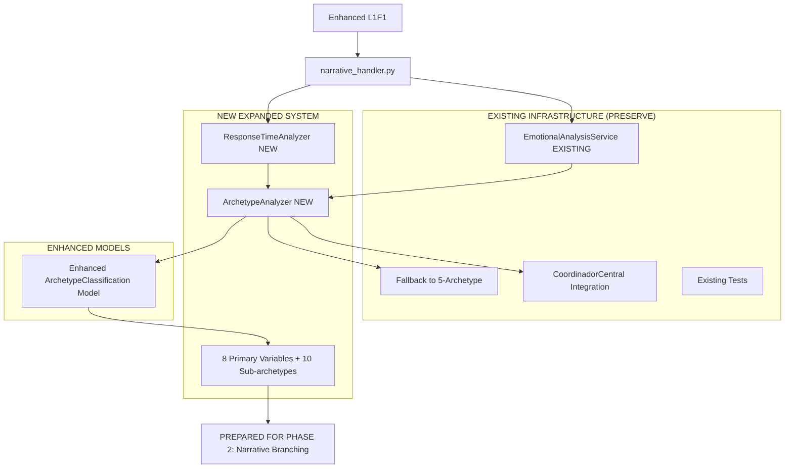

# ramificado - Task 10

Execute task 10 for the ramificado specification.

## Task Description
Create ArchetypeAnalyzer class foundation in services/archetype_analyzer.py

## Code Reuse
**Leverage existing code**: existing service patterns from EmotionalAnalysisService

## Requirements Reference
**Requirements**: 1.1, 4.1

## Usage
```
/Task:10-ramificado
```

## Instructions

Execute with @spec-task-executor agent the following task: "Create ArchetypeAnalyzer class foundation in services/archetype_analyzer.py"

```
Use the @spec-task-executor agent to implement task 10: "Create ArchetypeAnalyzer class foundation in services/archetype_analyzer.py" for the ramificado specification and include all the below context.

# Steering Context
## Steering Documents Context (Pre-loaded)

### Product Context
# Product Vision - DianaBot

## Product Purpose
DianaBot is an interactive narrative Telegram bot designed to create deep emotional engagement and drive VIP subscription conversions through sophisticated storytelling and gamification.

## Core Characters
- **Diana**: Mysterious, seductive, psychologically complex female character who evolves through user interaction
- **Lucien**: Elegant butler/guide who serves as mentor and evaluator of user authenticity

## Target Users
- Users seeking sophisticated adult interactive experiences
- Individuals interested in psychological/emotional depth over superficial content
- Adults looking for premium narrative-driven digital intimacy

## Business Objectives

### Primary Goal
**Drive VIP subscriptions through engagement and emotional attachment**

### Key Metrics
- **Conversion rate from free to VIP subscriptions** (primary KPI)
- User retention at each narrative level
- Time spent in bot interactions
- Emotional engagement depth (measured through narrative system)
- User progression through narrative levels 1-6

### Success Indicators
- High progression rate from free levels (1-3) to VIP levels (4-6)
- Strong emotional resonance metrics in narrative evaluations
- Consistent VIP subscription renewals
- User advocacy and organic growth

## Content Experience

### Tiered Access Model
- **Free Channel**: Narrative levels 1-3 (introduction, character development, initial intimacy)
- **VIP Channel**: Narrative levels 4-6 (deep intimacy, personalization, transcendent connection)

### Narrative Philosophy
Based on the sophisticated psychological framework in `Narrativo.md`:
- **Authentic vulnerability** over superficial seduction
- **Emotional intelligence** evaluation and development
- **Paradox appreciation** - users must learn to love complexity without trying to resolve it
- **Co-creation** - users become active participants in shaping the experience
- **Progressive revelation** - deeper layers unlock based on demonstrated emotional maturity

### Content Guidelines
- Maintain elegance and psychological sophistication
- Respect user autonomy while building emotional connection
- Never manipulative or exploitative - focus on genuine connection
- Character consistency: Diana must remain mysterious even when vulnerable
- Quality over quantity - each interaction should deepen the relationship

## Value Proposition
DianaBot offers a unique form of **digital intimacy** that respects both mystery and vulnerability, creating genuine emotional connections that justify premium subscriptions.

---

### Technology Context
# Technology Stack - DianaBot

## Core Framework
- **Python 3.8+** - Primary development language
- **aiogram 3.x** - Modern async Telegram bot framework
- **SQLAlchemy** - ORM for database operations
- **aiosqlite** - Async SQLite database driver

## Architecture Pattern
**Service-Oriented Architecture** with integration coordination

### Key Components
- **Handler Layer**: Organized by functionality (admin, VIP, shop, narrative, etc.)
- **Service Layer**: Business logic with specialized services
- **Database Layer**: Separated models by domain (emotional, narrative, main)
- **Middleware System**: User registration, points tracking, session management
- **Integration Coordinator**: Central orchestration via `CoordinadorCentral`

## Database Design

### Multi-Model Approach
- `database/models.py` - Core user, gamification, and channel management
- `database/emotional_models.py` - Emotional analysis and character voice tracking
- `database/narrative_models.py` - Story progression and decision tracking

### Key Principles
- **Async-first** - All database operations use async patterns
- **Session management** - Proper SQLAlchemy session handling via middleware
- **Data integrity** - Foreign key relationships and constraints

## Background Processing
- **APScheduler** - Handles recurring tasks
- **Background Task Manager** - Safe task execution with error handling
- **Scheduled Services**:
  - Channel access validation
  - VIP subscription management
  - Auction monitoring
  - Channel cleanup

## Character & Narrative Technology

### Emotional Analysis System
- **CharacterVoiceService** - Maintains character personality consistency
- **EmotionalAnalysisService** - Evaluates user emotional responses
- **Character Types**: Diana (mysterious/seductive), Lucien (supportive/authoritative)

### Advanced Features
- **Behavioral analysis** - Time patterns, response quality, authenticity detection
- **Personalization engine** - Adapts narrative based on user archetypes
- **Memory system** - Characters "remember" user interactions and evolution

## Performance Requirements
- **Response time**: < 2 seconds for standard interactions
- **Concurrent users**: Design for growth beyond current base
- **Data persistence**: All narrative progress and user state must survive restarts
- **Error resilience**: Comprehensive error handling and logging

## Security Considerations
- **Session security** - Proper session management and cleanup
- **Input validation** - All user inputs validated and sanitized
- **Access control** - VIP content protection and subscription validation
- **Content protection** - Narrative content should be secure against unauthorized access

## Integration Requirements
- **Telegram API** - Full Bot API compliance
- **Payment systems** - Future integration for VIP subscriptions
- **Analytics** - Tracking user engagement and conversion metrics

## Development Standards
- **Async/await** patterns throughout
- **Type hints** where beneficial for complex operations
- **Error handling** - Comprehensive logging and graceful degradation
- **Modular design** - Services should be loosely coupled and testable

## Scalability Considerations
- **Database optimization** - Proper indexing for user queries
- **Session pooling** - Efficient database connection management
- **Background task optimization** - Non-blocking scheduled operations
- **Content delivery** - Efficient narrative fragment serving

## Deployment Architecture
- **Environment management** - `.env` configuration
- **Logging** - Structured logging with multiple outputs
- **Process management** - Graceful shutdown handling
- **Resource management** - Proper cleanup of background tasks

## Technology Constraints
- **Telegram limitations** - Message size, rate limits, media restrictions
- **SQLite considerations** - Single-writer limitations for high concurrency
- **Memory usage** - Efficient handling of user sessions and narrative state

---

### Structure Context
# Project Structure - DianaBot

## Directory Organization

### Core Structure
```
/
├── handlers/           # Request handlers organized by functionality
│   ├── admin/         # Administrative functionality
│   ├── vip/           # VIP-specific features
│   ├── main_menu.py   # Primary navigation
│   ├── shop_handlers.py # Commerce and store
│   └── narrative_handler.py # Story progression
├── services/          # Business logic layer
│   ├── integration/   # Cross-system coordination
│   ├── narrative_service.py
│   ├── point_service.py
│   └── coordinador_central.py # Main orchestrator
├── database/          # Data layer
│   ├── models.py      # Core models
│   ├── emotional_models.py
│   └── narrative_models.py
├── keyboards/         # Telegram inline keyboards
├── middlewares/       # Request processing middleware
├── states/           # FSM state definitions
└── utils/            # Utility functions
```

## Handler Organization

### Naming Conventions
- **Descriptive names**: `shop_handlers.py`, `narrative_handler.py`
- **Domain grouping**: VIP features in `vip/` directory
- **Admin separation**: Administrative functions in `admin/` directory

### Router Registration Pattern
Handlers registered in `bot.py` with priority order:
1. Setup and admin handlers (highest priority)
2. Core functionality (start, main menu)
3. Feature-specific handlers (shop, narrative, etc.)
4. Catch-all handlers (lowest priority)

## Service Layer Patterns

### Integration Architecture
- **CoordinadorCentral**: Main facade for cross-system operations
- **Specialized services**: Domain-specific logic (narrative, points, emotions)
- **Integration services**: Handle cross-system workflows

### Service Responsibilities
- **Business logic**: Core functionality implementation
- **Data access**: Database operations and caching
- **External integration**: Telegram API interactions
- **State management**: User session and progress tracking

## Database Patterns

### Model Separation
- **Functional domains**: Separate models by business domain
- **Relationship management**: Clear foreign key relationships
- **Migration strategy**: Database schema evolution handling

### Session Management
- **Middleware injection**: Sessions provided via middleware
- **Proper cleanup**: Sessions closed in finally blocks
- **Transaction management**: Explicit commit/rollback handling

## Character System Structure

### Voice and Personality
- **CharacterVoiceService**: Maintains character consistency
- **Emotional context**: Tracks and responds to user emotional state
- **Character types**: Enum-based character identification

### Narrative Progression
- **Level-based access**: Free (1-3) vs VIP (4-6) levels
- **Decision tracking**: User choices affect story progression
- **Memory system**: Characters remember user interactions

## Code Style Guidelines

### Python Conventions
- **PEP 8 compliance**: Standard Python style guide
- **Async patterns**: Use async/await throughout
- **Type hints**: For complex functions and service interfaces
- **Docstrings**: Comprehensive documentation for services

### File Organization
- **Single responsibility**: Each file has clear, focused purpose
- **Import organization**: Local imports, then external, then stdlib
- **Configuration**: Environment variables via `.env`

## Testing Structure

### Test Organization
```
tests/
├── test_emotional_models.py
├── test_emotional_analysis_service.py
├── emotional/
│   └── test_emotional_integration.py
└── [additional test files]
```

### Testing Patterns
- **Unit tests**: Individual service testing
- **Integration tests**: Cross-system functionality
- **Emotional system tests**: Character voice and analysis validation

## Configuration Management

### Environment Variables
- **Sensitive data**: Tokens, keys, credentials in `.env`
- **Feature flags**: Enable/disable functionality
- **Channel configuration**: Free and VIP channel IDs

### Settings Pattern
- **utils/config.py**: Centralized configuration access
- **Validation**: Required environment variables checked at startup
- **Defaults**: Sensible fallbacks where appropriate

## Error Handling Patterns

### Logging Strategy
- **Structured logging**: Consistent format across all components
- **Multiple outputs**: File and console logging
- **Error levels**: Appropriate use of INFO, WARNING, ERROR, CRITICAL

### Exception Management
- **Global error handler**: Centralized error processing
- **Graceful degradation**: System continues operating when possible
- **User-friendly messages**: Errors translated to user-appropriate responses

## Development Workflow

### File Creation Guidelines
- **Edit over create**: Prefer extending existing files when logical
- **Modular additions**: New features as separate handlers/services
- **Integration points**: Use CoordinadorCentral for cross-system features

### Feature Implementation
1. **Handler**: User interaction logic
2. **Service**: Business logic implementation
3. **Database**: Model updates if needed
4. **Integration**: Connect to existing systems via coordinator
5. **Testing**: Validate functionality and character consistency

## Deployment Considerations

### File Dependencies
- **requirements.txt**: Python package dependencies
- **bot.py**: Main entry point with comprehensive setup
- **database/setup.py**: Database initialization
- **.env**: Environment configuration (not in repository)

### Process Management
- **Graceful shutdown**: Proper cleanup of background tasks
- **Resource management**: Database connections and file handles
- **Error recovery**: Automatic restart capabilities

**Note**: Steering documents have been pre-loaded. Do not use get-content to fetch them again.

# Specification Context
## Specification Context (Pre-loaded): ramificado

### Requirements
# Requirements Document - Sistema Narrativo Ramificado Diana

## Introduction

The Sistema Narrativo Ramificado Diana aims to transform the current linear narrative system into an intelligent branching ecosystem where each player experiences a completely different story based on their psychological archetype. This sophisticated system will analyze user behavior, response patterns, and emotional markers during Level 1 interactions to classify users into distinct psychological archetypes, then deliver personalized narrative experiences that evolve and branch based on their authentic personality traits.

The system leverages advanced behavioral analysis, timing pattern recognition, and emotional intelligence to create truly personalized storytelling experiences that drive deeper engagement and higher VIP conversion rates through meaningful character connection.

## Alignment with Product Vision

This feature directly supports the core product goals outlined in product.md:

- **Drive VIP subscriptions through engagement and emotional attachment**: By creating personalized narrative experiences that feel uniquely crafted for each user's psychological profile, users develop stronger emotional connections that naturally lead to VIP conversions.

- **Sophisticated psychological framework**: Builds upon the existing narrative philosophy of authentic vulnerability, emotional intelligence evaluation, and progressive revelation by making these elements adaptive to individual user archetypes.

- **Character consistency with enhanced personalization**: Maintains Diana's mysterious seductive essence and Lucien's supportive role while allowing their interactions to adapt to different user psychological profiles for maximum resonance.

- **Quality over quantity approach**: Each narrative branch represents a carefully crafted experience designed specifically for users with similar psychological patterns, ensuring high-quality, meaningful interactions rather than generic content.

## Requirements

### Requirement 1: Archetype Analysis System

**User Story:** As a system administrator, I want an intelligent archetype classification system that analyzes user behavior patterns during Level 1 interactions, so that users can be automatically classified into psychological archetypes for personalized narrative delivery.

#### Acceptance Criteria

1. WHEN a user completes their first interaction with L1F1 (redesigned archetype analyzer fragment) THEN the system SHALL capture response timing, choice selection, and behavioral markers for archetype analysis
2. WHEN a user's response time is under 10 seconds THEN the system SHALL increment their "direct" and "passionate_emotional" archetype scores
3. WHEN a user's response time is between 15-35 seconds THEN the system SHALL increment their "thoughtful" and "philosophical" archetype scores
4. WHEN a user selects choices containing intellectual keywords THEN the system SHALL increase their "intellectual" and "analytical" scores by 2.0 points
5. WHEN a user selects choices containing emotional keywords THEN the system SHALL increase their "emotional" and "vulnerable" scores by 2.0 points
6. WHEN a user completes 3-5 Level 1 interactions THEN the system SHALL calculate their primary archetype classification with confidence scores
7. IF archetype confidence is above 0.8 THEN the system SHALL activate personalized narrative branching for that user
8. WHEN archetype classification is complete THEN the system SHALL store the results in the existing ArchetypeClassification model with primary and secondary trait mappings

### Requirement 2: Dynamic L1F1 Fragment System

**User Story:** As a content creator, I want L1F1 to be redesigned as an intelligent archetype detection system with sophisticated choice options, so that user responses can effectively reveal their psychological patterns while maintaining Diana's mysterious character voice.

#### Acceptance Criteria

1. WHEN a user encounters the redesigned L1F1 THEN the system SHALL present 5 distinct choice options each targeting different archetype detection
2. WHEN L1F1 displays choices THEN each choice SHALL contain embedded archetype_weights and sub_archetype_weights for scoring
3. WHEN user makes a choice THEN the system SHALL track response_time, choice_index, and hesitation_patterns automatically
4. WHEN choice tracking is active THEN the system SHALL capture behavioral_markers including depth_seeking, authenticity_declaration, aesthetic_appreciation, pattern_recognition, and persistence_explanation
5. IF user shows "choice_l1_curiosity_intellectual" pattern THEN the system SHALL weight intellectual(3.0), philosophical(2.0), and analytical(1.0) scores
6. IF user shows "choice_l1_curiosity_emotional" pattern THEN the system SHALL weight emotional(3.0), vulnerable(2.0), and reciprocal(1.0) scores
7. WHEN fragment displays THEN Diana's voice SHALL maintain mysterious seductive essence while introducing archetype-revealing scenarios naturally

### Requirement 3: Response Time Analysis Engine

**User Story:** As a behavioral analyst, I want sophisticated response timing analysis that reveals cognitive and emotional processing patterns, so that the system can distinguish between quick intuitive responses, thoughtful deliberation, and various emotional processing styles.

#### Acceptance Criteria

1. WHEN user response time is under 10 seconds THEN the system SHALL classify as "quick_intuitive" and increment directness scores
2. WHEN user response time is 10-30 seconds THEN the system SHALL classify as "thoughtful" and increment philosophical scores
3. WHEN user response time exceeds 30 seconds THEN the system SHALL classify as "deliberate" and increment contemplative scores
4. WHEN analyzing response patterns THEN the system SHALL calculate consistency_score based on timing variance across interactions
5. WHEN response patterns show acceleration (getting faster) THEN the system SHALL flag "growing_comfort" behavioral pattern
6. WHEN response patterns show deceleration (getting slower) THEN the system SHALL flag "increasing_thoughtfulness" behavioral pattern
7. IF response timing is extremely consistent (variance < 1 second) THEN the system SHALL flag potential artificial behavior for review
8. WHEN timing analysis is complete THEN the system SHALL store patterns in EmotionalInteraction model with response_type classification

### Requirement 4: Multi-Archetype Classification Algorithm

**User Story:** As a user experience designer, I want a sophisticated archetype classification system that can identify primary and secondary personality traits, so that narrative branching can accommodate complex psychological profiles rather than simple categories.

#### Acceptance Criteria

1. WHEN user completes archetype analysis THEN the system SHALL calculate scores for all 8 primary archetype dimensions (intellectual, emotional, exploratory, vulnerable, philosophical, direct, patient, reciprocal)
2. WHEN primary scores are calculated THEN the system SHALL determine the highest-scoring dimension as primary_archetype
3. WHEN primary archetype is determined THEN the system SHALL calculate sub_archetype based on secondary score combinations
4. IF intellectual and emotional scores are both high THEN the system SHALL classify as "romantic_intellectual" sub-archetype
5. IF intellectual and philosophical scores dominate THEN the system SHALL classify as "skeptical_thinker" or "pure_theorist" based on additional patterns
6. WHEN archetype confidence is below 0.7 THEN the system SHALL classify as "mixed_traits" and include multiple secondary_archetypes
7. WHEN classification is complete THEN the system SHALL store comprehensive archetype data including raw_scores, sub_scores, confidence_level, and cognitive_style in the database
8. IF user shows inconsistent patterns THEN the system SHALL flag for "requires_observation" and continue gathering data

### Requirement 5: Narrative Branch Selection Engine

**User Story:** As a narrative designer, I want an intelligent system that selects appropriate narrative branches based on user archetypes, so that each user receives story content specifically crafted for their psychological profile and behavioral patterns.

#### Acceptance Criteria

1. WHEN user's archetype classification is confirmed THEN the system SHALL select narrative fragments tagged for their primary archetype
2. WHEN branching decision point is reached THEN the system SHALL present choices weighted toward user's archetype preferences
3. IF user is classified as "explorer_deep" THEN the system SHALL prioritize fragments with complexity, pattern recognition challenges, and layered meaning
4. IF user is classified as "direct_authentic" THEN the system SHALL prioritize fragments with emotional honesty, clear communication, and genuine connection opportunities
5. IF user is classified as "poet_desire" THEN the system SHALL prioritize fragments with aesthetic beauty, metaphorical language, and artistic expression
6. WHEN mixed archetype traits are detected THEN the system SHALL blend narrative elements from multiple archetype-specific fragment sets
7. WHEN narrative branch is selected THEN the system SHALL maintain Diana's character consistency while adapting interaction style to match user psychological preferences
8. IF archetype-specific content is unavailable THEN the system SHALL fall back to default linear progression without breaking user experience

### Requirement 6: Behavioral Tracking Integration

**User Story:** As a system architect, I want seamless integration with existing emotional analysis and user tracking systems, so that archetype classification enhances rather than duplicates current behavioral analysis capabilities.

#### Acceptance Criteria

1. WHEN archetype analysis is performed THEN the system SHALL integrate with existing EmotionalAnalysisService without breaking current functionality
2. WHEN user interactions are tracked THEN the system SHALL update both new archetype scores AND existing emotional profile data
3. WHEN timing analysis is performed THEN the system SHALL leverage existing EmotionalInteraction model to store detailed behavioral data
4. WHEN archetype classification changes THEN the system SHALL update ArchetypeClassification model and maintain evolution history
5. IF existing CoordinadorCentral workflows are active THEN the new archetype system SHALL integrate through established service patterns
6. WHEN behavioral patterns are detected THEN the system SHALL flag unusual patterns using existing EmotionalAnalysisService warning mechanisms
7. WHEN user shows archetype evolution THEN the system SHALL track progression in archetype_stability field while maintaining data continuity
8. IF integration fails THEN the system SHALL gracefully degrade to existing linear narrative without user-facing errors

## Non-Functional Requirements

### Performance
- Archetype classification analysis must complete within 2 seconds of user choice submission
- Response time tracking must not introduce perceptible delays in user interactions
- Narrative branch selection must complete within 1 second to maintain conversation flow
- System must handle concurrent archetype analysis for up to 100 users simultaneously
- Database queries for archetype-based fragment selection must execute within 500ms

### Security
- User psychological data must be encrypted at rest using existing database encryption
- Archetype analysis data must be accessible only to authorized admin users
- Behavioral tracking must comply with existing privacy policies
- User consent must be obtained before psychological profiling as per current bot terms
- Archetype classification data must be anonymized for any analytics reporting

### Reliability
- Archetype classification system must maintain 99.5% uptime aligned with existing bot availability
- Graceful degradation to linear narrative required if archetype system encounters errors
- Behavioral data collection must continue even if analysis services are temporarily unavailable
- Database integrity must be maintained during archetype classification updates
- System must recover automatically from temporary analysis service failures

### Usability
- Archetype classification must be invisible to users (no explicit "you are being analyzed" messaging)
- Narrative transitions between branches must feel natural and maintain immersion
- Users must not notice when they receive archetype-specific vs. default content
- Diana's character voice must remain consistent across all archetype-specific interactions
- Administrative interface for archetype management must integrate with existing admin panel patterns

---

### Design
# Design Document - Sistema de Clasificaci�n de Arquetipos Expandido

## Overview

Esta fase se enfoca en **expandir el sistema de arquetipos existente** de 5 categor�as simples a un sistema sofisticado de **8 variables primarias** y **10 sub-arquetipos** que proporcionar� la base granular necesaria para la futura ramificaci�n narrativa.

El dise�o integra el nuevo `ArchetypeAnalyzer` con la infraestructura existente, mantiene compatibilidad total con el sistema actual, y prepara la arquitectura para que la fase de ramificaci�n pueda consumir clasificaciones psicol�gicas mucho m�s precisas y matizadas.

## Steering Document Alignment

### Technical Standards (tech.md)
- **Service-Oriented Architecture**: El `ArchetypeAnalyzer` se integra como un nuevo servicio que extiende `EmotionalAnalysisService`
- **Async/await patterns**: Toda la l�gica de an�lisis sigue patrones async establecidos
- **Database integration**: Expande el modelo `ArchetypeClassification` existente sin romper compatibilidad
- **Performance requirements**: An�lisis de arquetipo debe completarse en <2 segundos
- **Error handling**: Graceful degradation al sistema de 5 arquetipos existente si el expandido falla

### Project Structure (structure.md)
- **Service layer**: Nuevo `ArchetypeAnalyzer` en `services/archetype_analyzer.py`
- **Model extensions**: Expande `ArchetypeClassification` con campos para variables granulares
- **Handler integration**: Integra con `narrative_handler.py` existente sin cambios disruptivos
- **Testing framework**: Extiende tests existentes en `/tests/emotional/` con nuevos arquetipos

## Code Reuse Analysis

### Existing Components to Leverage (100% Compatibility)

#### **ArchetypeClassification Model (EXTEND)**
- **Mantener campos existentes**: `primary_archetype`, `archetype_confidence`, `secondary_traits`, `trait_strengths`
- **Agregar campos expandidos**: Variables para 8 dimensiones primarias + 10 sub-arquetipos
- **Backward compatibility**: Sistema existente de 5 arquetipos seguir� funcionando para usuarios ya clasificados

#### **EmotionalAnalysisService (INTEGRATE)**
- **Timing analysis existente**: Reutilizar `analyze_response_timing()` como input para `ResponseTimeAnalyzer`
- **Behavioral tracking**: Expandir patrones existentes con las nuevas variables arquet�picas
- **Session management**: Mantener patrones establecidos de manejo de sesiones async

#### **Narrative Handler (MINIMAL CHANGES)**
- **Existing L1F1**: Reemplazar con versi�n expandida manteniendo misma interfaz
- **Choice processing**: Expandir con tracking de timing y archetype weights
- **User state**: Integrar nueva clasificaci�n expandida transparentemente

### Integration Points

#### **ArchetypeAnalyzer Service (NEW)**
- **Input integration**: Consume datos de timing de `EmotionalAnalysisService` existente
- **Output integration**: Almacena resultados en `ArchetypeClassification` expandido
- **Fallback integration**: Si an�lisis expandido falla, usa sistema de 5 arquetipos existente

#### **Enhanced L1F1 Fragment (REPLACE)**
- **Archetype detection**: Choices dise�ados espec�ficamente para revelar 8 dimensiones
- **Timing capture**: Integraci�n seamless con tracking de response time existente
- **Diana's voice**: Mantener consistency con character voice establecido

## Architecture

Sistema expandido que mantiene compatibilidad total con arquitectura existente:



## Components and Interfaces

### Component 1: ArchetypeAnalyzer (NEW - CORE)
- **Purpose:** An�lisis sofisticado de 8 variables primarias + 10 sub-arquetipos basado en choices y timing
- **Interfaces:**
  ```python
  class ArchetypeAnalyzer:
      async def analyze_l1_choices(self, user_id: int, choices: List[Dict], timings: List[float]) -> Dict
      async def classify_primary_archetype(self, scores: ArchetypeScores) -> str
      async def determine_sub_archetype(self, primary: str, sub_scores: SubArchetypeScores) -> str
      async def calculate_confidence_level(self, scores: ArchetypeScores, consistency: float) -> float
      async def store_classification_results(self, user_id: int, results: Dict) -> bool
  ```
- **Dependencies:** `EmotionalAnalysisService`, `ArchetypeClassification` model
- **Core Algorithm:**
  ```python
  async def analyze_l1_choices(self, user_id: int, choices: List[Dict], timings: List[float]) -> Dict:
      scores = ArchetypeScores()
      sub_scores = SubArchetypeScores()

      # Process each choice with archetype weights
      for choice, timing in zip(choices, timings):
          await self._process_choice_weights(choice, timing, scores, sub_scores)

      # Calculate final classification
      primary_archetype = await self._calculate_primary_archetype(scores)
      sub_archetype = await self._determine_sub_archetype(primary_archetype, sub_scores)
      confidence = await self._calculate_confidence(scores, timings)

      return {
          'primary_archetype': primary_archetype,
          'sub_archetype': sub_archetype,
          'confidence_level': confidence,
          'raw_scores': scores,
          'sub_scores': sub_scores,
          'cognitive_style': await self._analyze_cognitive_style(timings)
      }
  ```

### Component 2: ResponseTimeAnalyzer (NEW)
- **Purpose:** An�lisis sofisticado de patrones temporales para revelar estilo cognitivo
- **Interfaces:**
  ```python
  class ResponseTimeAnalyzer:
      def analyze_response_pattern(self, timings: List[float]) -> Dict
      def classify_response_style(self, avg_time: float) -> str
      def calculate_consistency(self, timings: List[float]) -> float
      def detect_temporal_patterns(self, timings: List[float]) -> str
  ```
- **Integration:** Consume timing data de `EmotionalAnalysisService` existente
- **Classification Logic:**
  ```python
  def analyze_response_pattern(self, timings: List[float]) -> Dict:
      style_mapping = {
          'quick_intuitive': (0, 10),      # Respuestas impulsivas, directas
          'thoughtful': (10, 30),          # Procesamiento reflexivo
          'deliberate': (30, float('inf')) # Contemplaci�n profunda
      }

      avg_time = sum(timings) / len(timings)
      consistency = self._calculate_consistency(timings)

      for style, (min_time, max_time) in style_mapping.items():
          if min_time <= avg_time < max_time:
              return {
                  'style': style,
                  'average_time': avg_time,
                  'consistency': consistency,
                  'pattern': self._detect_pattern(timings)
              }
  ```

### Component 3: Enhanced ArchetypeClassification Model (EXTEND)
- **Purpose:** Expandir modelo existente para almacenar 8 variables + 10 sub-arquetipos
- **Backward Compatibility:** Mantener todos los campos existentes
- **New Fields:**
  ```python
  class ArchetypeClassification(Base):
      # EXISTING FIELDS (preserved exactly as-is)
      id = Column(Integer, primary_key=True)
      user_id = Column(Integer, unique=True, nullable=False, index=True)
      primary_archetype = Column(String(50))
      archetype_confidence = Column(Float, default=0.5)
      secondary_traits = Column(Text)  # JSON
      trait_strengths = Column(Text)   # JSON

      # NEW EXPANDED FIELDS
      # 8 Primary Variables (0.0 - 10.0)
      intellectual_score = Column(Float, default=0.0)
      emotional_score = Column(Float, default=0.0)
      exploratory_score = Column(Float, default=0.0)
      vulnerable_score = Column(Float, default=0.0)
      philosophical_score = Column(Float, default=0.0)
      direct_score = Column(Float, default=0.0)
      patient_score = Column(Float, default=0.0)
      reciprocal_score = Column(Float, default=0.0)

      # 10 Sub-archetype Scores (0.0 - 5.0)
      romantic_intellectual_score = Column(Float, default=0.0)
      skeptical_thinker_score = Column(Float, default=0.0)
      hedonist_philosopher_score = Column(Float, default=0.0)
      pure_theorist_score = Column(Float, default=0.0)
      empathetic_emotional_score = Column(Float, default=0.0)
      passionate_emotional_score = Column(Float, default=0.0)
      wounded_healer_score = Column(Float, default=0.0)
      adventure_seeker_score = Column(Float, default=0.0)
      collector_explorer_score = Column(Float, default=0.0)
      freedom_lover_score = Column(Float, default=0.0)

      # Cognitive Style Analysis
      cognitive_style = Column(String(50), nullable=True)  # 'quick_intuitive', 'thoughtful', 'deliberate'
      response_consistency = Column(Float, default=0.5)
      temporal_pattern = Column(String(50), nullable=True) # 'getting_faster', 'getting_slower', 'consistent'
  ```

### Component 4: Enhanced L1F1 Fragment (REPLACE)
- **Purpose:** Reemplazar L1F1 existente con versi�n optimizada para detecci�n de arquetipos
- **Choice Design:** 5 opciones espec�ficamente dise�adas para revelar las 8 variables primarias
- **Diana's Voice:** Mantener misterio y seducci�n mientras introduce scenarios arquet�picos
- **Fragment Structure:**
  ```python
  ENHANCED_L1F1 = {
      "id": "diana_l1_f1_archetype_analyzer",
      "key": "enhanced_l1f1",
      "character": "Diana",
      "text": """Holis hermoso =

      Llegaste justo cuando estaba pensando en algo fascinante... �Sabes esa sensaci�n cuando conoces a alguien y sientes que hay capas esperando ser descubiertas?

      *[Se acomoda, con una curiosidad inteligente]*

      Bienvenido a Los Kinkys. Te voy a ser honesta desde el inicio: esto funciona diferente para cada persona.

      Algunos llegan buscando conversaciones que los desaf�en mentalmente. Otros quieren conexi�n emocional profunda. Hay quienes disfrutan explorar posibilidades nuevas...

      *[Sus ojos te eval�an con genuina curiosidad]*

      Me fascina descubrir qu� tipo de hambre trae cada persona. C�mo procesan, c�mo sienten, qu� los mueve realmente...

      *[Una sonrisa intrigante]*

      Por eso tengo curiosidad: �qu� te trajo hasta aqu� realmente?""",

      "choices": [
          {
              "id": "choice_l1_curiosity_intellectual",
              "text": "> Me intriga entender c�mo funciona esto psicol�gicamente",
              "archetype_weights": {
                  "intellectual": 3.0,
                  "philosophical": 2.0
              },
              "sub_archetype_weights": {
                  "pure_theorist": 2.0,
                  "skeptical_thinker": 1.0
              }
          },
          {
              "id": "choice_l1_curiosity_emotional",
              "text": "=� Busco una conexi�n que vaya m�s all� de lo superficial",
              "archetype_weights": {
                  "emotional": 3.0,
                  "vulnerable": 2.0,
                  "reciprocal": 1.0
              },
              "sub_archetype_weights": {
                  "empathetic_emotional": 2.0,
                  "wounded_healer": 1.0
              }
          },
          {
              "id": "choice_l1_curiosity_exploratory",
              "text": "=� Me gusta descubrir experiencias que no sab�a que exist�an",
              "archetype_weights": {
                  "exploratory": 3.0,
                  "direct": 1.0
              },
              "sub_archetype_weights": {
                  "adventure_seeker": 2.0,
                  "collector_explorer": 1.0
              }
          },
          {
              "id": "choice_l1_curiosity_romantic_intellectual",
              "text": "<� Me atraen las mentes que pueden seducir con ideas",
              "archetype_weights": {
                  "intellectual": 2.0,
                  "emotional": 2.0,
                  "philosophical": 1.0
              },
              "sub_archetype_weights": {
                  "romantic_intellectual": 3.0,
                  "hedonist_philosopher": 1.0
              }
          },
          {
              "id": "choice_l1_curiosity_freedom",
              "text": ">� Quiero algo sin expectativas ni ataduras",
              "archetype_weights": {
                  "exploratory": 2.0,
                  "direct": 2.0
              },
              "sub_archetype_weights": {
                  "freedom_lover": 3.0,
                  "adventure_seeker": 1.0
              }
          }
      ]
  }
  ```

## Data Models

### ArchetypeScores and SubArchetypeScores Dataclasses
```python
@dataclass
class ArchetypeScores:
    """8 Variables primarias de arquetipo (0-10)"""
    intellectual: float = 0.0      # B�squeda de comprensi�n, an�lisis
    emotional: float = 0.0         # Conexi�n emocional, vulnerability
    exploratory: float = 0.0       # Aventura, descubrimiento, novedad
    vulnerable: float = 0.0        # Apertura emocional, autenticidad
    philosophical: float = 0.0     # Reflexi�n profunda, contemplaci�n
    direct: float = 0.0           # Comunicaci�n clara, sin rodeos
    patient: float = 0.0          # Capacidad de espera, persistencia
    reciprocal: float = 0.0       # Deseo de conexi�n mutua, intercambio

@dataclass
class SubArchetypeScores:
    """10 Variables secundarias para sub-clasificaci�n"""
    romantic_intellectual: float = 0.0    # Seducci�n intelectual, ideas como cortejo
    skeptical_thinker: float = 0.0        # Cuestionamiento, an�lisis cr�tico
    hedonist_philosopher: float = 0.0     # Placer intelectual, gozo del pensamiento
    pure_theorist: float = 0.0            # Teor�a pura, abstracci�n mental
    empathetic_emotional: float = 0.0     # Empat�a profunda, comprensi�n emocional
    passionate_emotional: float = 0.0     # Intensidad emocional, respuestas viscerales
    wounded_healer: float = 0.0           # Sanaci�n mutua, vulnerabilidad compartida
    adventure_seeker: float = 0.0         # B�squeda activa de nuevas experiencias
    collector_explorer: float = 0.0       # Colecci�n de experiencias, curiosidad sistem�tica
    freedom_lover: float = 0.0            # Independencia, ausencia de restricciones
```

## Classification Algorithm Flow

### L1 Choice Processing
```python
async def _process_choice_weights(self, choice: Dict, timing: float,
                                 scores: ArchetypeScores, sub_scores: SubArchetypeScores):
    """Procesa una elecci�n individual y actualiza scores basado en weights"""
    choice_id = choice.get('id', '')

    # Apply archetype weights from choice
    if 'archetype_weights' in choice:
        for dimension, weight in choice['archetype_weights'].items():
            if hasattr(scores, dimension):
                current_value = getattr(scores, dimension)
                setattr(scores, dimension, current_value + weight)

    # Apply sub-archetype weights
    if 'sub_archetype_weights' in choice:
        for sub_dimension, weight in choice['sub_archetype_weights'].items():
            if hasattr(sub_scores, sub_dimension):
                current_value = getattr(sub_scores, sub_dimension)
                setattr(sub_scores, sub_dimension, current_value + weight)

    # Temporal analysis affects scores
    await self._apply_timing_modifiers(timing, scores, sub_scores)

async def _apply_timing_modifiers(self, timing: float, scores: ArchetypeScores, sub_scores: SubArchetypeScores):
    """Modifica scores basado en response timing patterns"""
    if timing < 10:  # Quick intuitive response
        scores.direct += 1.0
        sub_scores.passionate_emotional += 0.5
    elif 10 <= timing <= 30:  # Thoughtful response
        scores.philosophical += 0.5
        scores.intellectual += 0.3
    else:  # Deliberate response (>30s)
        scores.philosophical += 1.0
        sub_scores.skeptical_thinker += 0.5
        scores.patient += 0.7
```

### Primary Archetype Calculation
```python
async def _calculate_primary_archetype(self, scores: ArchetypeScores) -> str:
    """Determina arquetipo primario basado en score m�s alto"""
    score_dict = {
        'intellectual': scores.intellectual + scores.philosophical * 0.5,
        'emotional': scores.emotional + scores.vulnerable * 0.7,
        'exploratory': scores.exploratory + scores.direct * 0.3,
        'vulnerable_authentic': scores.vulnerable + scores.emotional * 0.4,
        'philosophical_deep': scores.philosophical + scores.intellectual * 0.6,
        'direct_honest': scores.direct + scores.reciprocal * 0.5,
        'patient_devoted': scores.patient + scores.reciprocal * 0.7,
        'balanced_complex': self._calculate_balance_score(scores)
    }

    primary = max(score_dict, key=score_dict.get)
    return primary
```

### Sub-Archetype Determination
```python
async def _determine_sub_archetype(self, primary: str, sub_scores: SubArchetypeScores) -> str:
    """Determina sub-arquetipo basado en primary + sub-scores"""
    sub_mapping = {
        'intellectual': {
            'romantic_intellectual': sub_scores.romantic_intellectual,
            'skeptical_thinker': sub_scores.skeptical_thinker,
            'hedonist_philosopher': sub_scores.hedonist_philosopher,
            'pure_theorist': sub_scores.pure_theorist
        },
        'emotional': {
            'empathetic_emotional': sub_scores.empathetic_emotional,
            'passionate_emotional': sub_scores.passionate_emotional,
            'wounded_healer': sub_scores.wounded_healer
        },
        'exploratory': {
            'adventure_seeker': sub_scores.adventure_seeker,
            'collector_explorer': sub_scores.collector_explorer,
            'freedom_lover': sub_scores.freedom_lover
        }
    }

    if primary in sub_mapping:
        relevant_subs = sub_mapping[primary]
        return max(relevant_subs, key=relevant_subs.get)

    return 'undefined'
```

## Error Handling

### Graceful Degradation Strategy
1. **ArchetypeAnalyzer Failure**
   - **Fallback:** Use existing 5-archetype classification system
   - **User Impact:** Seamless experience with current archetype system
   - **Data Preservation:** Store partial analysis for later completion

2. **Timing Analysis Failure**
   - **Fallback:** Use choice weights only, ignore temporal patterns
   - **User Impact:** Classification continues with slightly lower accuracy
   - **Logging:** Record timing failures for system optimization

3. **Enhanced L1F1 Unavailable**
   - **Fallback:** Use current L1F1 with basic archetype detection
   - **User Impact:** Standard experience until enhanced fragment is available
   - **Progressive Enhancement:** Enable enhanced analysis when fragment is restored

## Testing Strategy

### Unit Testing - ArchetypeAnalyzer
```python
class TestArchetypeAnalyzer:
    async def test_intellectual_archetype_detection(self):
        choices = [choice_intellectual_heavy, choice_philosophical_follow]
        timings = [25.0, 35.0]  # Thoughtful timing pattern

        result = await analyzer.analyze_l1_choices(user_id, choices, timings)

        assert result['primary_archetype'] == 'intellectual'
        assert result['sub_archetype'] == 'pure_theorist'
        assert result['confidence_level'] > 0.8

    async def test_emotional_vulnerable_detection(self):
        choices = [choice_emotional_connection, choice_vulnerability_seeking]
        timings = [12.0, 8.0]  # Mixed timing pattern

        result = await analyzer.analyze_l1_choices(user_id, choices, timings)

        assert result['primary_archetype'] == 'emotional'
        assert result['sub_archetype'] == 'empathetic_emotional'
```

### Integration Testing - Full Classification Flow
```python
class TestExpandedArchetypeFlow:
    async def test_l1f1_to_classification_complete_flow(self):
        # Simulate user completing enhanced L1F1
        user_responses = await simulate_enhanced_l1f1_completion(
            user_id=12345,
            choices=['choice_l1_curiosity_intellectual', 'choice_l1_curiosity_romantic_intellectual'],
            response_times=[22.3, 28.7]
        )

        # Verify expanded classification was stored
        classification = await session.get(ArchetypeClassification, 12345)
        assert classification.intellectual_score > 4.0
        assert classification.romantic_intellectual_score > 2.0
        assert classification.cognitive_style == 'thoughtful'
```

## Implementation Readiness

This design provides a **comprehensive foundation** for expanded archetype classification that:

1. **Maintains 100% backward compatibility** with existing 5-archetype system
2. **Provides granular 8+10 variable classification** for future narrative branching
3. **Integrates seamlessly** with existing infrastructure and patterns
4. **Prepares the data foundation** for Phase 2 narrative branching system
5. **Includes comprehensive testing strategy** for reliability and accuracy

The system is designed to be **implemented incrementally** without breaking existing functionality, while providing the sophisticated psychological profiling needed for truly personalized narrative experiences in Phase 2.

**Note**: Specification documents have been pre-loaded. Do not use get-content to fetch them again.

## Task Details
- Task ID: 10
- Description: Create ArchetypeAnalyzer class foundation in services/archetype_analyzer.py
- Leverage: existing service patterns from EmotionalAnalysisService
- Requirements: 1.1, 4.1

## Instructions
- Implement ONLY task 10: "Create ArchetypeAnalyzer class foundation in services/archetype_analyzer.py"
- Follow all project conventions and leverage existing code
- Mark the task as complete using: claude-code-spec-workflow get-tasks ramificado 10 --mode complete
- Provide a completion summary
```

## Task Completion
When the task is complete, mark it as done:
```bash
claude-code-spec-workflow get-tasks ramificado 10 --mode complete
```

## Next Steps
After task completion, you can:
- Execute the next task using /ramificado-task-[next-id]
- Check overall progress with /spec-status ramificado
