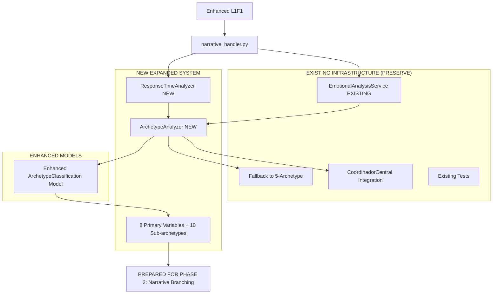

# Design Document - Sistema de Clasificación de Arquetipos Expandido

## Overview

Esta fase se enfoca en **expandir el sistema de arquetipos existente** de 5 categorías simples a un sistema sofisticado de **8 variables primarias** y **10 sub-arquetipos** que proporcionará la base granular necesaria para la futura ramificación narrativa.

El diseño integra el nuevo `ArchetypeAnalyzer` con la infraestructura existente, mantiene compatibilidad total con el sistema actual, y prepara la arquitectura para que la fase de ramificación pueda consumir clasificaciones psicológicas mucho más precisas y matizadas.

## Steering Document Alignment

### Technical Standards (tech.md)
- **Service-Oriented Architecture**: El `ArchetypeAnalyzer` se integra como un nuevo servicio que extiende `EmotionalAnalysisService`
- **Async/await patterns**: Toda la lógica de análisis sigue patrones async establecidos
- **Database integration**: Expande el modelo `ArchetypeClassification` existente sin romper compatibilidad
- **Performance requirements**: Análisis de arquetipo debe completarse en <2 segundos
- **Error handling**: Graceful degradation al sistema de 5 arquetipos existente si el expandido falla

### Project Structure (structure.md)
- **Service layer**: Nuevo `ArchetypeAnalyzer` en `services/archetype_analyzer.py`
- **Model extensions**: Expande `ArchetypeClassification` con campos para variables granulares
- **Handler integration**: Integra con `narrative_handler.py` existente sin cambios disruptivos
- **Testing framework**: Extiende tests existentes en `/tests/emotional/` con nuevos arquetipos

## Code Reuse Analysis

### Existing Components to Leverage (100% Compatibility)

#### **ArchetypeClassification Model (EXTEND)**
- **Mantener campos existentes**: `primary_archetype`, `archetype_confidence`, `secondary_traits`, `trait_strengths`
- **Agregar campos expandidos**: Variables para 8 dimensiones primarias + 10 sub-arquetipos
- **Backward compatibility**: Sistema existente de 5 arquetipos seguirá funcionando para usuarios ya clasificados

#### **EmotionalAnalysisService (INTEGRATE)**
- **Timing analysis existente**: Reutilizar `analyze_response_timing()` como input para `ResponseTimeAnalyzer`
- **Behavioral tracking**: Expandir patrones existentes con las nuevas variables arquetípicas
- **Session management**: Mantener patrones establecidos de manejo de sesiones async

#### **Narrative Handler (MINIMAL CHANGES)**
- **Existing L1F1**: Reemplazar con versión expandida manteniendo misma interfaz
- **Choice processing**: Expandir con tracking de timing y archetype weights
- **User state**: Integrar nueva clasificación expandida transparentemente

### Integration Points

#### **ArchetypeAnalyzer Service (NEW)**
- **Input integration**: Consume datos de timing de `EmotionalAnalysisService` existente
- **Output integration**: Almacena resultados en `ArchetypeClassification` expandido
- **Fallback integration**: Si análisis expandido falla, usa sistema de 5 arquetipos existente

#### **Enhanced L1F1 Fragment (REPLACE)**
- **Archetype detection**: Choices diseñados específicamente para revelar 8 dimensiones
- **Timing capture**: Integración seamless con tracking de response time existente
- **Diana's voice**: Mantener consistency con character voice establecido

## Architecture

Sistema expandido que mantiene compatibilidad total con arquitectura existente:



## Components and Interfaces

### Component 1: ArchetypeAnalyzer (NEW - CORE)
- **Purpose:** Análisis sofisticado de 8 variables primarias + 10 sub-arquetipos basado en choices y timing
- **Interfaces:**
  ```python
  class ArchetypeAnalyzer:
      async def analyze_l1_choices(self, user_id: int, choices: List[Dict], timings: List[float]) -> Dict
      async def classify_primary_archetype(self, scores: ArchetypeScores) -> str
      async def determine_sub_archetype(self, primary: str, sub_scores: SubArchetypeScores) -> str
      async def calculate_confidence_level(self, scores: ArchetypeScores, consistency: float) -> float
      async def store_classification_results(self, user_id: int, results: Dict) -> bool
  ```
- **Dependencies:** `EmotionalAnalysisService`, `ArchetypeClassification` model
- **Core Algorithm:**
  ```python
  async def analyze_l1_choices(self, user_id: int, choices: List[Dict], timings: List[float]) -> Dict:
      scores = ArchetypeScores()
      sub_scores = SubArchetypeScores()

      # Process each choice with archetype weights
      for choice, timing in zip(choices, timings):
          await self._process_choice_weights(choice, timing, scores, sub_scores)

      # Calculate final classification
      primary_archetype = await self._calculate_primary_archetype(scores)
      sub_archetype = await self._determine_sub_archetype(primary_archetype, sub_scores)
      confidence = await self._calculate_confidence(scores, timings)

      return {
          'primary_archetype': primary_archetype,
          'sub_archetype': sub_archetype,
          'confidence_level': confidence,
          'raw_scores': scores,
          'sub_scores': sub_scores,
          'cognitive_style': await self._analyze_cognitive_style(timings)
      }
  ```

### Component 2: ResponseTimeAnalyzer (NEW)
- **Purpose:** Análisis sofisticado de patrones temporales para revelar estilo cognitivo
- **Interfaces:**
  ```python
  class ResponseTimeAnalyzer:
      def analyze_response_pattern(self, timings: List[float]) -> Dict
      def classify_response_style(self, avg_time: float) -> str
      def calculate_consistency(self, timings: List[float]) -> float
      def detect_temporal_patterns(self, timings: List[float]) -> str
  ```
- **Integration:** Consume timing data de `EmotionalAnalysisService` existente
- **Classification Logic:**
  ```python
  def analyze_response_pattern(self, timings: List[float]) -> Dict:
      style_mapping = {
          'quick_intuitive': (0, 10),      # Respuestas impulsivas, directas
          'thoughtful': (10, 30),          # Procesamiento reflexivo
          'deliberate': (30, float('inf')) # Contemplación profunda
      }

      avg_time = sum(timings) / len(timings)
      consistency = self._calculate_consistency(timings)

      for style, (min_time, max_time) in style_mapping.items():
          if min_time <= avg_time < max_time:
              return {
                  'style': style,
                  'average_time': avg_time,
                  'consistency': consistency,
                  'pattern': self._detect_pattern(timings)
              }
  ```

### Component 3: Enhanced ArchetypeClassification Model (EXTEND)
- **Purpose:** Expandir modelo existente para almacenar 8 variables + 10 sub-arquetipos
- **Backward Compatibility:** Mantener todos los campos existentes
- **New Fields:**
  ```python
  class ArchetypeClassification(Base):
      # EXISTING FIELDS (preserved exactly as-is)
      id = Column(Integer, primary_key=True)
      user_id = Column(Integer, unique=True, nullable=False, index=True)
      primary_archetype = Column(String(50))
      archetype_confidence = Column(Float, default=0.5)
      secondary_traits = Column(Text)  # JSON
      trait_strengths = Column(Text)   # JSON

      # NEW EXPANDED FIELDS
      # 8 Primary Variables (0.0 - 10.0)
      intellectual_score = Column(Float, default=0.0)
      emotional_score = Column(Float, default=0.0)
      exploratory_score = Column(Float, default=0.0)
      vulnerable_score = Column(Float, default=0.0)
      philosophical_score = Column(Float, default=0.0)
      direct_score = Column(Float, default=0.0)
      patient_score = Column(Float, default=0.0)
      reciprocal_score = Column(Float, default=0.0)

      # 10 Sub-archetype Scores (0.0 - 5.0)
      romantic_intellectual_score = Column(Float, default=0.0)
      skeptical_thinker_score = Column(Float, default=0.0)
      hedonist_philosopher_score = Column(Float, default=0.0)
      pure_theorist_score = Column(Float, default=0.0)
      empathetic_emotional_score = Column(Float, default=0.0)
      passionate_emotional_score = Column(Float, default=0.0)
      wounded_healer_score = Column(Float, default=0.0)
      adventure_seeker_score = Column(Float, default=0.0)
      collector_explorer_score = Column(Float, default=0.0)
      freedom_lover_score = Column(Float, default=0.0)

      # Cognitive Style Analysis
      cognitive_style = Column(String(50), nullable=True)  # 'quick_intuitive', 'thoughtful', 'deliberate'
      response_consistency = Column(Float, default=0.5)
      temporal_pattern = Column(String(50), nullable=True) # 'getting_faster', 'getting_slower', 'consistent'
  ```

### Component 4: Enhanced L1F1 Fragment (REPLACE)
- **Purpose:** Reemplazar L1F1 existente con versión optimizada para detección de arquetipos
- **Choice Design:** 5 opciones específicamente diseñadas para revelar las 8 variables primarias
- **Diana's Voice:** Mantener misterio y seducción mientras introduce scenarios arquetípicos
- **Fragment Structure:**
  ```python
  ENHANCED_L1F1 = {
      "id": "diana_l1_f1_archetype_analyzer",
      "key": "enhanced_l1f1",
      "character": "Diana",
      "text": """Holis hermoso =

      Llegaste justo cuando estaba pensando en algo fascinante... ¿Sabes esa sensación cuando conoces a alguien y sientes que hay capas esperando ser descubiertas?

      *[Se acomoda, con una curiosidad inteligente]*

      Bienvenido a Los Kinkys. Te voy a ser honesta desde el inicio: esto funciona diferente para cada persona.

      Algunos llegan buscando conversaciones que los desafíen mentalmente. Otros quieren conexión emocional profunda. Hay quienes disfrutan explorar posibilidades nuevas...

      *[Sus ojos te evalúan con genuina curiosidad]*

      Me fascina descubrir qué tipo de hambre trae cada persona. Cómo procesan, cómo sienten, qué los mueve realmente...

      *[Una sonrisa intrigante]*

      Por eso tengo curiosidad: ¿qué te trajo hasta aquí realmente?""",

      "choices": [
          {
              "id": "choice_l1_curiosity_intellectual",
              "text": "> Me intriga entender cómo funciona esto psicológicamente",
              "archetype_weights": {
                  "intellectual": 3.0,
                  "philosophical": 2.0
              },
              "sub_archetype_weights": {
                  "pure_theorist": 2.0,
                  "skeptical_thinker": 1.0
              }
          },
          {
              "id": "choice_l1_curiosity_emotional",
              "text": "=« Busco una conexión que vaya más allá de lo superficial",
              "archetype_weights": {
                  "emotional": 3.0,
                  "vulnerable": 2.0,
                  "reciprocal": 1.0
              },
              "sub_archetype_weights": {
                  "empathetic_emotional": 2.0,
                  "wounded_healer": 1.0
              }
          },
          {
              "id": "choice_l1_curiosity_exploratory",
              "text": "=ú Me gusta descubrir experiencias que no sabía que existían",
              "archetype_weights": {
                  "exploratory": 3.0,
                  "direct": 1.0
              },
              "sub_archetype_weights": {
                  "adventure_seeker": 2.0,
                  "collector_explorer": 1.0
              }
          },
          {
              "id": "choice_l1_curiosity_romantic_intellectual",
              "text": "<­ Me atraen las mentes que pueden seducir con ideas",
              "archetype_weights": {
                  "intellectual": 2.0,
                  "emotional": 2.0,
                  "philosophical": 1.0
              },
              "sub_archetype_weights": {
                  "romantic_intellectual": 3.0,
                  "hedonist_philosopher": 1.0
              }
          },
          {
              "id": "choice_l1_curiosity_freedom",
              "text": ">‹ Quiero algo sin expectativas ni ataduras",
              "archetype_weights": {
                  "exploratory": 2.0,
                  "direct": 2.0
              },
              "sub_archetype_weights": {
                  "freedom_lover": 3.0,
                  "adventure_seeker": 1.0
              }
          }
      ]
  }
  ```

## Data Models

### ArchetypeScores and SubArchetypeScores Dataclasses
```python
@dataclass
class ArchetypeScores:
    """8 Variables primarias de arquetipo (0-10)"""
    intellectual: float = 0.0      # Búsqueda de comprensión, análisis
    emotional: float = 0.0         # Conexión emocional, vulnerability
    exploratory: float = 0.0       # Aventura, descubrimiento, novedad
    vulnerable: float = 0.0        # Apertura emocional, autenticidad
    philosophical: float = 0.0     # Reflexión profunda, contemplación
    direct: float = 0.0           # Comunicación clara, sin rodeos
    patient: float = 0.0          # Capacidad de espera, persistencia
    reciprocal: float = 0.0       # Deseo de conexión mutua, intercambio

@dataclass
class SubArchetypeScores:
    """10 Variables secundarias para sub-clasificación"""
    romantic_intellectual: float = 0.0    # Seducción intelectual, ideas como cortejo
    skeptical_thinker: float = 0.0        # Cuestionamiento, análisis crítico
    hedonist_philosopher: float = 0.0     # Placer intelectual, gozo del pensamiento
    pure_theorist: float = 0.0            # Teoría pura, abstracción mental
    empathetic_emotional: float = 0.0     # Empatía profunda, comprensión emocional
    passionate_emotional: float = 0.0     # Intensidad emocional, respuestas viscerales
    wounded_healer: float = 0.0           # Sanación mutua, vulnerabilidad compartida
    adventure_seeker: float = 0.0         # Búsqueda activa de nuevas experiencias
    collector_explorer: float = 0.0       # Colección de experiencias, curiosidad sistemática
    freedom_lover: float = 0.0            # Independencia, ausencia de restricciones
```

## Classification Algorithm Flow

### L1 Choice Processing
```python
async def _process_choice_weights(self, choice: Dict, timing: float,
                                 scores: ArchetypeScores, sub_scores: SubArchetypeScores):
    """Procesa una elección individual y actualiza scores basado en weights"""
    choice_id = choice.get('id', '')

    # Apply archetype weights from choice
    if 'archetype_weights' in choice:
        for dimension, weight in choice['archetype_weights'].items():
            if hasattr(scores, dimension):
                current_value = getattr(scores, dimension)
                setattr(scores, dimension, current_value + weight)

    # Apply sub-archetype weights
    if 'sub_archetype_weights' in choice:
        for sub_dimension, weight in choice['sub_archetype_weights'].items():
            if hasattr(sub_scores, sub_dimension):
                current_value = getattr(sub_scores, sub_dimension)
                setattr(sub_scores, sub_dimension, current_value + weight)

    # Temporal analysis affects scores
    await self._apply_timing_modifiers(timing, scores, sub_scores)

async def _apply_timing_modifiers(self, timing: float, scores: ArchetypeScores, sub_scores: SubArchetypeScores):
    """Modifica scores basado en response timing patterns"""
    if timing < 10:  # Quick intuitive response
        scores.direct += 1.0
        sub_scores.passionate_emotional += 0.5
    elif 10 <= timing <= 30:  # Thoughtful response
        scores.philosophical += 0.5
        scores.intellectual += 0.3
    else:  # Deliberate response (>30s)
        scores.philosophical += 1.0
        sub_scores.skeptical_thinker += 0.5
        scores.patient += 0.7
```

### Primary Archetype Calculation
```python
async def _calculate_primary_archetype(self, scores: ArchetypeScores) -> str:
    """Determina arquetipo primario basado en score más alto"""
    score_dict = {
        'intellectual': scores.intellectual + scores.philosophical * 0.5,
        'emotional': scores.emotional + scores.vulnerable * 0.7,
        'exploratory': scores.exploratory + scores.direct * 0.3,
        'vulnerable_authentic': scores.vulnerable + scores.emotional * 0.4,
        'philosophical_deep': scores.philosophical + scores.intellectual * 0.6,
        'direct_honest': scores.direct + scores.reciprocal * 0.5,
        'patient_devoted': scores.patient + scores.reciprocal * 0.7,
        'balanced_complex': self._calculate_balance_score(scores)
    }

    primary = max(score_dict, key=score_dict.get)
    return primary
```

### Sub-Archetype Determination
```python
async def _determine_sub_archetype(self, primary: str, sub_scores: SubArchetypeScores) -> str:
    """Determina sub-arquetipo basado en primary + sub-scores"""
    sub_mapping = {
        'intellectual': {
            'romantic_intellectual': sub_scores.romantic_intellectual,
            'skeptical_thinker': sub_scores.skeptical_thinker,
            'hedonist_philosopher': sub_scores.hedonist_philosopher,
            'pure_theorist': sub_scores.pure_theorist
        },
        'emotional': {
            'empathetic_emotional': sub_scores.empathetic_emotional,
            'passionate_emotional': sub_scores.passionate_emotional,
            'wounded_healer': sub_scores.wounded_healer
        },
        'exploratory': {
            'adventure_seeker': sub_scores.adventure_seeker,
            'collector_explorer': sub_scores.collector_explorer,
            'freedom_lover': sub_scores.freedom_lover
        }
    }

    if primary in sub_mapping:
        relevant_subs = sub_mapping[primary]
        return max(relevant_subs, key=relevant_subs.get)

    return 'undefined'
```

## Error Handling

### Graceful Degradation Strategy
1. **ArchetypeAnalyzer Failure**
   - **Fallback:** Use existing 5-archetype classification system
   - **User Impact:** Seamless experience with current archetype system
   - **Data Preservation:** Store partial analysis for later completion

2. **Timing Analysis Failure**
   - **Fallback:** Use choice weights only, ignore temporal patterns
   - **User Impact:** Classification continues with slightly lower accuracy
   - **Logging:** Record timing failures for system optimization

3. **Enhanced L1F1 Unavailable**
   - **Fallback:** Use current L1F1 with basic archetype detection
   - **User Impact:** Standard experience until enhanced fragment is available
   - **Progressive Enhancement:** Enable enhanced analysis when fragment is restored

## Testing Strategy

### Unit Testing - ArchetypeAnalyzer
```python
class TestArchetypeAnalyzer:
    async def test_intellectual_archetype_detection(self):
        choices = [choice_intellectual_heavy, choice_philosophical_follow]
        timings = [25.0, 35.0]  # Thoughtful timing pattern

        result = await analyzer.analyze_l1_choices(user_id, choices, timings)

        assert result['primary_archetype'] == 'intellectual'
        assert result['sub_archetype'] == 'pure_theorist'
        assert result['confidence_level'] > 0.8

    async def test_emotional_vulnerable_detection(self):
        choices = [choice_emotional_connection, choice_vulnerability_seeking]
        timings = [12.0, 8.0]  # Mixed timing pattern

        result = await analyzer.analyze_l1_choices(user_id, choices, timings)

        assert result['primary_archetype'] == 'emotional'
        assert result['sub_archetype'] == 'empathetic_emotional'
```

### Integration Testing - Full Classification Flow
```python
class TestExpandedArchetypeFlow:
    async def test_l1f1_to_classification_complete_flow(self):
        # Simulate user completing enhanced L1F1
        user_responses = await simulate_enhanced_l1f1_completion(
            user_id=12345,
            choices=['choice_l1_curiosity_intellectual', 'choice_l1_curiosity_romantic_intellectual'],
            response_times=[22.3, 28.7]
        )

        # Verify expanded classification was stored
        classification = await session.get(ArchetypeClassification, 12345)
        assert classification.intellectual_score > 4.0
        assert classification.romantic_intellectual_score > 2.0
        assert classification.cognitive_style == 'thoughtful'
```

## Implementation Readiness

This design provides a **comprehensive foundation** for expanded archetype classification that:

1. **Maintains 100% backward compatibility** with existing 5-archetype system
2. **Provides granular 8+10 variable classification** for future narrative branching
3. **Integrates seamlessly** with existing infrastructure and patterns
4. **Prepares the data foundation** for Phase 2 narrative branching system
5. **Includes comprehensive testing strategy** for reliability and accuracy

The system is designed to be **implemented incrementally** without breaking existing functionality, while providing the sophisticated psychological profiling needed for truly personalized narrative experiences in Phase 2.