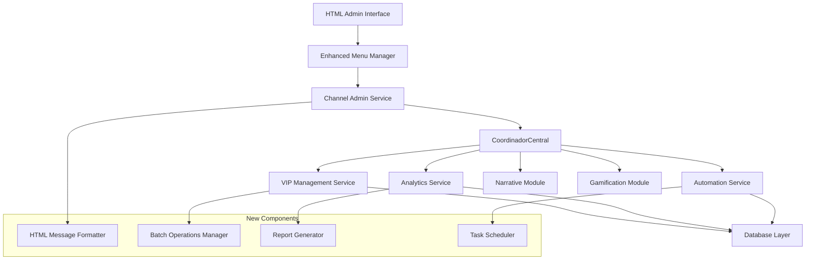

# modulo-admon - Task 23

Execute task 23 for the modulo-admon specification.

## Task Description
Add admin permission validation to utils/admin_security.py

## Code Reuse
**Leverage existing code**: utils/admin

## Requirements Reference
**Requirements**: 4.1, 4.5

## Usage
```
/Task:23-modulo-admon
```

## Instructions

Execute with @spec-task-executor agent the following task: "Add admin permission validation to utils/admin_security.py"

```
Use the @spec-task-executor agent to implement task 23: "Add admin permission validation to utils/admin_security.py" for the modulo-admon specification and include all the below context.

# Steering Context
## Steering Documents Context

No steering documents found or all are empty.

# Specification Context
## Specification Context (Pre-loaded): modulo-admon

### Requirements
# Requirements Document - Channel Administration Module

## Introduction

The Channel Administration Module is an evolution and robustness enhancement of DianaBot's current administration system. Its purpose is to provide a complete, intuitive and efficient administrative interface for managing free and VIP channels, subscriptions, exclusive content, and seamless integration with narrative and gamification modules. This module strengthens the existing system by improving usability, implementing advanced message cleanup, and expanding current administrative capabilities.

## Alignment with Product Vision

This module is fundamental for DianaBot's sustainability and scalability, as it:
- **Effective Monetization**: Facilitates VIP subscription management that generates sustainable revenue
- **Access Control**: Ensures exclusive content reaches only authorized users
- **Premium Experience**: Enables offering a differentiated, high-quality experience to VIP users
- **Efficient Operation**: Reduces administrative burden through intelligent automation
- **Cohesive Integration**: Connects narrative and gamification into a unified experience

## Requirements

### Requirement 1: Enhanced Administrative Menu System

**User Story:** As a bot administrator, I want an intuitive and clean menu interface that allows me to quickly access all administrative functions without cluttering the chat with system messages.

#### Acceptance Criteria

1. WHEN the administrator accesses the main panel THEN the system SHALL display an organized main menu with all available options
2. WHEN the administrator selects a menu option THEN the system SHALL automatically clean the previous message to maintain chat order
3. WHEN the administrator navigates between submenus THEN the system SHALL maintain navigation history with "Back" button
4. IF there are multiple active temporary messages THEN the system SHALL automatically delete previous messages
5. WHEN the administrator completes an action THEN the system SHALL show temporary confirmation that auto-deletes after 7 seconds
6. WHEN the system encounters a menu cleanup error THEN the system SHALL log the error and continue operation gracefully

### Requirement 2: Advanced VIP Subscription Management

**User Story:** As an administrator, I want robust tools to manage VIP subscriptions, including token creation, user tracking, and exclusive content administration.

#### Acceptance Criteria

1. WHEN the administrator generates a VIP token THEN the system SHALL create a unique token with associated tariff and expiration date
2. WHEN a user uses a valid token THEN the system SHALL automatically activate their VIP subscription and record the transaction
3. WHEN a VIP subscription is about to expire THEN the system SHALL send automatic reminders 3 days and 1 day before expiration
4. IF a VIP subscription expires THEN the system SHALL automatically remove the user from the VIP channel within 1 hour
5. WHEN the administrator queries VIP users THEN the system SHALL display complete list with expiration dates and status
6. WHEN batch token operations are requested THEN the system SHALL support generating up to 50 tokens simultaneously
7. IF token generation fails THEN the system SHALL provide specific error code and recovery options

### Requirement 3: Channel and Exclusive Content Control

**User Story:** As an administrator, I want to control access to different channels and manage exclusive content based on user subscription level.

#### Acceptance Criteria

1. WHEN a user attempts to access VIP content THEN the system SHALL verify their active subscription before allowing access
2. WHEN the administrator publishes exclusive content THEN the system SHALL automatically restrict visibility according to channel type
3. WHEN a user loses VIP access THEN the system SHALL immediately block their access to exclusive content within 30 seconds
4. IF the administrator configures protected content THEN the system SHALL disable forwarding and download options
5. WHEN exclusive content is scheduled THEN the system SHALL validate permissions before publication
6. WHEN content protection fails THEN the system SHALL alert administrator and provide fallback options

### Requirement 4: Coordinator Central Integration

**User Story:** As a system developer, I want the administration module to integrate seamlessly with the Central Coordinator to orchestrate actions between narrative, gamification and administration.

#### Acceptance Criteria

1. WHEN the administrator performs management actions THEN the system SHALL use the Central Coordinator to coordinate with other modules
2. WHEN a user's VIP access is modified THEN the system SHALL notify the narrative module to adjust available content within 10 seconds
3. WHEN subscriptions are updated THEN the system SHALL synchronize with the gamification system for premium function access
4. IF there are conflicts between modules THEN the system SHALL handle errors gracefully and report to administrator with error code
5. WHEN administrative operations are executed THEN the system SHALL maintain data consistency across all modules
6. WHEN integration points fail THEN the system SHALL continue core functionality and provide degraded service notification

### Requirement 5: Administrative Analysis and Reports

**User Story:** As an administrator, I want access to detailed analytics and reports about bot performance, user engagement, and subscription metrics.

#### Acceptance Criteria

1. WHEN the administrator accesses statistics THEN the system SHALL display metrics for active users, current subscriptions, and engagement within 3 seconds
2. WHEN financial metrics are consulted THEN the system SHALL calculate revenue from used tokens and projections with 99% accuracy
3. WHEN channel activity is reviewed THEN the system SHALL show participation, reactions, and most popular content
4. IF reports are generated THEN the system SHALL include visual charts and temporal trends
5. WHEN data export is requested THEN the system SHALL generate reports in structured format (JSON/CSV) within 30 seconds
6. WHEN report generation fails THEN the system SHALL provide partial data and error details

### Requirement 6: Administrative Task Automation

**User Story:** As an administrator, I want the system to automate repetitive tasks like subscription reminders, message cleanup, and inactive user management.

#### Acceptance Criteria

1. WHEN a subscription is about to expire THEN the system SHALL send personalized automatic reminders with renewal links
2. WHEN there are old temporary messages THEN the system SHALL clean them automatically according to configuration
3. WHEN a user leaves the free channel THEN the system SHALL evaluate and execute configured actions within 5 minutes
4. IF inactive VIP users are detected THEN the system SHALL notify administrator with action options
5. WHEN narrative events are scheduled THEN the system SHALL automatically coordinate content publication
6. WHEN automation tasks fail THEN the system SHALL retry up to 3 times and alert administrator if still failing

## Non-Functional Requirements

### Performance
- The system must respond to administrative commands in less than 2 seconds
- Message cleanup must execute without perceptible impact on user experience
- Statistics queries must load in less than 5 seconds
- The system must support up to 10,000 simultaneous VIP users

### Security
- All VIP tokens must be unique, secure, and single-use with UUID format
- Administrative access must require multi-factor authentication
- Subscription data must be encrypted in the database using AES-256
- The system must log all administrative actions for auditing purposes

### Reliability
- The system must maintain 99.9% availability
- Message cleanup must function even if individual message deletion fails
- The system must automatically recover from connection failures within 30 seconds
- Critical operations must have automatic backup and rollback capability

### Usability
- Administrative menus must be navigable with maximum 3 clicks for any function
- Action confirmations must be clear and allow cancellation within 10 seconds
- The system must provide contextual help for complex functions
- The interface must be consistent with bot tone and style (elegant, sarcastic)

---

### Design
# Design Document - Channel Administration Module

## Overview

<p>The Channel Administration Module represents a comprehensive enhancement to DianaBot's existing administrative infrastructure. Building upon the sophisticated foundation of <strong>MenuManager</strong>, <strong>CoordinadorCentral</strong>, and established VIP management systems, this design extends current capabilities while maintaining architectural consistency and ensuring seamless integration with narrative and gamification modules.</p>

<p>The design leverages existing patterns from <code>handlers/admin/admin_menu.py</code>, <code>utils/menu_manager.py</code>, and service-oriented architecture to provide a robust, scalable administrative interface with HTML-formatted messaging for improved text rendering.</p>

## Steering Document Alignment

### Technical Standards (tech.md)
<ul>
<li><strong>Service-Oriented Architecture:</strong> Follows established pattern with dedicated services for each administrative domain</li>
<li><strong>Handler Pattern:</strong> Extends existing handler structure in <code>handlers/admin/</code> directory</li>
<li><strong>Async/Await Pattern:</strong> Maintains consistency with existing async patterns throughout codebase</li>
<li><strong>Error Handling:</strong> Implements graceful degradation and comprehensive logging as per existing standards</li>
</ul>

### Project Structure (structure.md)
<ul>
<li><strong>Modular Organization:</strong> Follows established directory structure with clear separation of concerns</li>
<li><strong>Service Layer:</strong> Places business logic in <code>services/</code> directory consistent with existing architecture</li>
<li><strong>Handler Layer:</strong> Maintains Telegram-specific logic in <code>handlers/</code> as per current pattern</li>
<li><strong>Utility Integration:</strong> Leverages existing utilities and extends them appropriately</li>
</ul>

## Code Reuse Analysis

### Existing Components to Leverage
<ul>
<li><strong>MenuManager (utils/menu_manager.py):</strong> Core menu lifecycle management, message cleanup, navigation history</li>
<li><strong>CoordinadorCentral (services/coordinador_central.py):</strong> Module orchestration, action-based flow system</li>
<li><strong>Admin Handlers (handlers/admin/):</strong> Existing admin infrastructure, VIP management, channel administration</li>
<li><strong>VIP Services:</strong> Current subscription management, token generation, database operations</li>
<li><strong>Admin Keyboards (keyboards/admin_*.py):</strong> Existing keyboard layouts and button configurations</li>
</ul>

### Integration Points
<ul>
<li><strong>Database Layer:</strong> Extends existing SQLAlchemy models and database sessions</li>
<li><strong>Telegram Bot API:</strong> Integrates with current aiogram handler patterns</li>
<li><strong>Authentication System:</strong> Builds on existing admin verification in <code>utils/admin_check.py</code></li>
<li><strong>Narrative Module:</strong> Connects through CoordinadorCentral for content synchronization</li>
<li><strong>Gamification Module:</strong> Synchronizes VIP access for premium features</li>
</ul>

## Architecture

<p>The enhanced Channel Administration Module follows a layered architecture that extends the existing system:</p>



## Components and Interfaces

### Component 1: Enhanced MenuManager
<ul>
<li><strong>Purpose:</strong> Extends existing MenuManager with HTML formatting and improved cleanup</li>
<li><strong>Interfaces:</strong>
  <ul>
    <li><code>create_html_menu(user_id, menu_data, format_type="html")</code></li>
    <li><code>cleanup_with_retry(user_id, max_retries=3)</code></li>
    <li><code>schedule_cleanup(user_id, delay_seconds=7)</code></li>
  </ul>
</li>
<li><strong>Dependencies:</strong> aiogram, asyncio, logging</li>
<li><strong>Reuses:</strong> <code>utils/menu_manager.py</code> core functionality</li>
</ul>

### Component 2: ChannelAdminService
<ul>
<li><strong>Purpose:</strong> Orchestrates channel-specific administrative operations</li>
<li><strong>Interfaces:</strong>
  <ul>
    <li><code>manage_vip_access(user_id, action, duration=None)</code></li>
    <li><code>publish_exclusive_content(content, channel_type, protection_level)</code></li>
    <li><code>validate_channel_permissions(user_id, channel_id)</code></li>
  </ul>
</li>
<li><strong>Dependencies:</strong> CoordinadorCentral, Database Session</li>
<li><strong>Reuses:</strong> <code>handlers/admin/channel_admin.py</code>, <code>services/subscription_service.py</code></li>
</ul>

### Component 3: EnhancedVIPService
<ul>
<li><strong>Purpose:</strong> Extends current VIP management with batch operations and analytics</li>
<li><strong>Interfaces:</strong>
  <ul>
    <li><code>generate_batch_tokens(count, tariff_id, admin_id)</code></li>
    <li><code>get_vip_analytics(date_range, metrics_type)</code></li>
    <li><code>schedule_expiration_reminders(days_before=[3, 1])</code></li>
  </ul>
</li>
<li><strong>Dependencies:</strong> Database Session, UUID generator, Email/Telegram sender</li>
<li><strong>Reuses:</strong> Existing VIP management in <code>handlers/admin/vip_menu.py</code></li>
</ul>

### Component 4: AnalyticsService
<ul>
<li><strong>Purpose:</strong> Provides comprehensive reporting and metrics for administrative decisions</li>
<li><strong>Interfaces:</strong>
  <ul>
    <li><code>generate_engagement_report(channel_id, date_range)</code></li>
    <li><code>calculate_revenue_metrics(period, projection_months=3)</code></li>
    <li><code>export_data(report_type, format="json")</code></li>
  </ul>
</li>
<li><strong>Dependencies:</strong> Database Session, Chart generation library, Export utilities</li>
<li><strong>Reuses:</strong> Existing database models and query patterns</li>
</ul>

### Component 5: AutomationService
<ul>
<li><strong>Purpose:</strong> Handles automated administrative tasks and scheduling</li>
<li><strong>Interfaces:</strong>
  <ul>
    <li><code>schedule_vip_reminders(subscription_id, reminder_schedule)</code></li>
    <li><code>cleanup_inactive_sessions(inactivity_threshold_hours=24)</code></li>
    <li><code>coordinate_narrative_events(event_schedule)</code></li>
  </ul>
</li>
<li><strong>Dependencies:</strong> asyncio scheduler, CoordinadorCentral, Database Session</li>
<li><strong>Reuses:</strong> Existing automation patterns from current admin system</li>
</ul>

### Component 6: HTMLMessageFormatter
<ul>
<li><strong>Purpose:</strong> Formats administrative messages using HTML instead of Markdown</li>
<li><strong>Interfaces:</strong>
  <ul>
    <li><code>format_admin_menu(menu_data, user_context)</code></li>
    <li><code>format_confirmation_message(action, result, auto_delete=True)</code></li>
    <li><code>format_error_message(error_code, details, recovery_options)</code></li>
  </ul>
</li>
<li><strong>Dependencies:</strong> HTML templating utilities</li>
<li><strong>Reuses:</strong> Existing message patterns from <code>keyboards/admin_*.py</code></li>
</ul>

## Data Models

### Enhanced VIP Subscription Model
```python
class VIPSubscription:
    id: UUID
    user_id: int
    start_date: datetime
    expiration_date: datetime
    tariff_id: UUID
    status: SubscriptionStatus  # ACTIVE, EXPIRED, SUSPENDED
    auto_renewal: bool
    created_by_admin_id: int
    reminder_sent_dates: List[datetime]  # Track reminder history
    revenue_generated: Decimal
```

### Admin Action Log Model
```python
class AdminActionLog:
    id: UUID
    admin_user_id: int
    action_type: AdminActionType
    target_user_id: Optional[int]
    action_details: Dict  # JSON field for flexible data
    timestamp: datetime
    success: bool
    error_message: Optional[str]
    ip_address: Optional[str]
```

### Channel Content Model
```python
class ChannelContent:
    id: UUID
    channel_type: ChannelType  # FREE, VIP
    content_type: ContentType  # TEXT, IMAGE, VIDEO, POLL
    content_data: Dict  # JSON field for content
    protection_level: ProtectionLevel  # NONE, NO_FORWARD, NO_DOWNLOAD
    published_by_admin_id: int
    publish_date: datetime
    engagement_metrics: Dict  # Views, reactions, etc.
```

## Error Handling

### Error Scenarios
<ol>
<li><strong>Menu Cleanup Failure:</strong>
   <ul>
     <li><strong>Handling:</strong> Log error, continue operation, schedule retry</li>
     <li><strong>User Impact:</strong> Minimal - older menus may remain but functionality continues</li>
   </ul>
</li>

<li><strong>Token Generation Failure:</strong>
   <ul>
     <li><strong>Handling:</strong> Rollback partial operations, provide specific error code, suggest retry</li>
     <li><strong>User Impact:</strong> Admin receives clear error message with recovery options</li>
   </ul>
</li>

<li><strong>VIP Access Synchronization Failure:</strong>
   <ul>
     <li><strong>Handling:</strong> Queue operation for retry, notify admin, maintain audit trail</li>
     <li><strong>User Impact:</strong> Temporary access inconsistency with automated resolution</li>
   </ul>
</li>

<li><strong>Analytics Service Failure:</strong>
   <ul>
     <li><strong>Handling:</strong> Provide cached data if available, offer partial reports</li>
     <li><strong>User Impact:</strong> Degraded analytics functionality with clear status indication</li>
   </ul>
</li>
</ol>

## Testing Strategy

### Unit Testing
<ul>
<li>Test HTML message formatting with various input combinations</li>
<li>Validate batch token generation logic and security</li>
<li>Test error handling scenarios for each service component</li>
<li>Verify menu cleanup mechanisms under various failure conditions</li>
</ul>

### Integration Testing
<ul>
<li>Test CoordinadorCentral integration with new admin services</li>
<li>Validate VIP access synchronization across narrative and gamification modules</li>
<li>Test automated task scheduling and execution</li>
<li>Verify HTML formatting compatibility with Telegram API</li>
</ul>

### End-to-End Testing
<ul>
<li>Complete admin workflow: token generation � user activation � content access</li>
<li>VIP subscription lifecycle: creation � reminders � expiration � renewal</li>
<li>Analytics workflow: data collection � report generation � export</li>
<li>Error recovery scenarios: service failures � graceful degradation � recovery</li>
</ul>

## HTML Formatting Implementation

### HTML Message Structure
```html
<b><� Panel de Administraci�n</b>

<i>Gesti�n avanzada de canales y suscripciones</i>

<code>Estado del Sistema:</code> <b>Activo</b>
<code>Usuarios VIP:</code> <b>1,247</b>
<code>�ltimo backup:</code> <i>Hace 2 horas</i>

<u>Opciones disponibles:</u>
" <b>=� Canal VIP</b> - Gestionar suscripciones
" <b>=� Canal Free</b> - Administrar canal gratuito
" <b>=� An�lisis</b> - Reportes y m�tricas
" <b>� Automatizaci�n</b> - Tareas programadas
```

### Formatting Guidelines
<ul>
<li><strong>Headers:</strong> Use <code>&lt;b&gt;</code> tags for main titles</li>
<li><strong>Emphasis:</strong> Use <code>&lt;i&gt;</code> for secondary information</li>
<li><strong>Code/Data:</strong> Use <code>&lt;code&gt;</code> for labels and values</li>
<li><strong>Underline:</strong> Use <code>&lt;u&gt;</code> for section separators</li>
<li><strong>Lists:</strong> Use bullet points (") with <code>&lt;b&gt;</code> for options</li>
</ul>

## Performance Considerations

### Optimization Strategies
<ul>
<li><strong>Menu Caching:</strong> Cache frequently accessed menu structures</li>
<li><strong>Batch Operations:</strong> Optimize database queries for bulk token operations</li>
<li><strong>Async Processing:</strong> Use async patterns for all I/O operations</li>
<li><strong>Connection Pooling:</strong> Leverage existing database connection management</li>
</ul>

### Monitoring Points
<ul>
<li>Menu response times and cleanup success rates</li>
<li>VIP token generation and activation rates</li>
<li>Analytics query performance and cache hit rates</li>
<li>Automation task execution success and failure rates</li>
</ul>

**Note**: Specification documents have been pre-loaded. Do not use get-content to fetch them again.

## Task Details
- Task ID: 23
- Description: Add admin permission validation to utils/admin_security.py
- Leverage: utils/admin
- Requirements: 4.1, 4.5

## Instructions
- Implement ONLY task 23: "Add admin permission validation to utils/admin_security.py"
- Follow all project conventions and leverage existing code
- Mark the task as complete using: claude-code-spec-workflow get-tasks modulo-admon 23 --mode complete
- Provide a completion summary
```

## Task Completion
When the task is complete, mark it as done:
```bash
claude-code-spec-workflow get-tasks modulo-admon 23 --mode complete
```

## Next Steps
After task completion, you can:
- Execute the next task using /modulo-admon-task-[next-id]
- Check overall progress with /spec-status modulo-admon
