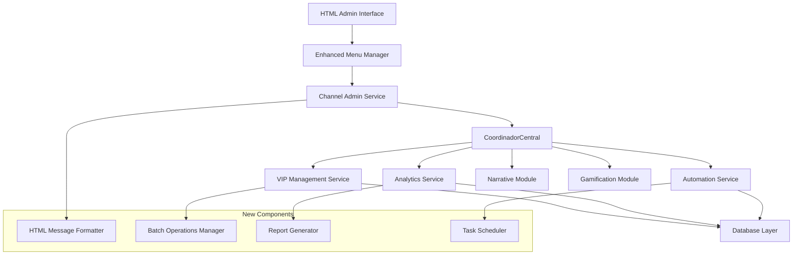

# Design Document - Channel Administration Module

## Overview

<p>The Channel Administration Module represents a comprehensive enhancement to DianaBot's existing administrative infrastructure. Building upon the sophisticated foundation of <strong>MenuManager</strong>, <strong>CoordinadorCentral</strong>, and established VIP management systems, this design extends current capabilities while maintaining architectural consistency and ensuring seamless integration with narrative and gamification modules.</p>

<p>The design leverages existing patterns from <code>handlers/admin/admin_menu.py</code>, <code>utils/menu_manager.py</code>, and service-oriented architecture to provide a robust, scalable administrative interface with HTML-formatted messaging for improved text rendering.</p>

## Steering Document Alignment

### Technical Standards (tech.md)
<ul>
<li><strong>Service-Oriented Architecture:</strong> Follows established pattern with dedicated services for each administrative domain</li>
<li><strong>Handler Pattern:</strong> Extends existing handler structure in <code>handlers/admin/</code> directory</li>
<li><strong>Async/Await Pattern:</strong> Maintains consistency with existing async patterns throughout codebase</li>
<li><strong>Error Handling:</strong> Implements graceful degradation and comprehensive logging as per existing standards</li>
</ul>

### Project Structure (structure.md)
<ul>
<li><strong>Modular Organization:</strong> Follows established directory structure with clear separation of concerns</li>
<li><strong>Service Layer:</strong> Places business logic in <code>services/</code> directory consistent with existing architecture</li>
<li><strong>Handler Layer:</strong> Maintains Telegram-specific logic in <code>handlers/</code> as per current pattern</li>
<li><strong>Utility Integration:</strong> Leverages existing utilities and extends them appropriately</li>
</ul>

## Code Reuse Analysis

### Existing Components to Leverage
<ul>
<li><strong>MenuManager (utils/menu_manager.py):</strong> Core menu lifecycle management, message cleanup, navigation history</li>
<li><strong>CoordinadorCentral (services/coordinador_central.py):</strong> Module orchestration, action-based flow system</li>
<li><strong>Admin Handlers (handlers/admin/):</strong> Existing admin infrastructure, VIP management, channel administration</li>
<li><strong>VIP Services:</strong> Current subscription management, token generation, database operations</li>
<li><strong>Admin Keyboards (keyboards/admin_*.py):</strong> Existing keyboard layouts and button configurations</li>
</ul>

### Integration Points
<ul>
<li><strong>Database Layer:</strong> Extends existing SQLAlchemy models and database sessions</li>
<li><strong>Telegram Bot API:</strong> Integrates with current aiogram handler patterns</li>
<li><strong>Authentication System:</strong> Builds on existing admin verification in <code>utils/admin_check.py</code></li>
<li><strong>Narrative Module:</strong> Connects through CoordinadorCentral for content synchronization</li>
<li><strong>Gamification Module:</strong> Synchronizes VIP access for premium features</li>
</ul>

## Architecture

<p>The enhanced Channel Administration Module follows a layered architecture that extends the existing system:</p>



## Components and Interfaces

### Component 1: Enhanced MenuManager
<ul>
<li><strong>Purpose:</strong> Extends existing MenuManager with HTML formatting and improved cleanup</li>
<li><strong>Interfaces:</strong>
  <ul>
    <li><code>create_html_menu(user_id, menu_data, format_type="html")</code></li>
    <li><code>cleanup_with_retry(user_id, max_retries=3)</code></li>
    <li><code>schedule_cleanup(user_id, delay_seconds=7)</code></li>
  </ul>
</li>
<li><strong>Dependencies:</strong> aiogram, asyncio, logging</li>
<li><strong>Reuses:</strong> <code>utils/menu_manager.py</code> core functionality</li>
</ul>

### Component 2: ChannelAdminService
<ul>
<li><strong>Purpose:</strong> Orchestrates channel-specific administrative operations</li>
<li><strong>Interfaces:</strong>
  <ul>
    <li><code>manage_vip_access(user_id, action, duration=None)</code></li>
    <li><code>publish_exclusive_content(content, channel_type, protection_level)</code></li>
    <li><code>validate_channel_permissions(user_id, channel_id)</code></li>
  </ul>
</li>
<li><strong>Dependencies:</strong> CoordinadorCentral, Database Session</li>
<li><strong>Reuses:</strong> <code>handlers/admin/channel_admin.py</code>, <code>services/subscription_service.py</code></li>
</ul>

### Component 3: EnhancedVIPService
<ul>
<li><strong>Purpose:</strong> Extends current VIP management with batch operations and analytics</li>
<li><strong>Interfaces:</strong>
  <ul>
    <li><code>generate_batch_tokens(count, tariff_id, admin_id)</code></li>
    <li><code>get_vip_analytics(date_range, metrics_type)</code></li>
    <li><code>schedule_expiration_reminders(days_before=[3, 1])</code></li>
  </ul>
</li>
<li><strong>Dependencies:</strong> Database Session, UUID generator, Email/Telegram sender</li>
<li><strong>Reuses:</strong> Existing VIP management in <code>handlers/admin/vip_menu.py</code></li>
</ul>

### Component 4: AnalyticsService
<ul>
<li><strong>Purpose:</strong> Provides comprehensive reporting and metrics for administrative decisions</li>
<li><strong>Interfaces:</strong>
  <ul>
    <li><code>generate_engagement_report(channel_id, date_range)</code></li>
    <li><code>calculate_revenue_metrics(period, projection_months=3)</code></li>
    <li><code>export_data(report_type, format="json")</code></li>
  </ul>
</li>
<li><strong>Dependencies:</strong> Database Session, Chart generation library, Export utilities</li>
<li><strong>Reuses:</strong> Existing database models and query patterns</li>
</ul>

### Component 5: AutomationService
<ul>
<li><strong>Purpose:</strong> Handles automated administrative tasks and scheduling</li>
<li><strong>Interfaces:</strong>
  <ul>
    <li><code>schedule_vip_reminders(subscription_id, reminder_schedule)</code></li>
    <li><code>cleanup_inactive_sessions(inactivity_threshold_hours=24)</code></li>
    <li><code>coordinate_narrative_events(event_schedule)</code></li>
  </ul>
</li>
<li><strong>Dependencies:</strong> asyncio scheduler, CoordinadorCentral, Database Session</li>
<li><strong>Reuses:</strong> Existing automation patterns from current admin system</li>
</ul>

### Component 6: HTMLMessageFormatter
<ul>
<li><strong>Purpose:</strong> Formats administrative messages using HTML instead of Markdown</li>
<li><strong>Interfaces:</strong>
  <ul>
    <li><code>format_admin_menu(menu_data, user_context)</code></li>
    <li><code>format_confirmation_message(action, result, auto_delete=True)</code></li>
    <li><code>format_error_message(error_code, details, recovery_options)</code></li>
  </ul>
</li>
<li><strong>Dependencies:</strong> HTML templating utilities</li>
<li><strong>Reuses:</strong> Existing message patterns from <code>keyboards/admin_*.py</code></li>
</ul>

## Data Models

### Enhanced VIP Subscription Model
```python
class VIPSubscription:
    id: UUID
    user_id: int
    start_date: datetime
    expiration_date: datetime
    tariff_id: UUID
    status: SubscriptionStatus  # ACTIVE, EXPIRED, SUSPENDED
    auto_renewal: bool
    created_by_admin_id: int
    reminder_sent_dates: List[datetime]  # Track reminder history
    revenue_generated: Decimal
```

### Admin Action Log Model
```python
class AdminActionLog:
    id: UUID
    admin_user_id: int
    action_type: AdminActionType
    target_user_id: Optional[int]
    action_details: Dict  # JSON field for flexible data
    timestamp: datetime
    success: bool
    error_message: Optional[str]
    ip_address: Optional[str]
```

### Channel Content Model
```python
class ChannelContent:
    id: UUID
    channel_type: ChannelType  # FREE, VIP
    content_type: ContentType  # TEXT, IMAGE, VIDEO, POLL
    content_data: Dict  # JSON field for content
    protection_level: ProtectionLevel  # NONE, NO_FORWARD, NO_DOWNLOAD
    published_by_admin_id: int
    publish_date: datetime
    engagement_metrics: Dict  # Views, reactions, etc.
```

## Error Handling

### Error Scenarios
<ol>
<li><strong>Menu Cleanup Failure:</strong>
   <ul>
     <li><strong>Handling:</strong> Log error, continue operation, schedule retry</li>
     <li><strong>User Impact:</strong> Minimal - older menus may remain but functionality continues</li>
   </ul>
</li>

<li><strong>Token Generation Failure:</strong>
   <ul>
     <li><strong>Handling:</strong> Rollback partial operations, provide specific error code, suggest retry</li>
     <li><strong>User Impact:</strong> Admin receives clear error message with recovery options</li>
   </ul>
</li>

<li><strong>VIP Access Synchronization Failure:</strong>
   <ul>
     <li><strong>Handling:</strong> Queue operation for retry, notify admin, maintain audit trail</li>
     <li><strong>User Impact:</strong> Temporary access inconsistency with automated resolution</li>
   </ul>
</li>

<li><strong>Analytics Service Failure:</strong>
   <ul>
     <li><strong>Handling:</strong> Provide cached data if available, offer partial reports</li>
     <li><strong>User Impact:</strong> Degraded analytics functionality with clear status indication</li>
   </ul>
</li>
</ol>

## Testing Strategy

### Unit Testing
<ul>
<li>Test HTML message formatting with various input combinations</li>
<li>Validate batch token generation logic and security</li>
<li>Test error handling scenarios for each service component</li>
<li>Verify menu cleanup mechanisms under various failure conditions</li>
</ul>

### Integration Testing
<ul>
<li>Test CoordinadorCentral integration with new admin services</li>
<li>Validate VIP access synchronization across narrative and gamification modules</li>
<li>Test automated task scheduling and execution</li>
<li>Verify HTML formatting compatibility with Telegram API</li>
</ul>

### End-to-End Testing
<ul>
<li>Complete admin workflow: token generation ’ user activation ’ content access</li>
<li>VIP subscription lifecycle: creation ’ reminders ’ expiration ’ renewal</li>
<li>Analytics workflow: data collection ’ report generation ’ export</li>
<li>Error recovery scenarios: service failures ’ graceful degradation ’ recovery</li>
</ul>

## HTML Formatting Implementation

### HTML Message Structure
```html
<b><› Panel de Administración</b>

<i>Gestión avanzada de canales y suscripciones</i>

<code>Estado del Sistema:</code> <b>Activo</b>
<code>Usuarios VIP:</code> <b>1,247</b>
<code>Último backup:</code> <i>Hace 2 horas</i>

<u>Opciones disponibles:</u>
" <b>=Ž Canal VIP</b> - Gestionar suscripciones
" <b>=¬ Canal Free</b> - Administrar canal gratuito
" <b>=Ê Análisis</b> - Reportes y métricas
" <b>™ Automatización</b> - Tareas programadas
```

### Formatting Guidelines
<ul>
<li><strong>Headers:</strong> Use <code>&lt;b&gt;</code> tags for main titles</li>
<li><strong>Emphasis:</strong> Use <code>&lt;i&gt;</code> for secondary information</li>
<li><strong>Code/Data:</strong> Use <code>&lt;code&gt;</code> for labels and values</li>
<li><strong>Underline:</strong> Use <code>&lt;u&gt;</code> for section separators</li>
<li><strong>Lists:</strong> Use bullet points (") with <code>&lt;b&gt;</code> for options</li>
</ul>

## Performance Considerations

### Optimization Strategies
<ul>
<li><strong>Menu Caching:</strong> Cache frequently accessed menu structures</li>
<li><strong>Batch Operations:</strong> Optimize database queries for bulk token operations</li>
<li><strong>Async Processing:</strong> Use async patterns for all I/O operations</li>
<li><strong>Connection Pooling:</strong> Leverage existing database connection management</li>
</ul>

### Monitoring Points
<ul>
<li>Menu response times and cleanup success rates</li>
<li>VIP token generation and activation rates</li>
<li>Analytics query performance and cache hit rates</li>
<li>Automation task execution success and failure rates</li>
</ul>