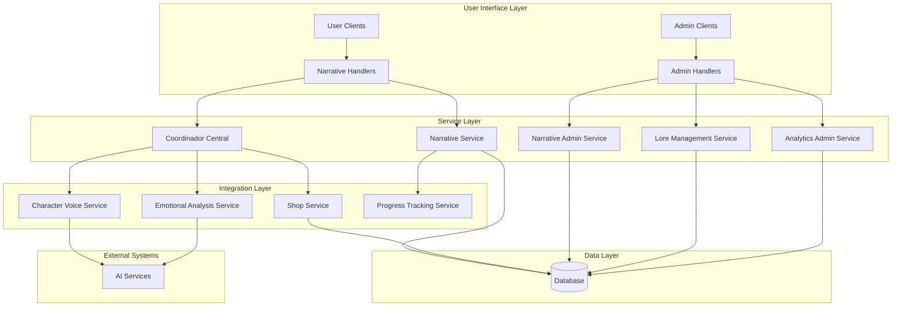

# Design Document

## Overview

The narrative module design represents the evolution from the current prototype validation system to a comprehensive, production-ready narrative experience. This design builds upon the existing foundation documented in the CoordinadorCentral orchestration system, the working shop integration, and the sophisticated character voice system outlined in Narrativo.md.

The design maintains the successful item-conditioning paradigm while adding sophisticated content management capabilities, enhanced user experience features, and comprehensive analytics. The system will preserve the existing shop integration that is already "totalmente funcional" while expanding the narrative possibilities.

## Steering Document Alignment

### Technical Standards Integration
- **Database Layer**: Extends existing narrative_models.py structure with enhanced metadata and content management capabilities
- **Service Layer**: Builds upon NarrativeService and ShopService with new admin services and enhanced user tracking
- **Handler Layer**: Expands admin_narrative_handlers.py with comprehensive content management interfaces
- **API Integration**: Maintains CoordinadorCentral orchestration patterns for seamless system integration

### Project Structure Adherence
- **Admin Interfaces**: Following established admin panel patterns in handlers/admin/ directory structure
- **Service Architecture**: Maintains separation of concerns with dedicated services for different functional areas
- **Database Models**: Extends existing models without breaking current schema relationships
- **Integration Patterns**: Preserves the working shop-narrative integration through CoordinadorCentral

## Code Reuse Analysis

### Existing Components to Leverage

#### Core Infrastructure
- **CoordinadorCentral**: Already orchestrates narrative-shop integration perfectly; will be extended with new narrative admin operations
- **NarrativeService**: Current implementation provides solid foundation for user progression; will be enhanced with advanced analytics and user journey tracking
- **ShopService**: Fully functional shop system with item inventory management; integration points already established
- **NarrativeLoader**: Existing JSON-based fragment loading system provides foundation for enhanced content management

#### Database Foundation
- **StoryFragment Model**: Current structure supports key-based referencing and character attribution; will be extended with enhanced metadata
- **NarrativeChoice Model**: Existing decision system with conditions; will be enhanced with advanced conditional logic
- **UserNarrativeState**: Current user progress tracking; will be expanded with detailed analytics data

#### Admin Infrastructure
- **Admin Authentication**: Existing admin check utilities and user role system
- **Admin UI Patterns**: Established keyboard layouts and handler patterns in admin/ directory
- **File Upload Systems**: Current narrative file upload capabilities in admin_narrative_handlers.py

### Integration Points

#### Shop System Integration
- **Existing Item-Condition Logic**: CoordinadorCentral.decision_requirements mapping system already working
- **Purchase Flow**: ShopService.purchase_item() with UserPurchase and lore piece unlocking
- **Inventory Management**: ShopService.has_item_in_inventory() verification system
- **Teaser System**: Current implementation of restricted content with teaser fragments

#### Character Voice Integration
- **CharacterVoiceService**: Advanced emotional intelligence system for Diana and Lucien responses
- **Emotional Context Mapping**: Existing user archetype detection and response adaptation
- **Character Consistency**: Established voice patterns and personality maintenance

## Architecture

The narrative module follows a layered architecture that integrates seamlessly with the existing system while providing new capabilities:



## Components and Interfaces

### Component 1: Enhanced Narrative Admin Service
- **Purpose:** Comprehensive content management system for narrative fragments and progression paths
- **Interfaces:** REST-like handler methods for CRUD operations on narrative content
- **Dependencies:** Database models, existing NarrativeLoader, file upload utilities
- **Reuses:** admin_narrative_handlers.py patterns, existing authentication, NarrativeLoader foundation

**Key Methods:**
```python
# Content Management
async def create_story_fragment(fragment_data: Dict) -> Result
async def update_story_fragment(fragment_id: str, updates: Dict) -> Result
async def delete_story_fragment(fragment_id: str) -> Result
async def get_fragment_with_analytics(fragment_id: str) -> FragmentAnalytics

# Progression Management
async def visualize_narrative_graph() -> GraphData
async def validate_narrative_consistency() -> ValidationReport
async def bulk_import_narrative_content(file_data: bytes) -> ImportResult
```

### Component 2: Advanced Lore Management Service
- **Purpose:** Creation, editing, and linking of lore pieces with shop items and narrative progression
- **Interfaces:** Visual lore piece management with rich content support and conditional logic
- **Dependencies:** ShopService integration, existing LorePiece model, UserLorePiece tracking
- **Reuses:** Shop item creation patterns, existing lore piece unlocking system, ShopService.purchase_item()

**Key Methods:**
```python
# Lore Piece Management
async def create_lore_piece(lore_data: Dict) -> Result
async def update_lore_piece(lore_id: int, updates: Dict) -> Result
async def link_lore_to_shop_item(lore_id: int, shop_item_id: int) -> Result
async def unlink_lore_from_shop_item(lore_id: int, shop_item_id: int) -> Result

# Content Organization
async def organize_lore_by_category(category_filters: Dict) -> CategorizedLore
async def search_lore_pieces(search_criteria: Dict) -> SearchResults
async def get_lore_unlock_analytics(lore_id: int) -> UnlockAnalytics
```

### Component 3: User Experience Enhancement Service
- **Purpose:** Sophisticated user journey tracking and personalized narrative experiences
- **Interfaces:** Real-time progress tracking, choice pattern analysis, emotional state adaptation
- **Dependencies:** CharacterVoiceService, EmotionalAnalysisService, existing UserNarrativeState
- **Reuses:** CoordinadorCentral orchestration, existing user archetype detection, character voice patterns

**Key Methods:**
```python
# User Journey Tracking
async def track_user_choice_patterns(user_id: int) -> ChoicePatterns
async def adapt_narrative_to_user_archetype(user_id: int, fragment_id: str) -> AdaptedFragment
async def generate_personalized_teaser_content(user_id: int, restricted_content: str) -> TeaserContent

# Progress Analytics
async def get_user_narrative_insights(user_id: int) -> UserInsights
async def predict_user_engagement_path(user_id: int) -> EngagementPrediction
async def generate_content_recommendations(user_id: int) -> ContentRecommendations
```

### Component 4: Comprehensive Analytics Service
- **Purpose:** Detailed analytics for content effectiveness, user engagement, and system optimization
- **Interfaces:** Real-time dashboards, exportable reports, predictive analytics
- **Dependencies:** Database aggregation queries, existing user tracking data
- **Reuses:** Existing user progress data, shop purchase analytics, CoordinadorCentral flow tracking

**Key Methods:**
```python
# Content Analytics
async def get_fragment_engagement_metrics(fragment_id: str) -> EngagementMetrics
async def analyze_choice_distribution_patterns() -> ChoiceDistribution
async def identify_narrative_bottlenecks() -> BottleneckReport

# User Analytics
async def generate_user_segment_analysis() -> SegmentAnalysis
async def track_conversion_funnel_metrics() -> ConversionFunnel
async def export_analytics_data(date_range: Tuple, format: str) -> ExportData
```

### Component 5: Enhanced Character Intelligence Service
- **Purpose:** Advanced character voice adaptation and emotional intelligence integration
- **Interfaces:** Real-time character response generation, emotional state analysis, relationship evolution
- **Dependencies:** CharacterVoiceService, EmotionalAnalysisService, user interaction history
- **Reuses:** Existing character voice patterns, emotional context mapping, user archetype detection

**Key Methods:**
```python
# Character Intelligence
async def generate_contextual_character_response(context: InteractionContext) -> CharacterResponse
async def analyze_relationship_evolution(user_id: int, character: str) -> RelationshipInsights
async def adapt_character_intimacy_level(user_id: int, progression_data: Dict) -> IntimacyLevel

# Emotional Intelligence
async def process_user_emotional_state(user_id: int, interaction_data: Dict) -> EmotionalState
async def recommend_narrative_adjustments(emotional_context: Dict) -> NarrativeAdjustments
async def maintain_character_consistency(character: str, response_history: List) -> ConsistencyCheck
```

## Data Models

### Enhanced StoryFragment Model
```python
class StoryFragment(Base):
    # Existing fields preserved
    id: int
    key: str  # Unique identifier
    text: str  # Fragment content
    character: str  # Diana, Lucien, etc.
    level: int  # Access level
    min_besitos: int  # Required points
    reward_besitos: int  # Points awarded

    # Enhanced metadata
    content_type: str  # text, rich_text, interactive
    emotional_tone: str  # intimate, playful, mysterious, etc.
    user_archetype_tags: JSON  # Target archetypes
    analytics_metadata: JSON  # Engagement tracking data
    content_warnings: JSON  # Content advisory information
    localization_data: JSON  # Multi-language support

    # Advanced conditions
    complex_unlock_conditions: JSON  # Advanced conditional logic
    prerequisite_fragments: List[str]  # Required previous fragments
    unlock_analytics: JSON  # Track unlock patterns
```

### Enhanced LorePiece Model
```python
class LorePiece(Base):
    # Existing fields preserved
    id: int
    title: str
    content: str
    content_type: str

    # Enhanced content management
    rich_content_data: JSON  # Images, videos, interactive elements
    content_metadata: JSON  # Tags, categories, search keywords
    unlock_condition_tree: JSON  # Complex conditional logic
    related_lore_pieces: List[int]  # Content relationships

    # Analytics integration
    access_analytics: JSON  # Track access patterns
    engagement_metrics: JSON  # User interaction data
    content_effectiveness: JSON  # Performance metrics
```

### Enhanced UserNarrativeState Model
```python
class UserNarrativeState(Base):
    # Existing fields preserved
    user_id: int
    current_fragment_key: str
    choices_made: JSON
    fragments_visited: int

    # Enhanced user tracking
    choice_patterns: JSON  # Pattern analysis data
    emotional_journey: JSON  # Emotional state progression
    archetype_classification: JSON  # User personality analysis
    relationship_progress: JSON  # Character relationship data

    # Advanced analytics
    engagement_metrics: JSON  # Detailed interaction metrics
    content_preferences: JSON  # User preference analysis
    progression_predictions: JSON  # Predicted user paths
```

### New Analytics Models
```python
class FragmentAnalytics(Base):
    fragment_id: str
    total_views: int
    completion_rate: float
    average_time_spent: float
    choice_distribution: JSON
    user_feedback_scores: JSON
    conversion_metrics: JSON

class UserJourneyAnalytics(Base):
    user_id: int
    journey_start: DateTime
    total_fragments_viewed: int
    total_choices_made: int
    archetype_evolution: JSON
    emotional_progression: JSON
    purchase_correlation: JSON
```

## Error Handling

### Error Scenarios and Handling Strategies

#### Scenario 1: Content Management Errors
- **Description:** Fragment creation/editing failures, invalid narrative flow configurations
- **Handling:** Validation layer with rollback capabilities, detailed error reporting for admins
- **User Impact:** Admin sees specific validation errors with suggestions for fixes

#### Scenario 2: Integration Failures
- **Description:** Shop service unavailable, character voice service errors, database connectivity issues
- **Handling:** Graceful degradation with fallback responses, queue-based retry mechanisms
- **User Impact:** Basic narrative functionality maintained with simple responses

#### Scenario 3: Analytics Processing Errors
- **Description:** Large dataset processing failures, real-time analytics service unavailable
- **Handling:** Async processing with error queues, cached analytics data for critical displays
- **User Impact:** Delayed analytics updates but core functionality preserved

#### Scenario 4: Character Intelligence Failures
- **Description:** AI service unavailable, emotional analysis errors, character consistency breaks
- **Handling:** Fallback to predefined character responses, maintain character voice patterns
- **User Impact:** Slightly less personalized experience but character authenticity preserved

#### Scenario 5: User Data Corruption
- **Description:** Narrative state inconsistencies, choice history corruption, progress loss
- **Handling:** Data validation and repair utilities, progress recovery from analytics data
- **User Impact:** Automated recovery with minimal progress loss, admin intervention for complex cases

## Testing Strategy

### Unit Testing
- **Content Management**: Test all CRUD operations for fragments and lore pieces
- **Analytics Engine**: Verify calculation accuracy for engagement metrics and user insights
- **Character Intelligence**: Test character response generation and consistency maintenance
- **Integration Logic**: Validate shop-narrative integration and CoordinadorCentral orchestration

### Integration Testing
- **End-to-End User Flows**: Complete narrative progression with item purchases and unlocks
- **Admin Workflows**: Full content creation and management processes
- **Analytics Pipeline**: Data collection through processing to report generation
- **Character Voice Integration**: Real-time character response generation with emotional context

### End-to-End Testing
- **Complete User Journeys**: New user onboarding through advanced narrative levels
- **Admin Content Management**: Full content lifecycle from creation to analytics review
- **Shop Integration Scenarios**: Item purchase to narrative unlock workflows
- **System Performance**: Load testing with concurrent users and content management operations