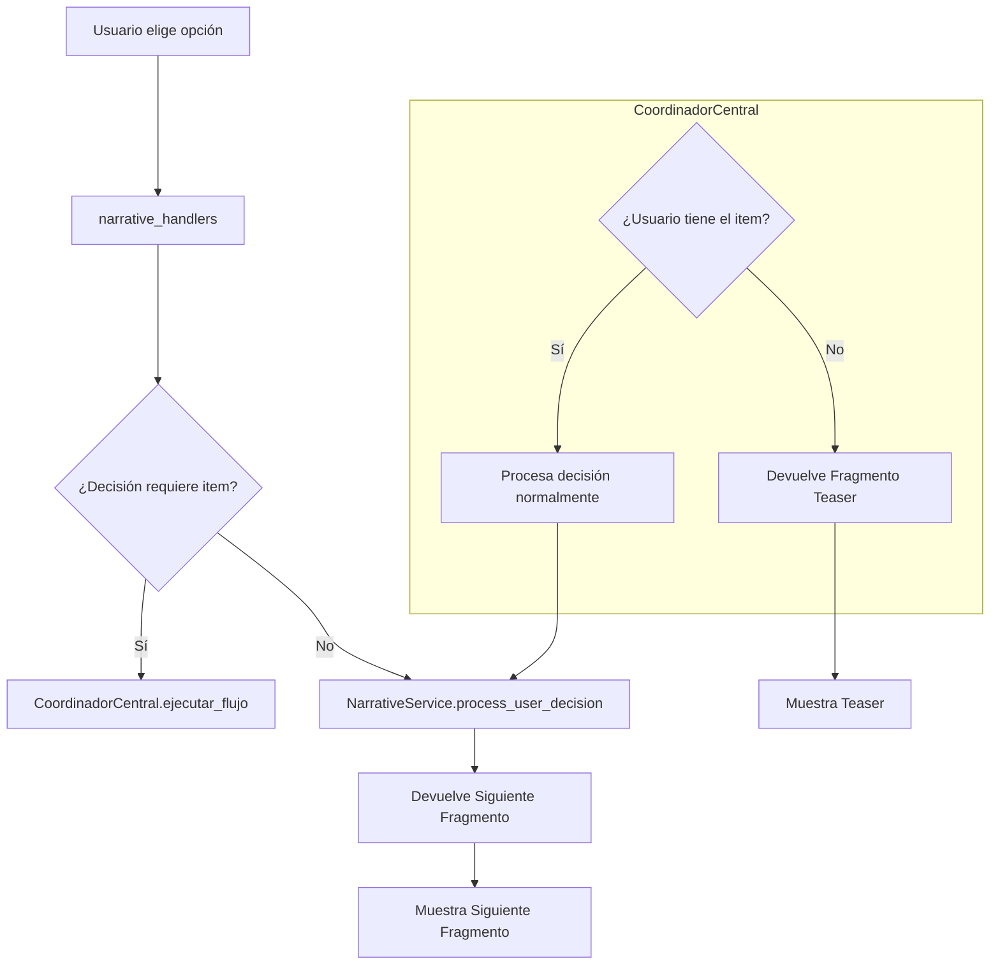
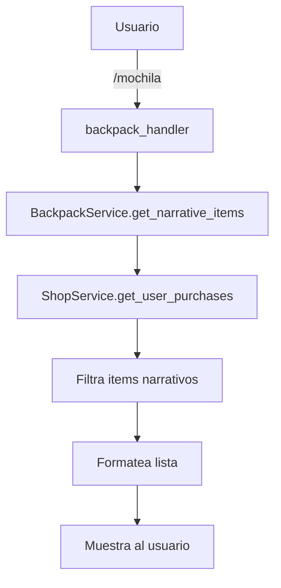

# Diseño del Sistema de Narrativa

## 1. Arquitectura General

La arquitectura se basará en los patrones existentes, extendiendo el sistema con un nuevo módulo de administración y mejorando la interacción entre los servicios existentes. La `CoordinadorCentral` seguirá siendo el orquestador principal para las interacciones complejas que cruzan diferentes dominios (narrativa, tienda, gamificación).

### Diagrama de Componentes Principales
```mermaid
graph TD
    subgraph User Facing
        A[Usuario (Jugador)]
        B[Usuario (Admin)]
    end

    subgraph Bot Application
        subgraph Handlers
            H1[narrative_handlers.py]
            H2[admin_narrative_handlers.py]
        end

        subgraph Services
            S1[NarrativeService]
            S2[ShopService]
            S3[CoordinadorCentral]
            S4[AdminNarrativeService]
        end

        subgraph Database
            DB[(PostgreSQL/SQLite)]
        end
    end

    A --> H1
    B --> H2
    H1 --> S3
    H2 --> S4
    S3 --> S1
    S3 --> S2
    S4 --> S1
    S1 --> DB
    S2 --> DB
```

## 2. Diseño del Sistema de Administración de Narrativa

Se creará un nuevo conjunto de manejadores y servicios para permitir la administración de la narrativa a través de comandos de Telegram.

### Componentes del Módulo de Administración
- **Handlers (`handlers/admin/narrative_admin_handlers.py`):** Contendrá los manejadores de comandos para los administradores (e.g., `/narrativa_admin`). Utilizará FSM para operaciones de varios pasos.
- **Services (`services/admin/narrative_admin_service.py`):** Encapsulará la lógica de negocio para las operaciones CRUD sobre los fragmentos y decisiones.
- **Keyboards (`keyboards/admin/narrative_admin_kb.py`):** Proveerá los teclados en línea para la interfaz de administración.

### Diagrama de Flujo del Administrador
```mermaid
graph TD
    A[Admin] -- /narrativa_admin --> B[narrative_admin_handlers]
    B --> C[Muestra Menú Principal]
    C -- Selecciona "Gestionar Fragmentos" --> D[Flujo de Fragmentos]
    D -- "Crear Nuevo" --> E[Inicia FSM para crear fragmento]
    E --> F[Pide 'key']
    F --> G[Pide 'texto']
    G --> H[...otros campos]
    H --> I[AdminNarrativeService.create_fragment]
    I --> J[Guarda en BD]
    J --> K[Confirma creación]
```

### Comandos de Administración
- `/narrativa_admin`: Muestra el menú principal de administración de narrativa.
- `/narrativa_fragmentos`: Inicia el flujo para gestionar fragmentos (CRUD).
- `/narrativa_decisiones <fragment_key>`: Inicia el flujo para gestionar las decisiones de un fragmento específico.
- `/narrativa_grafo`: (Opcional) Genera y muestra una representación del grafo narrativo.

## 3. Diseño del Flujo de Contenido Condicionado por Items

Este diseño formaliza el flujo descrito en la guía proporcionada. La `CoordinadorCentral` es clave para este flujo.

### Diagrama de Flujo de Decisión Condicionada


La lógica de `decision_requirements` dentro de `CoordinadorCentral` será la fuente de verdad para determinar qué decisiones requieren items.

## 4. Diseño de Mejoras en la Experiencia de Usuario

### Inventario / Mochila del Jugador

Para que los jugadores puedan ver los items que desbloquean narrativa, se creará un nuevo comando.

- **Comando:** `/mochila`
- **Handler (`handlers/user/backpack_handler.py`):** Un nuevo manejador que responderá al comando `/mochila`.
- **Servicio (`services/user/backpack_service.py`):** Un nuevo servicio que:
    1. Obtiene las compras del usuario desde `ShopService`.
    2. Filtra los items que son relevantes para la narrativa (e.g., aquellos que tienen `unlocks_lore_piece_id`).
    3. Formatea la lista de items y la presenta al usuario.

### Flujo del Comando `/mochila`


## 5. Modelo de Datos

El modelo de datos existente (`database/narrative_models.py`) es robusto y soporta los requisitos. No se necesitan cambios mayores en la estructura de `StoryFragment`, `NarrativeChoice` o `UserNarrativeState`. Las nuevas funcionalidades se construirán sobre este modelo.
