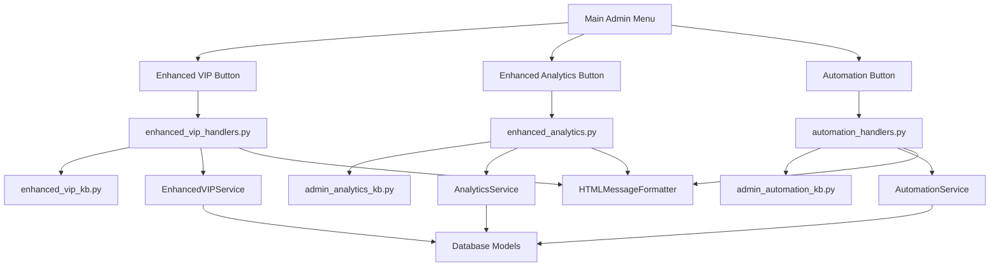

# conectar-menu - Task 17

Execute task 17 for the conectar-menu specification.

## Task Description
Add enhanced feature error handling to menu navigation

## Code Reuse
**Leverage existing code**: existing error handling patterns, menu cleanup functionality

## Requirements Reference
**Requirements**: 2.1.4

## Usage
```
/Task:17-conectar-menu
```

## Instructions

Execute with @spec-task-executor agent the following task: "Add enhanced feature error handling to menu navigation"

```
Use the @spec-task-executor agent to implement task 17: "Add enhanced feature error handling to menu navigation" for the conectar-menu specification and include all the below context.

# Steering Context
## Steering Documents Context

No steering documents found or all are empty.

# Specification Context
## Specification Context (Pre-loaded): conectar-menu

### Requirements
# Requirements Document - Menu Integration for Admin Module

## Introduction

The Admin Module Menu Integration addresses the gap between existing enhanced administrative functionality and its accessibility through the bot's user interface. While the modulo-admon tasks created comprehensive backend services and handlers (`enhanced_vip_handlers.py`, `enhanced_analytics.py`, `automation_handlers.py`), many of these features lack proper menu button connections, callback registrations, and UI pathways.

Analysis shows that enhanced handlers exist but are not fully accessible through the admin menu buttons, creating a disconnect between powerful backend functionality and user interface access. This specification focuses on completing the menu integration by adding missing buttons, callbacks, and navigation paths to make all enhanced features properly accessible.

## Alignment with Product Vision

This integration is essential for DianaBot's administrative efficiency and user experience because it:
- **Accessibility**: Makes all enhanced admin features actually usable through the UI
- **User Experience**: Provides intuitive navigation to powerful backend functionality
- **Administrative Efficiency**: Enables administrators to access enhanced tools without technical knowledge
- **Feature Utilization**: Ensures the investment in modulo-admon backend development pays off through actual usage
- **Seamless Integration**: Connects advanced features to the existing familiar menu structure

## Requirements

### Requirement 1.1: Missing Enhanced VIP Menu Connections

**User Story:** As a bot administrator, I want to access the enhanced VIP management features in `enhanced_vip_handlers.py` through dedicated menu buttons so that I can use batch token generation, VIP analytics, and reminder management capabilities.

#### Acceptance Criteria

1. WHEN the administrator accesses VIP management THEN the system SHALL provide a button to access enhanced VIP features beyond basic VIP menu
2. WHEN "Enhanced VIP" or "VIP Analytics" is clicked THEN the system SHALL route to callbacks in `enhanced_vip_handlers.py`
3. WHEN batch token generation is accessed THEN the system SHALL connect to the `batch_token_generation()` handler in enhanced VIP handlers
4. IF VIP analytics are requested THEN the system SHALL route to `vip_analytics_display()` handler with comprehensive metrics
5. WHEN VIP reminder management is selected THEN the system SHALL connect to `reminder_management()` functionality
6. WHEN enhanced VIP features are accessed THEN the system SHALL use HTML formatting from existing HTMLMessageFormatter

### Requirement 1.2: Missing Enhanced Analytics Menu Access

**User Story:** As an administrator, I want to access the comprehensive analytics features in `enhanced_analytics.py` through the admin menu so that I can view advanced reports and data export capabilities beyond basic analytics.

#### Acceptance Criteria

1. WHEN the administrator selects analytics THEN the system SHALL provide access to both basic analytics and enhanced analytics options
2. WHEN "Enhanced Analytics" is clicked THEN the system SHALL route to handlers in `enhanced_analytics.py`
3. WHEN comprehensive dashboard is requested THEN the system SHALL connect to `show_enhanced_analytics_main()` handler
4. IF advanced reporting is selected THEN the system SHALL provide access to chart generation and export functionality from analytics service
5. WHEN real-time analytics are needed THEN the system SHALL route to enhanced analytics with live data capabilities
6. WHEN analytics export is requested THEN the system SHALL provide JSON/CSV export options through enhanced analytics handlers

### Requirement 1.3: Missing Automation Controls Menu Integration

**User Story:** As an administrator, I want to access the automation features in `automation_handlers.py` through the admin menu so that I can configure and monitor automated tasks without requiring technical knowledge.

#### Acceptance Criteria

1. WHEN the admin menu displays automation options THEN the system SHALL route to callbacks in `automation_handlers.py`
2. WHEN automation configuration is accessed THEN the system SHALL connect to automation status and configuration handlers
3. WHEN automation scheduling is needed THEN the system SHALL provide interface to automation service scheduling functionality
4. IF automation is available (AUTOMATION_AVAILABLE = True) THEN the system SHALL display automation buttons in the enhanced admin menu
5. WHEN automation logs are requested THEN the system SHALL provide access to automation history through existing handlers
6. WHEN manual automation triggers are needed THEN the system SHALL connect to cleanup and task execution handlers

### Requirement 1.4: Enhanced Channel Management Access

**User Story:** As an administrator, I want to access the enhanced channel management features through improved menu navigation so that I can efficiently manage content and user access using existing enhanced services.

#### Acceptance Criteria

1. WHEN channel administration is selected THEN the system SHALL provide access to enhanced channel management through proper callback routing
2. WHEN content management is accessed THEN the system SHALL connect to channel admin service functionality for content protection
3. WHEN bulk channel operations are needed THEN the system SHALL provide access to batch management functions in channel admin service
4. IF enhanced channel features are available THEN the system SHALL display appropriate buttons in admin keyboard layouts
5. WHEN channel analytics are requested THEN the system SHALL route to channel engagement metrics in analytics service
6. WHEN channel security features are accessed THEN the system SHALL connect to content protection capabilities

### Requirement 2.1: Callback Handler Registration and Routing

**User Story:** As a system developer, I want all enhanced admin feature buttons to have properly registered callback handlers so that menu navigation routes correctly to existing enhanced functionality.

#### Acceptance Criteria

1. WHEN enhanced VIP buttons are added to keyboards THEN the system SHALL register callbacks that route to `enhanced_vip_handlers.py` functions
2. WHEN enhanced analytics buttons are clicked THEN the system SHALL route to existing callbacks in `enhanced_analytics.py`
3. WHEN automation buttons are activated THEN the system SHALL connect to registered handlers in `automation_handlers.py`
4. IF enhanced features fail to load THEN the system SHALL provide graceful fallback to basic admin functionality
5. WHEN new callback data is defined THEN the system SHALL ensure unique callback strings that don't conflict with existing handlers
6. WHEN routing occurs THEN the system SHALL maintain proper menu state and navigation history using existing menu_manager patterns

## Non-Functional Requirements

### Performance
- Menu navigation to enhanced features must respond in less than 2 seconds
- Analytics data loading must complete within 5 seconds for standard reports
- Batch operations must provide progress feedback for operations taking longer than 3 seconds
- Menu state transitions must be instantaneous with proper loading indicators

### Usability
- All enhanced features must be accessible within 3 clicks from the main admin menu
- Menu button labels must clearly indicate enhanced vs basic functionality
- Navigation flow must be intuitive with consistent back/forward button behavior
- Error messages must guide users back to working functionality

### Compatibility
- New menu integration must not break existing admin functionality
- Enhanced features must gracefully degrade if backend services are unavailable
- Menu structure must work with existing HTML formatting and cleanup systems
- Integration must be compatible with current admin security and permission systems

### Reliability
- Menu integration must handle service failures gracefully with fallback options
- Navigation state must be preserved during temporary connectivity issues
- Enhanced feature access must work consistently across all admin user sessions
- Menu cleanup must function properly with new enhanced menu states

---

### Design
# Design Document - Menu Integration for Admin Module

## Overview

The Menu Integration for Admin Module is a focused implementation that connects existing enhanced administrative functionality to the bot's user interface. The codebase analysis reveals that comprehensive backend handlers exist (`enhanced_vip_handlers.py`, `enhanced_analytics.py`, `automation_handlers.py`) along with their corresponding keyboard layouts (`enhanced_vip_kb.py`, `admin_automation_kb.py`), but the main admin menu lacks proper routing to these enhanced features.

This design focuses on bridging the gap between the main admin menu entry points and the existing enhanced functionality without recreating existing components.

## Steering Document Alignment

### Technical Standards
The implementation follows existing aiogram patterns with:
- InlineKeyboardBuilder for menu construction
- Router-based callback handling in handlers/admin/ directory
- MenuManager integration for state management and HTML formatting
- Consistent callback_data naming conventions

### Project Structure
All modifications follow established project conventions:
- Menu keyboards in `keyboards/` directory
- Admin handlers in `handlers/admin/` directory
- Service integration through existing dependency patterns
- HTML formatting through existing `utils/html_formatter.py`

## Code Reuse Analysis

### Existing Components to Leverage

**Enhanced Handlers (Already Implemented)**:
- **enhanced_vip_handlers.py**: Contains `batch_token_generation()`, `vip_analytics_display()`, `reminder_management()` functions
- **enhanced_analytics.py**: Contains `show_enhanced_analytics_main()` and comprehensive analytics handlers
- **automation_handlers.py**: Contains automation configuration and monitoring handlers

**Keyboard Infrastructure (Exists but Disconnected)**:
- **enhanced_vip_kb.py**: Complete keyboard layouts with callbacks like `vip_enhanced_batch_tokens`, `vip_enhanced_analytics`
- **admin_automation_kb.py**: Automation control keyboards with callbacks like `automation_start_all`, `automation_config`
- **admin_enhanced_kb.py**: Enhanced admin keyboards with callbacks like `admin_vip_enhanced`, `admin_analytics_enhanced`

**Menu Management System (Fully Available)**:
- **menu_manager.py**: HTML formatting, cleanup, and state management
- **html_formatter.py**: Existing HTML formatting for enhanced presentation

### Integration Points

**Current Menu Structure**: The main admin menu in `admin_main_kb.py` routes to basic handlers but lacks connections to enhanced versions:
- `admin_vip` → needs route to enhanced VIP features
- `admin_analytics_main` → needs route to enhanced analytics options
- `automation` → exists but conditional on AUTOMATION_AVAILABLE

**Service Integration**: Enhanced services are available and imported in handlers:
- `EnhancedVIPService` for batch operations and analytics
- `AnalyticsService` for comprehensive reporting
- `AutomationService` for task scheduling and management

## Architecture

The integration architecture follows a layered approach connecting existing components:



## Components and Interfaces

### Component 1: Enhanced Admin Main Keyboard
- **Purpose**: Extend main admin keyboard with buttons routing to enhanced features
- **Interfaces**:
  - `get_enhanced_admin_main_kb()` - returns keyboard with enhanced feature buttons
  - Add enhanced VIP, analytics, and automation access buttons
- **Dependencies**: Existing keyboard builder patterns, availability flags
- **Reuses**: Current `admin_main_kb.py` structure and layout patterns

### Component 2: Callback Router Extensions
- **Purpose**: Register callback handlers for enhanced feature access buttons
- **Interfaces**:
  - Enhanced VIP access callback: `admin_vip_enhanced` → `enhanced_vip_handlers.py`
  - Enhanced analytics callback: `admin_analytics_enhanced` → `enhanced_analytics.py`
  - Direct automation access: ensure `automation` callback is properly registered
- **Dependencies**: Existing callback routing in `admin_menu.py`
- **Reuses**: Current callback registration patterns and menu_manager routing

### Component 3: Menu Navigation Enhancement
- **Purpose**: Improve menu flow to provide access to both basic and enhanced features
- **Interfaces**:
  - Basic vs Enhanced selection menus for VIP and Analytics
  - Breadcrumb navigation for enhanced features
  - Consistent back navigation to main menu
- **Dependencies**: MenuManager state management, existing keyboard layouts
- **Reuses**: Existing navigation patterns and menu state tracking

### Component 4: Feature Availability Detection
- **Purpose**: Detect and enable enhanced features based on service availability
- **Interfaces**:
  - `ENHANCED_VIP_AVAILABLE` flag based on service import success
  - `ENHANCED_ANALYTICS_AVAILABLE` flag for analytics features
  - `AUTOMATION_AVAILABLE` flag (already exists)
- **Dependencies**: Service import success, error handling patterns
- **Reuses**: Existing availability detection pattern used for automation

## Data Models

### Complete Callback Data Mapping
```python
# Comprehensive callback mapping for all enhanced features
ENHANCED_CALLBACK_MAPPING = {
    # Enhanced VIP Access
    "enhanced_vip_main": {
        "button_text": "💎 VIP Avanzado",
        "callback_data": "admin_vip_enhanced",
        "handler": "enhanced_vip_handlers.show_enhanced_vip_main",
        "requirements": ["1.1.1", "1.1.2"]
    },
    "vip_batch_tokens": {
        "button_text": "📦 Tokens en Lote",
        "callback_data": "vip_enhanced_batch_tokens",
        "handler": "enhanced_vip_handlers.batch_token_generation",
        "requirements": ["1.1.3"]
    },
    "vip_analytics": {
        "button_text": "📊 Analytics VIP",
        "callback_data": "vip_enhanced_analytics",
        "handler": "enhanced_vip_handlers.vip_analytics_display",
        "requirements": ["1.1.4"]
    },

    # Enhanced Analytics Access
    "enhanced_analytics_main": {
        "button_text": "📈 Analytics Plus",
        "callback_data": "admin_analytics_enhanced",
        "handler": "enhanced_analytics.show_enhanced_analytics_main",
        "requirements": ["1.2.2", "1.2.3"]
    },
    "analytics_export": {
        "button_text": "📁 Exportar Datos",
        "callback_data": "analytics_export_data",
        "handler": "enhanced_analytics.export_analytics_data",
        "requirements": ["1.2.6"]
    },

    # Automation Access
    "automation_main": {
        "button_text": "🤖 Automatización",
        "callback_data": "automation",
        "handler": "automation_handlers.show_automation_main",
        "requirements": ["1.3.1", "1.3.2"]
    },

    # Enhanced Channel Management
    "enhanced_channel_admin": {
        "button_text": "🏢 Canales Plus",
        "callback_data": "admin_channel_enhanced",
        "handler": "channel_admin.show_enhanced_channel_menu",
        "requirements": ["1.4.1", "1.4.2"]
    }
}
```

### Service Availability Flags
```python
# Service availability detection pattern
SERVICE_AVAILABILITY = {
    "enhanced_vip": {
        "import_path": "handlers.admin.enhanced_vip_handlers",
        "flag_name": "ENHANCED_VIP_AVAILABLE",
        "fallback": "admin_vip"  # Basic VIP menu
    },
    "enhanced_analytics": {
        "import_path": "handlers.admin.enhanced_analytics",
        "flag_name": "ENHANCED_ANALYTICS_AVAILABLE",
        "fallback": "admin_analytics_main"  # Basic analytics
    },
    "automation": {
        "import_path": "handlers.admin.automation_handlers",
        "flag_name": "AUTOMATION_AVAILABLE",
        "fallback": None  # Hide button if unavailable
    }
}
```

## Error Handling

### Error Scenarios

1. **Enhanced Service Unavailable**
   - **Handling**: Graceful fallback to basic admin functionality
   - **User Impact**: Show message indicating enhanced features temporarily unavailable

2. **Import Failures for Enhanced Handlers**
   - **Handling**: Disable enhanced buttons, log warning, continue with basic functionality
   - **User Impact**: Enhanced buttons not displayed, basic functionality remains available

3. **Navigation State Corruption**
   - **Handling**: Reset to main admin menu, log error for debugging
   - **User Impact**: Return to known good state (main admin menu)

## Testing Strategy

### Unit Testing
- Test keyboard generation with different availability flags
- Test callback routing to correct handlers
- Test error handling for unavailable services

### Integration Testing
- Test complete navigation flow from main menu to enhanced features
- Test back navigation and menu state preservation
- Test HTML formatting integration with enhanced features

### End-to-End Testing
- Test admin user accessing enhanced VIP features through menu
- Test analytics access and data display
- Test automation control accessibility and functionality

## Implementation Approach

### Phase 1: Service Availability Detection (File: handlers/admin/admin_menu.py)
**Objective**: Implement robust detection for enhanced services
- Add try/catch blocks for importing enhanced handlers following existing AUTOMATION_AVAILABLE pattern
- Create availability flags: ENHANCED_VIP_AVAILABLE, ENHANCED_ANALYTICS_AVAILABLE
- Log warnings for unavailable services without breaking basic functionality
- **Expected outcome**: Clean service availability detection without import errors

### Phase 2: Enhanced Keyboard Implementation (File: keyboards/admin_main_kb.py)
**Objective**: Modify main admin keyboard to include enhanced feature access
- Replace current `get_enhanced_admin_main_kb()` implementation that just returns basic keyboard
- Add conditional buttons based on availability flags:
  - "💎 VIP Avanzado" button when ENHANCED_VIP_AVAILABLE
  - "📈 Analytics Plus" button when ENHANCED_ANALYTICS_AVAILABLE
  - Ensure automation button uses existing AUTOMATION_AVAILABLE logic
- Maintain existing layout structure and button organization
- **Expected outcome**: Enhanced buttons appear in main admin menu when services available

### Phase 3: Callback Registration (File: handlers/admin/admin_menu.py)
**Objective**: Register callback handlers for enhanced feature buttons
- Add callback handlers for each enhanced feature following existing patterns:
  ```python
  @router.callback_query(F.data == "admin_vip_enhanced")
  async def enhanced_vip_access(callback: CallbackQuery, session: AsyncSession):
      # Route to enhanced_vip_handlers.show_enhanced_vip_main
  ```
- Implement admin permission checking using existing `is_admin()` function
- Use existing menu_manager for state transitions and HTML formatting
- Add error handling with fallback to basic functionality
- **Expected outcome**: All enhanced buttons route correctly to corresponding handlers

### Phase 4: Analytics Export Integration (File: handlers/admin/enhanced_analytics.py)
**Objective**: Ensure analytics export functionality is accessible through UI
- Verify `export_analytics_data()` handler exists and is accessible
- Add export button to enhanced analytics keyboard if missing
- Implement JSON/CSV export options as required by acceptance criteria 1.2.6
- **Expected outcome**: Complete analytics export functionality available through UI

### Phase 5: Channel Management Enhancement (File: handlers/admin/channel_admin.py)
**Objective**: Provide enhanced channel management access
- Create or enhance channel administration menu to include bulk operations
- Connect to existing channel_admin_service functionality
- Add enhanced channel management button to main menu
- **Expected outcome**: Enhanced channel management accessible through improved navigation

### Phase 6: Performance Optimization
**Objective**: Meet non-functional requirements for response times
- Implement loading indicators for operations taking longer than 2 seconds
- Optimize database queries in analytics handlers to meet 5-second requirement
- Add progress feedback for batch operations taking longer than 3 seconds
- **Expected outcome**: All performance requirements met

### Phase 7: Integration Testing and Validation
**Objective**: Comprehensive testing of all integration points
- Test each enhanced feature access path from main menu
- Verify fallback behavior when services unavailable
- Test HTML formatting consistency across all enhanced features
- Validate admin permission enforcement across all new routes
- **Expected outcome**: Robust, tested integration with no breaking changes

## Success Metrics

- All enhanced handlers accessible through UI navigation
- Menu navigation completes in under 2 seconds
- No breaking changes to existing basic admin functionality
- Proper fallback behavior when enhanced services unavailable
- Consistent HTML formatting across all enhanced features

**Note**: Specification documents have been pre-loaded. Do not use get-content to fetch them again.

## Task Details
- Task ID: 17
- Description: Add enhanced feature error handling to menu navigation
- Leverage: existing error handling patterns, menu cleanup functionality
- Requirements: 2.1.4

## Instructions
- Implement ONLY task 17: "Add enhanced feature error handling to menu navigation"
- Follow all project conventions and leverage existing code
- Mark the task as complete using: claude-code-spec-workflow get-tasks conectar-menu 17 --mode complete
- Provide a completion summary
```

## Task Completion
When the task is complete, mark it as done:
```bash
claude-code-spec-workflow get-tasks conectar-menu 17 --mode complete
```

## Next Steps
After task completion, you can:
- Execute the next task using /conectar-menu-task-[next-id]
- Check overall progress with /spec-status conectar-menu
