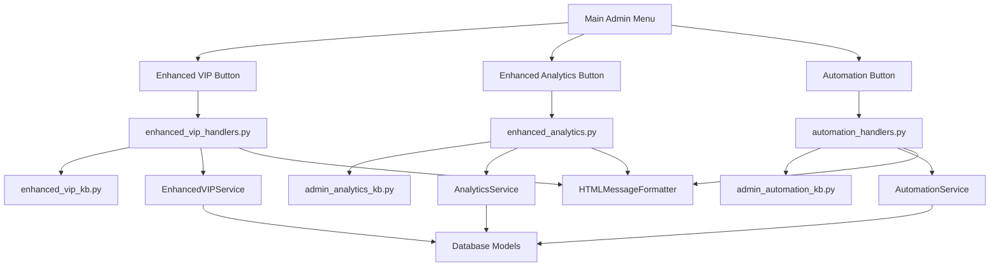

# Design Document - Menu Integration for Admin Module

## Overview

The Menu Integration for Admin Module is a focused implementation that connects existing enhanced administrative functionality to the bot's user interface. The codebase analysis reveals that comprehensive backend handlers exist (`enhanced_vip_handlers.py`, `enhanced_analytics.py`, `automation_handlers.py`) along with their corresponding keyboard layouts (`enhanced_vip_kb.py`, `admin_automation_kb.py`), but the main admin menu lacks proper routing to these enhanced features.

This design focuses on bridging the gap between the main admin menu entry points and the existing enhanced functionality without recreating existing components.

## Steering Document Alignment

### Technical Standards
The implementation follows existing aiogram patterns with:
- InlineKeyboardBuilder for menu construction
- Router-based callback handling in handlers/admin/ directory
- MenuManager integration for state management and HTML formatting
- Consistent callback_data naming conventions

### Project Structure
All modifications follow established project conventions:
- Menu keyboards in `keyboards/` directory
- Admin handlers in `handlers/admin/` directory
- Service integration through existing dependency patterns
- HTML formatting through existing `utils/html_formatter.py`

## Code Reuse Analysis

### Existing Components to Leverage

**Enhanced Handlers (Already Implemented)**:
- **enhanced_vip_handlers.py**: Contains `batch_token_generation()`, `vip_analytics_display()`, `reminder_management()` functions
- **enhanced_analytics.py**: Contains `show_enhanced_analytics_main()` and comprehensive analytics handlers
- **automation_handlers.py**: Contains automation configuration and monitoring handlers

**Keyboard Infrastructure (Exists but Disconnected)**:
- **enhanced_vip_kb.py**: Complete keyboard layouts with callbacks like `vip_enhanced_batch_tokens`, `vip_enhanced_analytics`
- **admin_automation_kb.py**: Automation control keyboards with callbacks like `automation_start_all`, `automation_config`
- **admin_enhanced_kb.py**: Enhanced admin keyboards with callbacks like `admin_vip_enhanced`, `admin_analytics_enhanced`

**Menu Management System (Fully Available)**:
- **menu_manager.py**: HTML formatting, cleanup, and state management
- **html_formatter.py**: Existing HTML formatting for enhanced presentation

### Integration Points

**Current Menu Structure**: The main admin menu in `admin_main_kb.py` routes to basic handlers but lacks connections to enhanced versions:
- `admin_vip` → needs route to enhanced VIP features
- `admin_analytics_main` → needs route to enhanced analytics options
- `automation` → exists but conditional on AUTOMATION_AVAILABLE

**Service Integration**: Enhanced services are available and imported in handlers:
- `EnhancedVIPService` for batch operations and analytics
- `AnalyticsService` for comprehensive reporting
- `AutomationService` for task scheduling and management

## Architecture

The integration architecture follows a layered approach connecting existing components:



## Components and Interfaces

### Component 1: Enhanced Admin Main Keyboard
- **Purpose**: Extend main admin keyboard with buttons routing to enhanced features
- **Interfaces**:
  - `get_enhanced_admin_main_kb()` - returns keyboard with enhanced feature buttons
  - Add enhanced VIP, analytics, and automation access buttons
- **Dependencies**: Existing keyboard builder patterns, availability flags
- **Reuses**: Current `admin_main_kb.py` structure and layout patterns

### Component 2: Callback Router Extensions
- **Purpose**: Register callback handlers for enhanced feature access buttons
- **Interfaces**:
  - Enhanced VIP access callback: `admin_vip_enhanced` → `enhanced_vip_handlers.py`
  - Enhanced analytics callback: `admin_analytics_enhanced` → `enhanced_analytics.py`
  - Direct automation access: ensure `automation` callback is properly registered
- **Dependencies**: Existing callback routing in `admin_menu.py`
- **Reuses**: Current callback registration patterns and menu_manager routing

### Component 3: Menu Navigation Enhancement
- **Purpose**: Improve menu flow to provide access to both basic and enhanced features
- **Interfaces**:
  - Basic vs Enhanced selection menus for VIP and Analytics
  - Breadcrumb navigation for enhanced features
  - Consistent back navigation to main menu
- **Dependencies**: MenuManager state management, existing keyboard layouts
- **Reuses**: Existing navigation patterns and menu state tracking

### Component 4: Feature Availability Detection
- **Purpose**: Detect and enable enhanced features based on service availability
- **Interfaces**:
  - `ENHANCED_VIP_AVAILABLE` flag based on service import success
  - `ENHANCED_ANALYTICS_AVAILABLE` flag for analytics features
  - `AUTOMATION_AVAILABLE` flag (already exists)
- **Dependencies**: Service import success, error handling patterns
- **Reuses**: Existing availability detection pattern used for automation

## Data Models

### Complete Callback Data Mapping
```python
# Comprehensive callback mapping for all enhanced features
ENHANCED_CALLBACK_MAPPING = {
    # Enhanced VIP Access
    "enhanced_vip_main": {
        "button_text": "💎 VIP Avanzado",
        "callback_data": "admin_vip_enhanced",
        "handler": "enhanced_vip_handlers.show_enhanced_vip_main",
        "requirements": ["1.1.1", "1.1.2"]
    },
    "vip_batch_tokens": {
        "button_text": "📦 Tokens en Lote",
        "callback_data": "vip_enhanced_batch_tokens",
        "handler": "enhanced_vip_handlers.batch_token_generation",
        "requirements": ["1.1.3"]
    },
    "vip_analytics": {
        "button_text": "📊 Analytics VIP",
        "callback_data": "vip_enhanced_analytics",
        "handler": "enhanced_vip_handlers.vip_analytics_display",
        "requirements": ["1.1.4"]
    },

    # Enhanced Analytics Access
    "enhanced_analytics_main": {
        "button_text": "📈 Analytics Plus",
        "callback_data": "admin_analytics_enhanced",
        "handler": "enhanced_analytics.show_enhanced_analytics_main",
        "requirements": ["1.2.2", "1.2.3"]
    },
    "analytics_export": {
        "button_text": "📁 Exportar Datos",
        "callback_data": "analytics_export_data",
        "handler": "enhanced_analytics.export_analytics_data",
        "requirements": ["1.2.6"]
    },

    # Automation Access
    "automation_main": {
        "button_text": "🤖 Automatización",
        "callback_data": "automation",
        "handler": "automation_handlers.show_automation_main",
        "requirements": ["1.3.1", "1.3.2"]
    },

    # Enhanced Channel Management
    "enhanced_channel_admin": {
        "button_text": "🏢 Canales Plus",
        "callback_data": "admin_channel_enhanced",
        "handler": "channel_admin.show_enhanced_channel_menu",
        "requirements": ["1.4.1", "1.4.2"]
    }
}
```

### Service Availability Flags
```python
# Service availability detection pattern
SERVICE_AVAILABILITY = {
    "enhanced_vip": {
        "import_path": "handlers.admin.enhanced_vip_handlers",
        "flag_name": "ENHANCED_VIP_AVAILABLE",
        "fallback": "admin_vip"  # Basic VIP menu
    },
    "enhanced_analytics": {
        "import_path": "handlers.admin.enhanced_analytics",
        "flag_name": "ENHANCED_ANALYTICS_AVAILABLE",
        "fallback": "admin_analytics_main"  # Basic analytics
    },
    "automation": {
        "import_path": "handlers.admin.automation_handlers",
        "flag_name": "AUTOMATION_AVAILABLE",
        "fallback": None  # Hide button if unavailable
    }
}
```

## Error Handling

### Error Scenarios

1. **Enhanced Service Unavailable**
   - **Handling**: Graceful fallback to basic admin functionality
   - **User Impact**: Show message indicating enhanced features temporarily unavailable

2. **Import Failures for Enhanced Handlers**
   - **Handling**: Disable enhanced buttons, log warning, continue with basic functionality
   - **User Impact**: Enhanced buttons not displayed, basic functionality remains available

3. **Navigation State Corruption**
   - **Handling**: Reset to main admin menu, log error for debugging
   - **User Impact**: Return to known good state (main admin menu)

## Testing Strategy

### Unit Testing
- Test keyboard generation with different availability flags
- Test callback routing to correct handlers
- Test error handling for unavailable services

### Integration Testing
- Test complete navigation flow from main menu to enhanced features
- Test back navigation and menu state preservation
- Test HTML formatting integration with enhanced features

### End-to-End Testing
- Test admin user accessing enhanced VIP features through menu
- Test analytics access and data display
- Test automation control accessibility and functionality

## Implementation Approach

### Phase 1: Service Availability Detection (File: handlers/admin/admin_menu.py)
**Objective**: Implement robust detection for enhanced services
- Add try/catch blocks for importing enhanced handlers following existing AUTOMATION_AVAILABLE pattern
- Create availability flags: ENHANCED_VIP_AVAILABLE, ENHANCED_ANALYTICS_AVAILABLE
- Log warnings for unavailable services without breaking basic functionality
- **Expected outcome**: Clean service availability detection without import errors

### Phase 2: Enhanced Keyboard Implementation (File: keyboards/admin_main_kb.py)
**Objective**: Modify main admin keyboard to include enhanced feature access
- Replace current `get_enhanced_admin_main_kb()` implementation that just returns basic keyboard
- Add conditional buttons based on availability flags:
  - "💎 VIP Avanzado" button when ENHANCED_VIP_AVAILABLE
  - "📈 Analytics Plus" button when ENHANCED_ANALYTICS_AVAILABLE
  - Ensure automation button uses existing AUTOMATION_AVAILABLE logic
- Maintain existing layout structure and button organization
- **Expected outcome**: Enhanced buttons appear in main admin menu when services available

### Phase 3: Callback Registration (File: handlers/admin/admin_menu.py)
**Objective**: Register callback handlers for enhanced feature buttons
- Add callback handlers for each enhanced feature following existing patterns:
  ```python
  @router.callback_query(F.data == "admin_vip_enhanced")
  async def enhanced_vip_access(callback: CallbackQuery, session: AsyncSession):
      # Route to enhanced_vip_handlers.show_enhanced_vip_main
  ```
- Implement admin permission checking using existing `is_admin()` function
- Use existing menu_manager for state transitions and HTML formatting
- Add error handling with fallback to basic functionality
- **Expected outcome**: All enhanced buttons route correctly to corresponding handlers

### Phase 4: Analytics Export Integration (File: handlers/admin/enhanced_analytics.py)
**Objective**: Ensure analytics export functionality is accessible through UI
- Verify `export_analytics_data()` handler exists and is accessible
- Add export button to enhanced analytics keyboard if missing
- Implement JSON/CSV export options as required by acceptance criteria 1.2.6
- **Expected outcome**: Complete analytics export functionality available through UI

### Phase 5: Channel Management Enhancement (File: handlers/admin/channel_admin.py)
**Objective**: Provide enhanced channel management access
- Create or enhance channel administration menu to include bulk operations
- Connect to existing channel_admin_service functionality
- Add enhanced channel management button to main menu
- **Expected outcome**: Enhanced channel management accessible through improved navigation

### Phase 6: Performance Optimization
**Objective**: Meet non-functional requirements for response times
- Implement loading indicators for operations taking longer than 2 seconds
- Optimize database queries in analytics handlers to meet 5-second requirement
- Add progress feedback for batch operations taking longer than 3 seconds
- **Expected outcome**: All performance requirements met

### Phase 7: Integration Testing and Validation
**Objective**: Comprehensive testing of all integration points
- Test each enhanced feature access path from main menu
- Verify fallback behavior when services unavailable
- Test HTML formatting consistency across all enhanced features
- Validate admin permission enforcement across all new routes
- **Expected outcome**: Robust, tested integration with no breaking changes

## Success Metrics

- All enhanced handlers accessible through UI navigation
- Menu navigation completes in under 2 seconds
- No breaking changes to existing basic admin functionality
- Proper fallback behavior when enhanced services unavailable
- Consistent HTML formatting across all enhanced features