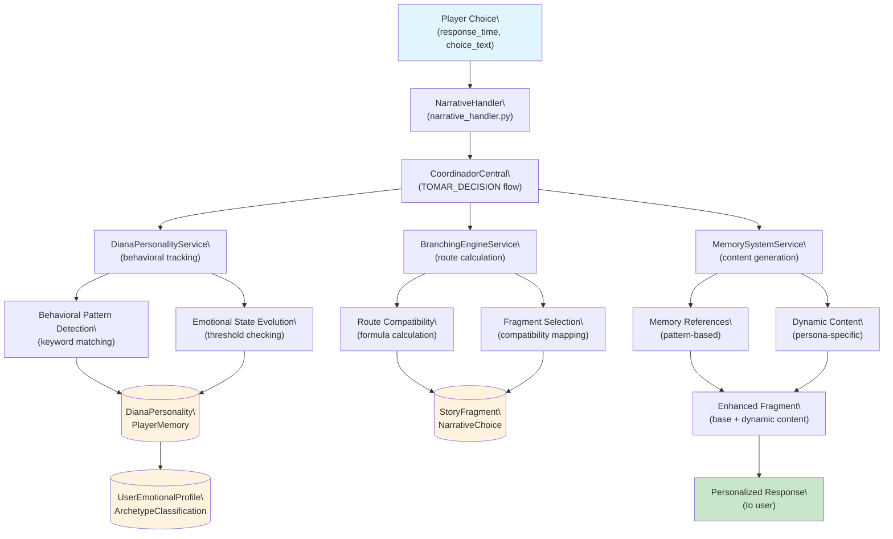
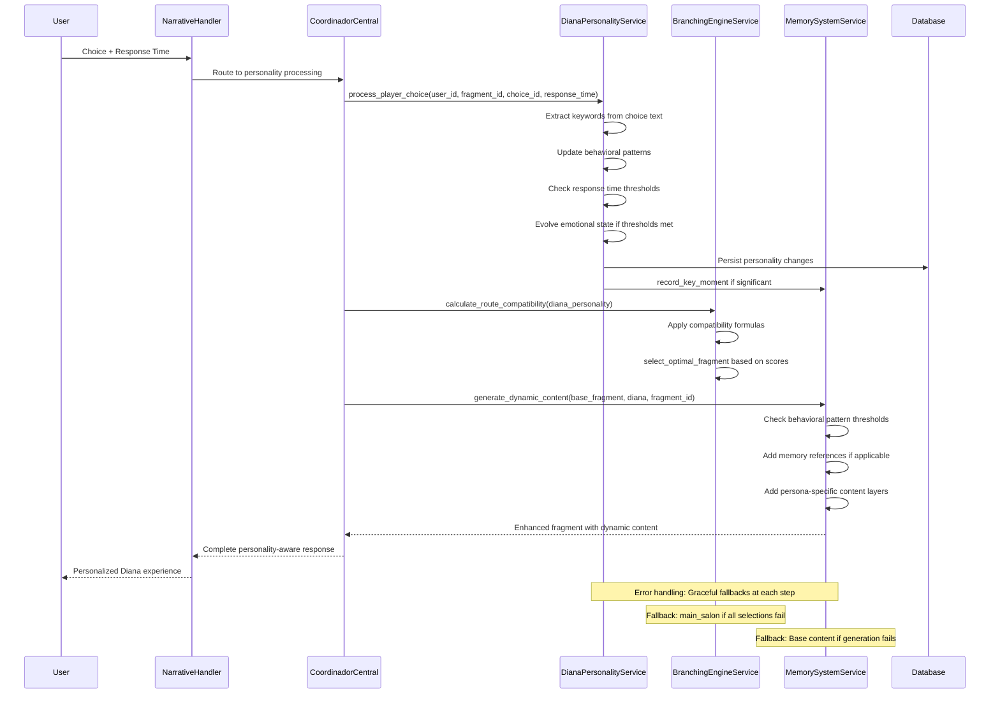

# Design Document - Ramificado Fase 2: Sistema de Diana Evolutiva con Ramificación Inteligente

## Overview

The ramificado-fase2 system implements an advanced evolutionary personality framework for Diana that creates deeply personalized narrative experiences through intelligent behavioral analysis and dynamic content adaptation. The system consists of four core components that work together to track player patterns, evolve Diana's emotional state, calculate route compatibility, and generate personalized content.

This design builds upon the existing narrative infrastructure while introducing sophisticated personality evolution mechanics that make Diana feel genuinely aware of and responsive to each player's unique psychological profile and behavioral patterns.

## Steering Document Alignment

### Technical Standards (tech.md)
The design follows documented technical patterns and standards:

- **Service-Oriented Architecture**: Clear separation of concerns across DianaPersonalityService, BranchingEngineService, and MemorySystemService
- **Async-First Design**: All components use async/await patterns consistent with existing services
- **Coordinator Pattern**: Integration through existing CoordinadorCentral for cross-service orchestration
- **Error-First Design**: Comprehensive error handling and graceful degradation at all levels
- **Database Integration**: Extends existing SQLAlchemy models with proper async session management

### Project Structure (structure.md)
Implementation follows project organization conventions:

- **Services Directory**: New services placed in `/services/` following naming convention (`diana_personality_service.py`)
- **Database Models**: Extensions to `/database/emotional_models.py` for new personality data structures
- **Integration Services**: Cross-service coordination in `/services/integration/` directory
- **Handler Integration**: Narrative handler modifications follow existing router patterns
- **Logging Standards**: Module-level logger configuration with structured error handling

## Code Reuse Analysis

### Existing Components to Leverage

- **EmotionalAnalysisService**: Behavioral pattern tracking infrastructure and timing analysis capabilities
- **ArchetypeIntegrationService**: Player archetype classification system for persona initialization
- **NarrativeService**: Fragment management, user state tracking, and choice processing workflows
- **CoordinadorCentral**: Orchestration patterns for complex multi-service workflows
- **UserEmotionalProfile**: Existing behavioral metrics storage and pattern tracking models
- **ArchetypeClassification**: Player personality classification and sub-archetype scoring systems

### Integration Points

- **Database Models**: Extend `emotional_models.py` with DianaPersonality and PlayerMemory models linked to existing UserEmotionalProfile
- **Fragment System**: Integrate with existing `StoryFragment` and `NarrativeChoice` models for content management
- **Handler Integration**: Enhance `narrative_handler.py` to process personality evolution alongside existing decision workflows
- **Service Coordination**: Use established `AccionUsuario.TOMAR_DECISION` flow for personality-aware decision processing

## Architecture

The system uses a layered architecture with clear separation of concerns and well-defined interfaces between components:



### Component Interaction Flow


## Components and Interfaces

### Component 1: DianaPersonalityService
- **Purpose:** Core personality management including emotional state evolution and behavioral pattern tracking
- **Interfaces:**
  - `async def process_player_choice(user_id: int, fragment_id: str, choice_id: str, response_time: float) -> PersonalityEvolution`
  - `async def get_diana_personality(user_id: int) -> DianaPersonality`
  - `async def initialize_personality_for_archetype(user_id: int, archetype: ArchetypeClassification) -> DianaPersonality`
  - `async def update_behavioral_patterns(user_id: int, choice_text: str, response_time: float) -> Dict[str, float]`
  - `async def evolve_emotional_state(user_id: int, behavioral_patterns: Dict[str, float]) -> DianaEmotionalState`
- **Dependencies:** AsyncSession, ArchetypeIntegrationService, UserEmotionalProfile, EmotionalInteraction models
- **Reuses:** Existing EmotionalAnalysisService patterns for behavioral tracking and ArchetypeClassification for persona initialization
- **Behavioral Pattern Detection:** Implements exact keyword matching per requirements:
  - Keywords "intellectual", "theory" → increment "thinks_before_feeling" and "appreciates_complexity" by 1.0
  - Keywords "vulnerable", "honest" → increment "shows_emotional_courage" and "safe_for_vulnerability" by 1.0
  - Keywords "explore", "adventure" → increment "seeks_novelty" and "comfortable_with_unknown" by 1.0
  - Response time >30s → set diana_observations["deliberate_thinker"] = True
  - Response time <10s → set diana_observations["intuitive_responder"] = True

### Component 2: BranchingEngineService
- **Purpose:** Route compatibility calculation and intelligent fragment selection based on personality state
- **Interfaces:**
  - `async def calculate_route_compatibility(diana_personality: DianaPersonality) -> Dict[str, float]`
  - `async def select_optimal_fragment(current_fragment: str, compatibility: Dict, diana: DianaPersonality) -> str`
  - `async def determine_next_fragment(user_id: int, choice_data: Dict) -> FragmentSelectionResult`
- **Dependencies:** DianaPersonalityService, NarrativeService, StoryFragment models
- **Reuses:** Existing NarrativeService fragment management and navigation patterns
- **Compatibility Calculation Formulas (per requirements):**
  - **Filosófica:** (intellectual_trust * 0.4) + (appreciates_complexity_pattern * 0.3) + ((10 - mask_level) * 0.3)
  - **Corazón:** (emotional_openness * 0.4) + (safe_for_vulnerability_pattern * 0.3) + (vulnerability_level * 0.3)
  - **Aventurera:** (adventure_readiness * 0.4) + (comfortable_with_unknown_pattern * 0.3) + (seeks_novelty_pattern * 0.3)
- **Fragment Selection Logic:**
  - Compatibility ≥6.0: Advanced fragments (filosofica_advanced, corazon_intimate, aventurera_deep)
  - Compatibility 3.0-5.9: Buildup fragments
  - Compatibility <3.0: Relationship building fragments
  - Fallback chain: Route-specific → Buildup → Relationship building → main_salon

### Component 3: MemorySystemService
- **Purpose:** Dynamic content generation with memory references and adaptive narrative enhancement
- **Interfaces:**
  - `async def generate_dynamic_content(base_content: str, diana: DianaPersonality, fragment_id: str) -> str`
  - `async def record_key_moment(user_id: int, moment_type: str, impact: str, diana_reaction: str) -> None`
  - `async def get_memory_references(diana: DianaPersonality, fragment_context: str) -> List[str]`
  - `async def update_behavior_pattern(user_id: int, pattern: str, strength: float) -> None`
- **Dependencies:** DianaPersonalityService, PlayerMemory models, CharacterVoiceService
- **Reuses:** Existing CharacterVoiceService for maintaining Diana's consistent voice and speech patterns
- **Memory Reference Examples (per requirements):**
  - When behavior_patterns["shows_emotional_courage"] >2: "Sabes? Cada vez que has elegido ser honesto conmigo, algo en mí se ha abierto más..."
  - When behavior_patterns["appreciates_complexity"] >3.0 + INTELLECTUAL persona: "Sus ojos brillan con curiosidad intelectual... como si estuvieras construyendo mapas conceptuales de nuestra interacción."
  - When behavior_patterns["safe_for_vulnerability"] >2.0 + EMOTIONAL persona: "La seguridad que generas hace que partes de mí que normalmente mantengo guardadas quieran emerger..."

### Component 4: PersonalityIntegrationService
- **Purpose:** Orchestrates personality system integration with existing narrative flow
- **Interfaces:**
  - `async def process_personality_decision(user_id: int, decision_data: Dict) -> IntegratedResponse`
  - `async def handle_evolutionary_trigger(user_id: int, trigger_data: Dict) -> PersonalityEvolution`
- **Dependencies:** All personality services, CoordinadorCentral, NarrativePointService
- **Reuses:** Existing integration service patterns and CoordinadorCentral orchestration workflows

## Data Models

### DianaPersonality Model (extends emotional_models.py)
```python
class PersonaType(enum.Enum):
    PERFORMER = "performer"
    INTELLECTUAL = "intellectual"
    EMOTIONAL = "emotional"
    WILD = "wild"
    ARTIST = "artist"
    PHILOSOPHER = "philosopher"
    HEALER = "healer"

class DianaPersonality(Base):
    __tablename__ = 'diana_personalities'

    id = Column(Integer, primary_key=True)
    user_id = Column(Integer, ForeignKey('user_emotional_profiles.user_id'), unique=True, nullable=False, index=True)

    # Core personality state (per requirements)
    dominant_persona = Column(Enum(PersonaType), default=PersonaType.EMOTIONAL)
    available_facets = Column(JSON, default=lambda: [PersonaType.PERFORMER.value])
    evolution_tracker = Column(JSON, default=dict)

    # Emotional state metrics (exact per requirements)
    intellectual_trust = Column(Float, default=0.0)
    emotional_openness = Column(Float, default=0.0)
    adventure_readiness = Column(Float, default=0.0)
    vulnerability_level = Column(Float, default=0.0)

    # Universal states
    mask_level = Column(Float, default=10.0)  # 10=performativa, 0=auténtica
    player_intrigue = Column(Float, default=0.0)
    connection_depth = Column(Float, default=0.0)

    # Specific evolution metrics
    addiction_to_player_mind = Column(Float, default=0.0)
    soul_seen_level = Column(Float, default=0.0)
    wild_self_acceptance = Column(Float, default=0.0)

    # Timestamps
    created_at = Column(DateTime, default=datetime.utcnow)
    updated_at = Column(DateTime, default=datetime.utcnow, onupdate=datetime.utcnow)

    # Relationships
    memory_system = relationship("PlayerMemory", back_populates="diana_personality", uselist=False, cascade="all, delete-orphan")
    user_profile = relationship("UserEmotionalProfile", back_populates="diana_personality")
```

### PlayerMemory Model (per requirements)
```python
class PlayerMemory(Base):
    __tablename__ = 'player_memories'

    id = Column(Integer, primary_key=True)
    diana_personality_id = Column(Integer, ForeignKey('diana_personalities.id'), unique=True, nullable=False, index=True)

    # Memory storage (per requirements structure)
    key_moments = Column(JSON, default=list)  # [{'moment': str, 'impact': str, 'diana_reaction': str, 'timestamp': float}]
    behavior_patterns = Column(JSON, default=dict)  # {'pattern_name': float}
    emotional_responses = Column(JSON, default=list)
    diana_observations = Column(JSON, default=dict)  # {'observation_key': bool/str}

    # Memory metadata
    last_updated = Column(DateTime, default=datetime.utcnow, onupdate=datetime.utcnow)
    total_interactions = Column(Integer, default=0)

    # Relationships
    diana_personality = relationship("DianaPersonality", back_populates="memory_system")

    def record_key_moment(self, moment_type: str, impact: str, diana_reaction: str):
        """Record key moment per requirements interface."""
        import time
        if not self.key_moments:
            self.key_moments = []

        self.key_moments.append({
            'moment': moment_type,
            'impact': impact,
            'diana_reaction': diana_reaction,
            'timestamp': time.time()
        })

    def update_behavior_pattern(self, pattern: str, strength: float):
        """Update behavioral pattern per requirements interface."""
        if not self.behavior_patterns:
            self.behavior_patterns = {}

        current = self.behavior_patterns.get(pattern, 0.0)
        self.behavior_patterns[pattern] = current + strength
```

### PersonalityEvolution Model
```python
class PersonalityEvolution(Base):
    __tablename__ = 'personality_evolutions'

    id = Column(Integer, primary_key=True)
    user_id = Column(Integer, nullable=False, index=True)

    # Evolution tracking
    evolution_type = Column(String(50), nullable=False)  # emotional_state, persona_unlock, memory_milestone
    before_state = Column(JSON)
    after_state = Column(JSON)
    trigger_context = Column(JSON)

    # Metadata
    created_at = Column(DateTime, default=datetime.utcnow)
    fragment_context = Column(String(100))
    behavioral_trigger = Column(String(100))
```

## Error Handling (per requirements)

### Error Scenarios

1. **Diana Personality Data Initialization Failure:**
   - **Handling:** Fall back to EMOTIONAL persona with default values per requirements
   - **Implementation:** Initialize DianaPersonality with PersonaType.EMOTIONAL, all emotional metrics to 0.0, mask_level to 10.0
   - **User Impact:** Diana starts with basic personality; evolution continues normally once behavioral data accumulates
   - **Recovery:** System attempts personality re-initialization on next interaction

2. **Memory System Database Errors:**
   - **Handling:** Continue with reduced functionality and log errors for recovery per requirements
   - **Implementation:** Initialize empty PlayerMemory with default behavioral patterns dict, continue tracking new patterns
   - **User Impact:** Temporary loss of memory references; Diana rebuilds understanding through continued interaction
   - **Recovery:** Background process attempts to rebuild memory from EmotionalInteraction history

3. **Compatibility Calculation Failures:**
   - **Handling:** Default to relationship_building fragments per requirements
   - **Implementation:** Return compatibility scores of 0.0 for all routes, select relationship_building fragments
   - **User Impact:** More general content until compatibility can be recalculated successfully
   - **Recovery:** Retry calculation on next personality evolution event

4. **Dynamic Content Generation Failures:**
   - **Handling:** Serve base fragment content without interruption per requirements
   - **Implementation:** Return original fragment content without dynamic additions, log generation error
   - **User Impact:** Standard narrative experience without memory references until system recovery
   - **Recovery:** Retry content generation with simplified memory reference logic

5. **Fragment Selection Failures:**
   - **Handling:** Progressive fallback chain ending with main_salon per requirements
   - **Implementation:** Try route-specific → buildup → relationship_building → main_salon, log each failure level
   - **User Impact:** Gradual degradation to basic content while maintaining conversation flow
   - **Recovery:** Fragment availability monitoring and automatic cache refresh

6. **Response Time Tracking Errors:**
   - **Handling:** Use default 15.0 seconds for behavioral analysis
   - **Implementation:** If response_time is None, 0, or invalid, default to middle-range timing
   - **User Impact:** Neutral timing classification until valid timing data accumulates
   - **Recovery:** Resume normal timing tracking on next valid interaction

## Testing Strategy

### Unit Testing
- **DianaPersonalityService**: Test behavioral pattern tracking, emotional state evolution algorithms, and persona development logic
- **BranchingEngineService**: Verify compatibility calculation formulas and fragment selection decision trees
- **MemorySystemService**: Validate memory storage, retrieval, and dynamic content generation accuracy
- **Integration Services**: Test orchestration workflows and error handling scenarios

### Integration Testing
- **Cross-Service Workflows**: Test complete personality evolution flow from choice processing through content generation
- **Database Operations**: Verify proper persistence and retrieval of personality data across sessions
- **CoordinadorCentral Integration**: Ensure smooth integration with existing orchestration patterns
- **Fragment System Integration**: Test compatibility with existing narrative navigation and fragment management

### End-to-End Testing
- **Personality Development Scenarios**: Test complete user journeys from initial archetype detection through advanced route unlocking
- **Memory Reference Accuracy**: Validate that Diana's memory references match actual player behavioral history
- **Content Consistency**: Ensure dynamic content maintains Diana's character voice and narrative continuity
- **Performance Under Load**: Test system performance with multiple concurrent users developing different personality paths

## Route Compatibility Algorithm (exact per requirements)
```python
async def calculate_route_compatibility(self, diana: DianaPersonality) -> Dict[str, float]:
    """Calculate compatibility with different routes per requirements formulas."""
    compatibility = {}

    try:
        # Filosófica route (INTELLECTUAL persona)
        if diana.dominant_persona == PersonaType.INTELLECTUAL:
            compatibility['filosofica'] = (
                diana.intellectual_trust * 0.4 +
                diana.memory_system.behavior_patterns.get('appreciates_complexity', 0) * 0.3 +
                (10 - diana.mask_level) * 0.3
            )

        # Corazón route (EMOTIONAL persona)
        if diana.dominant_persona == PersonaType.EMOTIONAL:
            compatibility['corazon'] = (
                diana.emotional_openness * 0.4 +
                diana.memory_system.behavior_patterns.get('safe_for_vulnerability', 0) * 0.3 +
                diana.vulnerability_level * 0.3
            )

        # Aventurera route (WILD persona)
        if diana.dominant_persona == PersonaType.WILD:
            compatibility['aventurera'] = (
                diana.adventure_readiness * 0.4 +
                diana.memory_system.behavior_patterns.get('comfortable_with_unknown', 0) * 0.3 +
                diana.memory_system.behavior_patterns.get('seeks_novelty', 0) * 0.3
            )

    except Exception as e:
        logger.error(f"Compatibility calculation error for user {diana.user_id}: {e}")
        # Fallback: return 0.0 for affected routes per requirements
        for route in ['filosofica', 'corazon', 'aventurera']:
            if route not in compatibility:
                compatibility[route] = 0.0

    return compatibility

async def select_optimal_fragment(self, current_fragment: str, compatibility: Dict[str, float],
                                diana: DianaPersonality) -> str:
    """Select fragment based on compatibility scores per requirements."""
    try:
        highest_route = max(compatibility.keys(), key=lambda k: compatibility[k])
        highest_score = compatibility[highest_route]

        # Fragment selection per requirements
        if highest_score >= 6.0:
            # Advanced route-specific fragments
            fragment_map = {
                'filosofica': 'filosofica_advanced',
                'corazon': 'corazon_intimate',
                'aventurera': 'aventurera_deep'
            }
            return fragment_map.get(highest_route, 'relationship_building')

        elif 3.0 <= highest_score <= 5.9:
            # Buildup fragments
            return f"{highest_route}_buildup"

        else:  # < 3.0
            # Relationship building fragments
            return 'relationship_building'

    except Exception as e:
        logger.error(f"Fragment selection error: {e}")
        # Ultimate fallback per requirements
        return 'main_salon'
```

## Implementation Considerations

### Performance Optimization (meeting 500ms/200ms requirements)
- **Behavioral Pattern Caching**: Cache frequently accessed behavioral patterns in Redis for sub-50ms pattern lookups
- **Compatibility Calculation Optimization**: Pre-calculate and cache route compatibility scores, update incrementally to meet 200ms requirement
- **Content Generation Efficiency**: Template-based dynamic content generation with pre-compiled memory reference templates
- **Database Query Optimization**:
  - Index on `diana_personalities.user_id` for O(1) personality lookups
  - Index on `player_memories.diana_personality_id` for fast memory retrieval
  - Connection pooling with minimum 5 connections for concurrent personality processing
- **Response Time Tracking**: Efficient timestamp capture without impacting processing (target <5ms overhead)
- **Memory Reference Generation**: Pre-computed reference templates based on behavioral pattern ranges

### Data Privacy and Security
- **Behavioral Data Encryption**: Encrypt sensitive behavioral pattern data both at rest and in transit
- **Access Control**: Implement proper access controls to prevent cross-user personality data exposure
- **Memory Reference Sanitization**: Ensure memory references don't inadvertently expose sensitive personal information
- **Audit Trail**: Maintain logs of personality evolution for debugging while respecting privacy constraints

### Scalability Design
- **Horizontal Scaling**: Design services to be stateless and horizontally scalable across multiple instances
- **Database Sharding**: Prepare personality data models for potential user-based database sharding
- **Caching Strategy**: Implement Redis-based caching for frequently accessed personality data and compatibility calculations
- **Background Processing**: Use task queues for non-critical personality analysis that doesn't need real-time processing