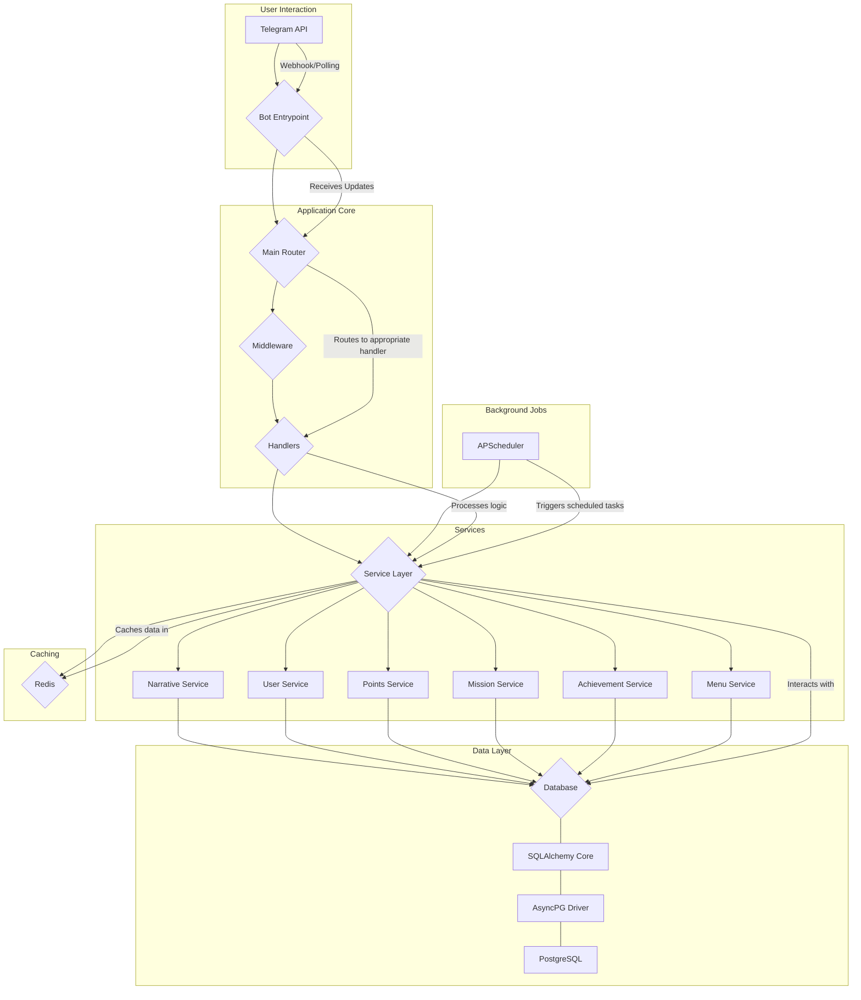

# DIANA BOT - Technical Documentation

## 1. Executive Summary

Diana Bot is an interactive narrative experience delivered via Telegram, centered around the enigmatic character of Diana. The system is designed to provide users with a deeply engaging and personalized story, where their choices have a meaningful impact on the narrative and their relationship with the main character. The bot's architecture is built to be scalable, maintainable, and extensible, allowing for the continuous addition of new content and features.

The core of the system is a sophisticated narrative engine that manages story progression, character consistency, and user interactions. This is complemented by a gamification layer, featuring a points system ("besitos"), levels, missions, and achievements, designed to enhance user engagement and retention. The entire system is built on a modern, asynchronous Python stack, utilizing a robust database schema and a caching layer for optimal performance.

## 2. Quick Start Guide

This guide provides the necessary steps to set up the Diana Bot development environment and run the application.

### 2.1. Prerequisites

- Python 3.10+
- PostgreSQL database
- Redis server
- Telegram Bot API Token

### 2.2. Dependencies

The project dependencies are listed in the `requirements.txt` file. Install them using pip:

```bash
pip install -r requirements.txt
```

The main dependencies are:
- `aiogram>=3.0`
- `SQLAlchemy>=2.0.0`
- `aiosqlite>=0.17.0`
- `APScheduler>=3.10.0`
- `python-dotenv>=1.0.0`
- `asyncpg>=0.27.0`
- `psycopg2-binary>=2.9.0`
- `pytest>=8.0.0`
- `pytest-asyncio>=0.21.0`
- `pytest-cov>=4.1.0`
- `pytest-mock>=3.10.0`

### 2.3. Environment Configuration

1.  Create a `.env` file in the root of the project.
2.  Add the following environment variables to the `.env` file:

```
TELEGRAM_API_TOKEN=<your_telegram_bot_api_token>
DATABASE_URL=postgresql+asyncpg://<user>:<password>@<host>:<port>/<database>
REDIS_HOST=localhost
REDIS_PORT=6379
```

### 2.4. Database Setup

1.  Ensure your PostgreSQL server is running.
2.  Create a new database for the bot.
3.  Run the database migration scripts to create the necessary tables:

```bash
python -m database.setup
```

### 2.5. Running the Bot

To start the bot, run the following command from the root of the project:

```bash
python bot.py
```

The bot should now be running and responsive on Telegram.

## 3. Architecture Deep Dive

### 3.1. System Architecture

The Diana Bot's architecture is designed to be modular and scalable, with a clear separation of concerns between the different components.



**Component Responsibilities:**

-   **Telegram API**: The external interface to the Telegram platform.
-   **Bot Entrypoint (`bot.py`**)): Initializes the bot, sets up logging, and starts the dispatcher.
-   **Main Router**: The main `aiogram` router that directs incoming updates to the appropriate handlers.
-   **Middleware**: Intercepts incoming updates to perform tasks like user authentication, session management, and logging.
-   **Handlers**: Contain the core logic for handling specific commands, messages, and callbacks from the user.
-   **Service Layer**: A collection of services that encapsulate the business logic of the application, decoupling the handlers from the database.
-   **Narrative Service**: Manages the user's progression through the story, including narrative fragments, decisions, and character consistency.
-   **User Service**: Handles user registration, profile management, and state tracking.
-   **Points Service**: Manages the "besitos" economy, including awarding and spending points.
-   **Mission Service**: Tracks user progress on missions and grants rewards upon completion.
-   **Achievement Service**: Manages achievements and unlocks them for users based on their actions.
-   **Menu Service**: Generates and manages the dynamic menus presented to the user.
-   **Database**: The PostgreSQL database that stores all persistent data, including user information, narrative content, and game state.
-   **SQLAlchemy Core**: The ORM used to interact with the database.
-   **AsyncPG Driver**: The asynchronous driver for connecting to the PostgreSQL database.
-   **Redis**: The in-memory data store used for caching session data, user progress, and other frequently accessed information.
-   **APScheduler**: The library used for scheduling background tasks, such as daily rewards and notifications.

### 3.2. Data Flow

1.  A user sends a message to the bot on Telegram.
2.  The Telegram API sends an update to the bot's webhook.
3.  The `Bot Entrypoint` receives the update and passes it to the `Main Router`.
4.  The `Main Router` matches the update to a registered `Handler` based on the message content or callback data.
5.  The `Middleware` intercepts the update to perform pre-processing tasks.
6.  The `Handler` processes the update, calling one or more `Services` to execute the required business logic.
7.  The `Service` interacts with the `Database` to retrieve or modify data, and may also use `Redis` for caching.
8.  The `Service` returns the result to the `Handler`.
9.  The `Handler` constructs a response and sends it back to the user via the Telegram API.

### 3.3. Critical Dependencies

| Dependency        | Version        | Purpose                               |
| ----------------- | -------------- | ------------------------------------- |
| `aiogram`         | `>=3.0`        | Asynchronous Telegram Bot Framework   |
| `SQLAlchemy`      | `>=2.0.0`      | Object Relational Mapper (ORM)        |
| `aiosqlite`       | `>=0.17.0`     | Async driver for SQLite (testing)     |
| `asyncpg`         | `>=0.27.0`     | Async driver for PostgreSQL           |
| `APScheduler`     | `>=3.10.0`     | In-process task scheduler             |
| `python-dotenv`   | `>=1.0.0`      | Environment variable management       |
| `psycopg2-binary` | `>=2.9.0`      | PostgreSQL adapter for Python         |
| `pytest`          | `>=8.0.0`      | Testing framework                     |
| `pytest-asyncio`  | `>=0.21.0`     | Pytest support for asyncio            |
| `pytest-cov`      | `>=4.1.0`      | Code coverage plugin for pytest       |
| `pytest-mock`     | `>=3.10.0`     | Mocking library for pytest            |

### 3.4. Design Patterns

-   **Model-View-Controller (MVC)**: The architecture loosely follows the MVC pattern, with the `Handlers` acting as controllers, the `Services` and `Database` as the model, and the Telegram messages as the view.
-   **Dependency Injection**: The `Service` layer is designed to be injectable into the `Handlers`, allowing for easier testing and decoupling.
-   **Repository Pattern**: The `Services` act as repositories for the database models, providing a clean API for data access.
-   **Observer Pattern**: The achievement and mission systems use an observer pattern to listen for events in the application and trigger actions accordingly.

### 3.5. Service to Business Functionality Mapping

| Service               | Business Functionality                                      |
| --------------------- | ----------------------------------------------------------- |
| `Narrative Service`   | Core story progression, decision making, character consistency |
| `User Service`        | User onboarding, profile management, state tracking         |
| `Points Service`      | "Besitos" economy, rewards, virtual currency                |
| `Mission Service`     | User tasks and goals, engagement loops                      |
| `Achievement Service` | Long-term user recognition, milestone rewards               |
| `Menu Service`        | User interface, navigation, command access                  |