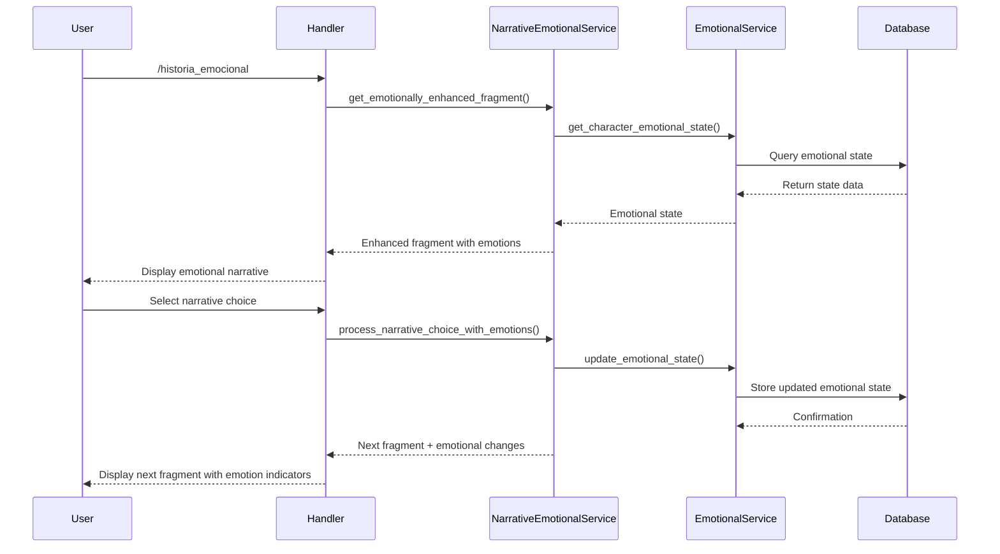

# DianaEmotionalService - Arquitectura y Diseño

## Visión General

DianaEmotionalService es un sistema de gestión de emociones para personajes en el bot Telegram, diseñado para añadir profundidad a las interacciones narrativas. El sistema permite que los personajes (Diana, Lucien, etc.) mantengan estados emocionales persistentes hacia cada usuario, los cuales evolucionan basados en las decisiones e interacciones del usuario.

## Arquitectura

La arquitectura del sistema emocional se integra con el sistema narrativo existente y sigue un patrón de capas similar:

```
┌─────────────────────────────────────┐
│           Handlers Layer            │
│  emotional_handler.py               │
│  emotional_narrative_handler.py     │
└───────────────────┬─────────────────┘
                    │
┌───────────────────▼─────────────────┐
│         Integration Layer           │
│  narrative_emotional_service.py     │
└───────────────────┬─────────────────┘
                    │
┌───────────────────▼─────────────────┐
│          Service Layer              │
│  emotional_service.py               │
└───────────────────┬─────────────────┘
                    │
┌───────────────────▼─────────────────┐
│          Data Layer                 │
│  models/emotional.py                │
└─────────────────────────────────────┘
```

### Componentes Principales

1. **EmotionalService**: Servicio base que gestiona los estados emocionales de los personajes
2. **NarrativeEmotionalService**: Integración entre el sistema narrativo y el sistema emocional
3. **Handlers Emocionales**: Manejadores para comandos y callbacks relacionados con emociones
4. **Modelos de Datos**: Estructuras para almacenar estados emocionales y plantillas de respuesta

## Modelo Emocional

El sistema utiliza un modelo emocional basado en las 8 emociones básicas de Plutchik:

- **Alegría** (Joy)
- **Confianza** (Trust)
- **Miedo** (Fear)
- **Tristeza** (Sadness)
- **Enfado** (Anger)
- **Sorpresa** (Surprise)
- **Anticipación** (Anticipation)
- **Disgusto** (Disgust)

Cada emoción tiene:
- Un rango de intensidad (0-100)
- Una tasa de decaimiento natural
- Un valor predeterminado para cada personaje
- Iconos y descripciones asociadas

## Flujo de Datos

1. **Captura de Interacciones**: Las decisiones narrativas del usuario influyen en el estado emocional de los personajes
2. **Procesamiento Emocional**: El sistema calcula los cambios emocionales basados en el contenido y contexto
3. **Almacenamiento**: Los estados emocionales se guardan en la base de datos
4. **Retroalimentación Visual**: Los usuarios pueden ver el estado emocional de los personajes
5. **Modificación Narrativa**: Las respuestas narrativas se adaptan según el estado emocional



## Modelos de Datos

### CharacterEmotionalState
Almacena el estado emocional actual de un personaje hacia un usuario específico.

```python
class CharacterEmotionalState(Base):
    id = Column(Integer, primary_key=True)
    user_id = Column(BigInteger, ForeignKey('users.id'))
    character_name = Column(String(50))
    
    # Valores emocionales (0-100)
    joy = Column(Float, default=50.0)
    trust = Column(Float, default=30.0)
    fear = Column(Float, default=20.0)
    sadness = Column(Float, default=15.0)
    anger = Column(Float, default=10.0)
    surprise = Column(Float, default=25.0)
    anticipation = Column(Float, default=40.0)
    disgust = Column(Float, default=5.0)
    
    # Metadatos adicionales
    dominant_emotion = Column(String(20))
    relationship_level = Column(Integer)
    relationship_status = Column(String(20))
    
    # Datos históricos
    history_entries = Column(JSON)
    last_updated = Column(DateTime)
```

### EmotionalHistoryEntry
Registra cambios históricos en los estados emocionales para análisis y visualización.

```python
class EmotionalHistoryEntry(Base):
    id = Column(Integer, primary_key=True)
    user_id = Column(BigInteger, ForeignKey('users.id'))
    character_name = Column(String(50))
    timestamp = Column(DateTime)
    
    emotional_state = Column(JSON)
    context_type = Column(String(50))
    context_description = Column(Text)
    context_reference_id = Column(String(50))
```

### EmotionalResponseTemplate
Plantillas para generar respuestas adaptadas al estado emocional.

```python
class EmotionalResponseTemplate(Base):
    id = Column(Integer, primary_key=True)
    character_name = Column(String(50))
    emotion = Column(String(20))
    intensity_level = Column(String(10))
    
    text_prefixes = Column(JSON)
    text_suffixes = Column(JSON)
    style_suggestions = Column(JSON)
    emoji_suggestions = Column(JSON)
    sample_phrases = Column(JSON)
```

## Características Principales

### 1. Estados Emocionales Persistentes
Los personajes mantienen estados emocionales que evolucionan con cada interacción.

### 2. Análisis de Decisiones Narrativas
El sistema analiza decisiones narrativas para determinar su impacto emocional.

### 3. Modificadores de Respuesta
Sugerencias de estilo y formato basadas en el estado emocional:
- Prefijos y sufijos de texto
- Sugerencias de estilo
- Sugerencias de emojis

### 4. Visualización de Estados Emocionales
Interfaces visuales para que los usuarios puedan ver cómo se sienten los personajes hacia ellos.

### 5. Relaciones Dinámicas
Sistema de niveles de relación que cambian con el tiempo:
- Distante (Nivel 1)
- Cautelosa (Nivel 2)
- Neutral (Nivel 3)
- Amistosa (Nivel 4)
- Íntima (Nivel 5)

### 6. Historial Emocional
Registro histórico de cambios emocionales para análisis y visualización.

## Integración con Sistemas Existentes

### Integración con Sistema Narrativo
- Los fragmentos narrativos se enriquecen con estados emocionales
- Las decisiones narrativas afectan y son afectadas por estados emocionales
- Nuevos tipos de decisiones basadas en emociones

### Integración con Sistema de Puntos
- Recompensas basadas en mejoras de relaciones
- Desbloqueo de contenido basado en niveles de relación

## Comandos del Bot

- `/emociones [personaje]` - Muestra el estado emocional actual de un personaje
- `/historia_emocional` - Versión mejorada de la narrativa con contexto emocional
- Callbacks para mostrar relaciones y estados emocionales desde la narrativa

## Futuras Expansiones

1. **Memoria Emocional**: Recordar eventos específicos y sus impactos emocionales
2. **Respuestas Generadas**: Integración con LLM para generar respuestas personalizadas
3. **Análisis de Sentimientos**: Procesamiento de lenguaje natural para determinar impactos emocionales
4. **Visualizaciones Avanzadas**: Gráficos de evolución emocional a lo largo del tiempo
5. **Misiones Emocionales**: Desafíos específicos para mejorar relaciones con personajes

## Consideraciones Técnicas

- **Rendimiento**: Estados emocionales se calculan bajo demanda y se almacenan en caché
- **Escalabilidad**: Diseño modular que permite añadir más personajes y emociones
- **Persistencia**: Almacenamiento eficiente de historiales emocionales
- **Mantenibilidad**: Separación clara de responsabilidades entre componentes

## Ejemplo de Flujo de Usuario

1. Usuario envía `/historia_emocional`
2. Bot muestra fragmento narrativo con modificadores emocionales
3. Usuario toma decisión que afecta negativamente a Diana
4. Bot procesa la decisión, actualizando el estado emocional
5. Bot muestra siguiente fragmento con indicadores de cambio emocional
6. Usuario puede ver `/emociones Diana` para comprobar el impacto de su decisión