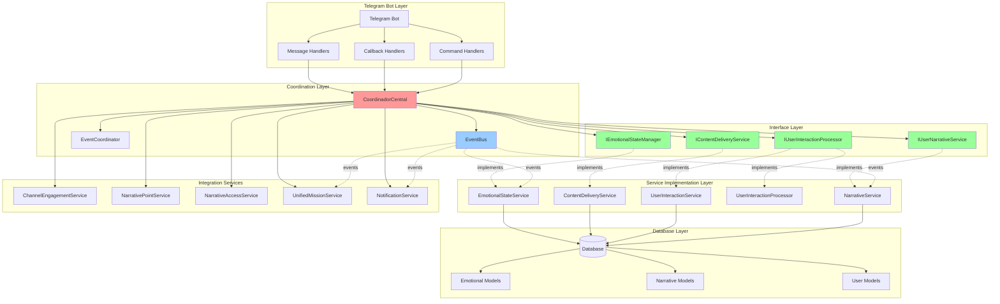
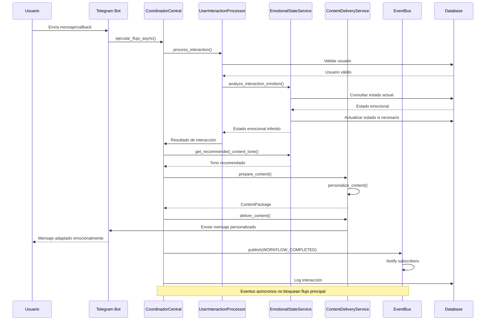
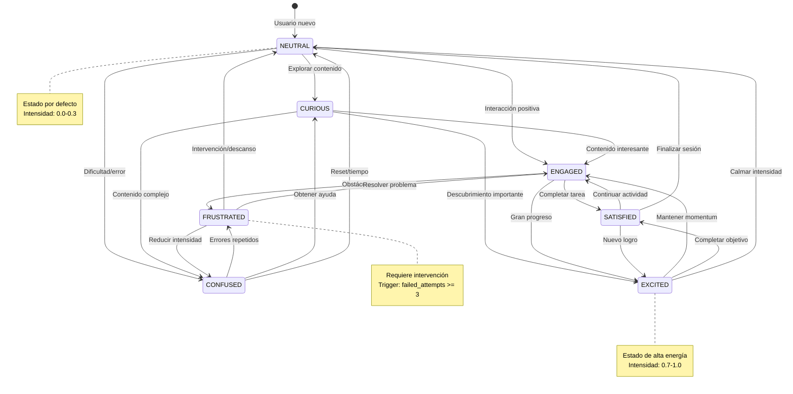
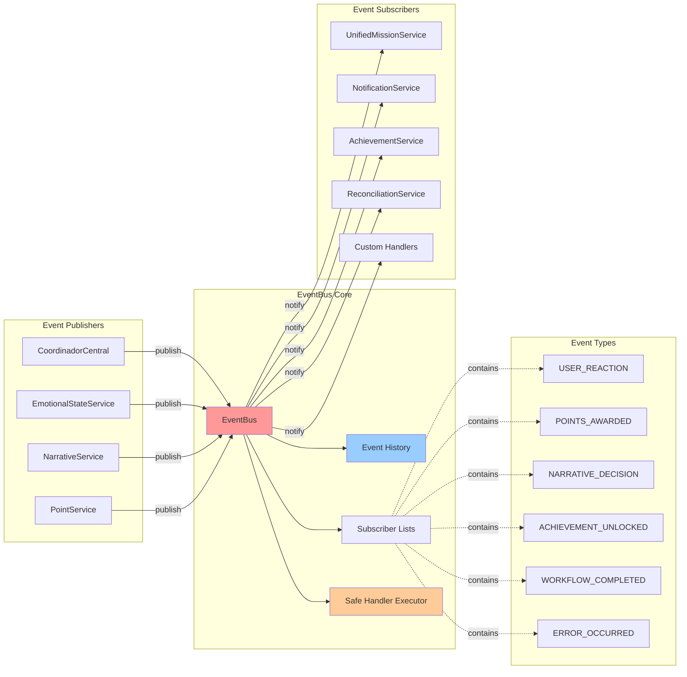
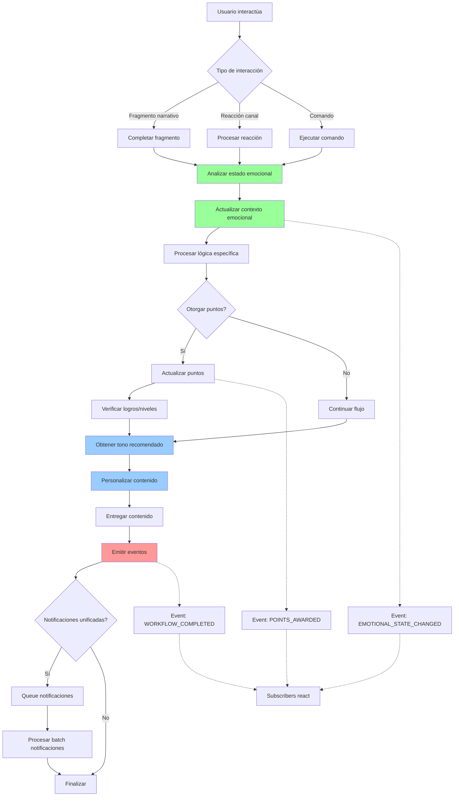
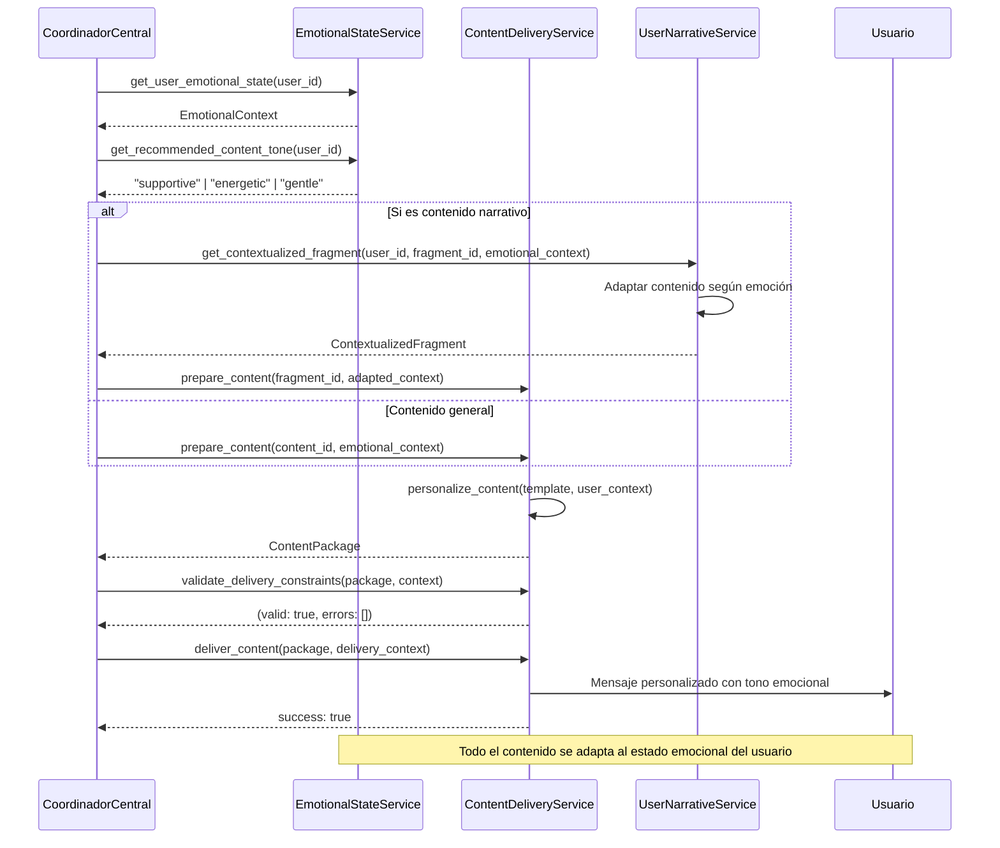
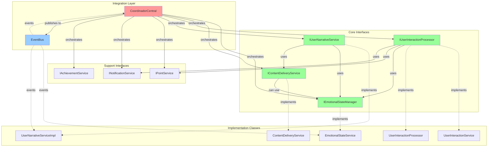
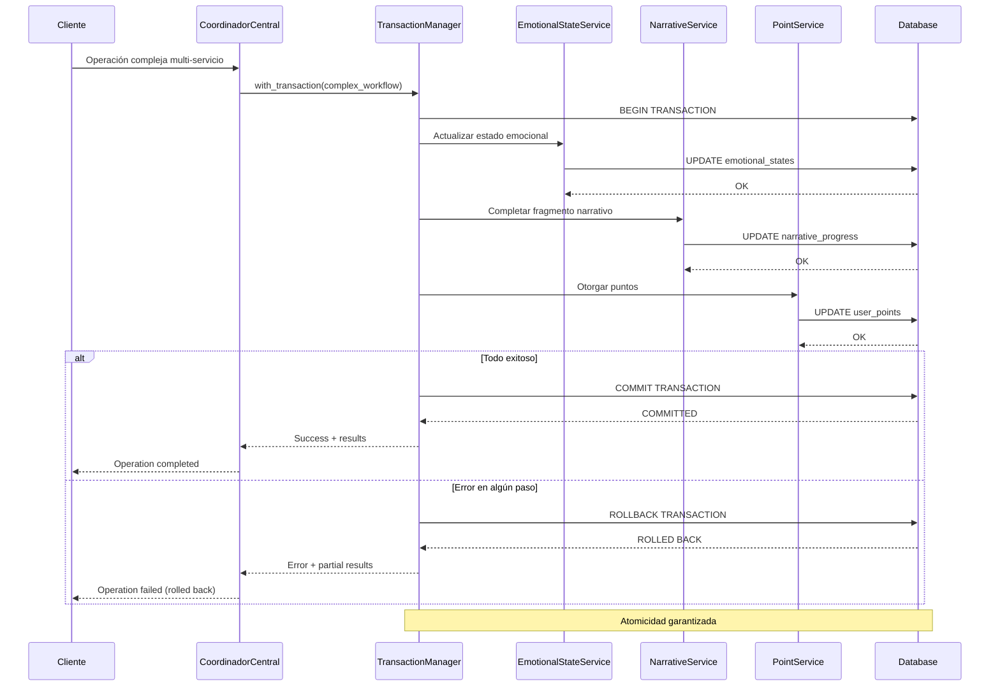
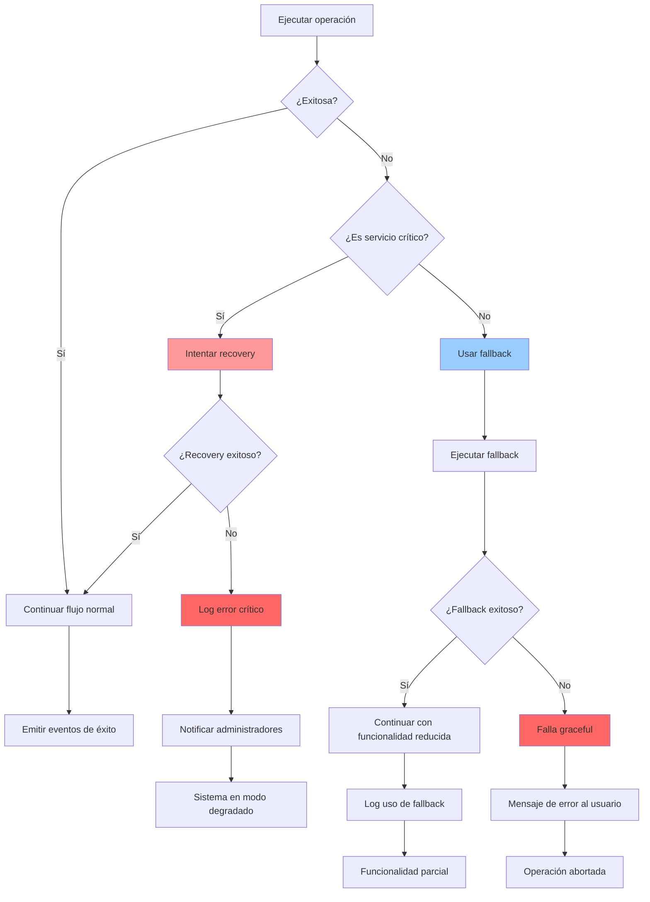
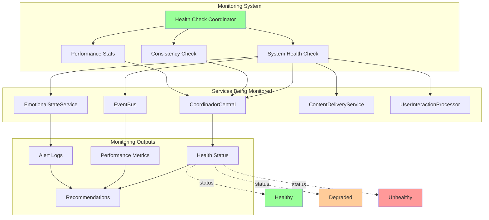

# Diagramas de Arquitectura y Flujos del Sistema de Interfaces

## Diagrama de Arquitectura General

## Flujo de Procesamiento de Interacciones

## Flujo de Estados Emocionales

## Arquitectura de EventBus

## Flujo de Integración Cross-Módulo

## Flujo de Content Delivery Contextualizado

## Diagrama de Dependencias entre Interfaces

## Flujo de Transacciones Complejas

## Patrón de Recuperación ante Fallas

## Monitoreo y Health Checks

---

*Estos diagramas representan la arquitectura actual del sistema de interfaces implementado y sus flujos de integración.*