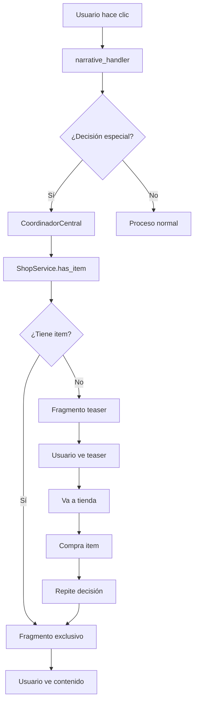

# Guía de Desarrollo: Sistema de Fragmentos Narrativos Condicionados por Items

**Fecha:** 15 de Septiembre, 2025
**Proyecto:** Bot Diana - Sistema de Narrativa Interactiva
**Versión:** 1.0

## 📋 Tabla de Contenidos

1. [Arquitectura del Sistema](#arquitectura-del-sistema)
2. [Componentes Principales](#componentes-principales)
3. [Flujo Técnico Completo](#flujo-técnico-completo)
4. [Implementación Paso a Paso](#implementación-paso-a-paso)
5. [Agregar Nuevos Items Condicionados](#agregar-nuevos-items-condicionados)
6. [Mejores Prácticas](#mejores-prácticas)
7. [Troubleshooting](#troubleshooting)

---

## 🏗️ Arquitectura del Sistema

### Diagrama de Flujo
```
[Usuario] → [Narrative Handler] → [Coordinador Central] → [Shop Service]
    ↓              ↓                      ↓                    ↓
[Decisión]    [Verificación]      [Item Check]         [Inventory Check]
    ↓              ↓                      ↓                    ↓
[Fragment]    [Route Decision]    [Teaser/Exclusive]    [Database Query]
```

### Componentes Clave
- **CoordinadorCentral**: Orquesta la verificación de items y decisiones especiales
- **ShopService**: Maneja inventario y verificación de compras
- **NarrativeService**: Procesa fragmentos y navegación narrativa
- **NarrativeHandler**: Intercepta decisiones especiales y rutea al coordinador

---

## 🔧 Componentes Principales

### 1. CoordinadorCentral (`services/coordinador_central.py`)

```python
# Mapa de decisiones que requieren items específicos
decision_requirements = {
    1: "📖 Diario Secreto",      # Primera decisión requiere diario básico
    15: "📓 Diario Íntimo",     # Decisión íntima requiere diario especial
    # Agregar más aquí...
}
```

**Función principal de verificación:**
```python
async def _flujo_tomar_decision(self, user_id: int, decision_id: int, bot=None):
    # 1. Verificar si la decisión requiere un item
    required_item = decision_requirements.get(decision_id)

    if required_item:
        # 2. Verificar inventario del usuario
        shop_service = ShopService(self.session)
        has_item = await shop_service.has_item_in_inventory(user_id, required_item)

        if not has_item:
            # 3. Redirigir a fragmento teaser
            if decision_id == 15:  # Caso especial para diario íntimo
                teaser_fragment = await self.narrative_service._get_fragment_by_key("diana_diary_tease")
                # Actualizar estado del usuario al teaser
                # ...
                return {"success": True, "fragment": teaser_fragment}

            # 4. Para otros items, mostrar mensaje de restricción
            return {"success": False, "message": "Necesitas [item] para esta decisión"}

    # 5. Procesar decisión normal si tiene el item
    return await self._process_normal_decision(user_id, decision_id)
```

### 2. ShopService (`services/shop_service.py`)

**Creación automática de items:**
```python
async def _ensure_diario_intimo_item_exists(self):
    # Verificar si el item ya existe
    stmt = select(ShopItem).where(ShopItem.name == "📓 Diario Íntimo")
    result = await self.session.execute(stmt)
    item = result.scalar_one_or_none()

    if not item:
        # Crear lore piece asociado
        lore_piece = LorePiece(
            title="Diario Íntimo de Diana",
            code_name="diario_intimo_diana",
            content="Contenido exclusivo...",
            content_type="text",
            unlock_condition_type="requires_item",
            unlock_condition_value="diario_intimo"
        )
        self.session.add(lore_piece)
        await self.session.flush()

        # Crear shop item
        shop_item = ShopItem(
            name="📓 Diario Íntimo",
            description="Desbloquea contenido narrativo especial",
            price=30,
            is_vip_only=False,
            is_active=True,
            unlocks_lore_piece_id=lore_piece.id
        )
        self.session.add(shop_item)
        await self.session.commit()
```

**Verificación de inventario:**
```python
async def has_item_in_inventory(self, user_id: int, item_name: str) -> bool:
    # Consultar si el usuario ha comprado el item
    stmt = select(UserPurchase, ShopItem).join(
        ShopItem, UserPurchase.shop_item_id == ShopItem.id
    ).where(
        UserPurchase.user_id == user_id,
        ShopItem.name == item_name
    )
    result = await self.session.execute(stmt)
    return result.first() is not None
```

### 3. NarrativeHandler (`handlers/narrative_handler.py`)

**Interceptación de decisiones especiales:**
```python
@router.callback_query(F.data.startswith("narrative_choice:"))
async def handle_narrative_choice(callback: CallbackQuery, session: AsyncSession):
    # Extraer información de la decisión
    choice_data = callback.data.split(":")
    choice_index = int(choice_data[1])

    service = NarrativeService(session, callback.bot)
    current_fragment = await service.get_user_current_fragment(user_id)

    if current_fragment:
        choices = await service._get_fragment_choices(current_fragment.id)
        selected_choice = choices[choice_index]

        # CLAVE: Detectar decisiones que requieren items
        if "diario íntimo" in selected_choice.text.lower():
            # Rutear a través del CoordinadorCentral
            coordinador = CoordinadorCentral(session)
            result = await coordinador.ejecutar_flujo(
                user_id,
                AccionUsuario.TOMAR_DECISION,
                decision_id=selected_choice.id  # Usar ID real de BD
            )

            if result["success"]:
                next_fragment = result.get("fragment")
            else:
                await callback.answer(result.get("message"), show_alert=True)
                return
        else:
            # Procesar decisión normal
            next_fragment = await service.process_user_decision_by_id(
                user_id, selected_choice.id
            )

    # Mostrar fragmento resultante
    await _display_narrative_fragment(callback.message, next_fragment, session, is_callback=True)
```

---

## 🔄 Flujo Técnico Completo

### Fase 1: Sin Item (Teaser)
```
1. Usuario hace clic en "📓 Preguntarle sobre su diario íntimo"
2. NarrativeHandler detecta texto "diario íntimo"
3. Rutea a CoordinadorCentral.ejecutar_flujo()
4. CoordinadorCentral verifica decision_id=15 requiere "📓 Diario Íntimo"
5. ShopService.has_item_in_inventory() retorna False
6. CoordinadorCentral redirige a fragmento "diana_diary_tease"
7. Usuario ve mensaje explicativo con link a tienda
```

### Fase 2: Compra del Item
```
1. Usuario va a la tienda
2. ShopService._ensure_diario_intimo_item_exists() crea item si no existe
3. Usuario compra "📓 Diario Íntimo" por 30 besitos
4. ShopService.purchase_item() deduce puntos y crea UserPurchase
5. ShopService._add_to_backpack() agrega LorePiece a inventario del usuario
```

### Fase 3: Con Item (Acceso Exclusivo)
```
1. Usuario repite la decisión "📓 Preguntarle sobre su diario íntimo"
2. Mismo flujo hasta CoordinadorCentral
3. ShopService.has_item_in_inventory() retorna True
4. CoordinadorCentral procesa decisión normal
5. NarrativePointService.process_decision_with_points() ejecuta transición
6. Usuario accede a fragmento "diana_diary_intimate" con contenido exclusivo
```

---

## 🛠️ Implementación Paso a Paso

### Paso 1: Definir el Item en la Tienda

```python
# En ShopService
async def _ensure_nuevo_item_exists(self):
    stmt = select(ShopItem).where(ShopItem.name == "🔮 Nuevo Item")
    result = await self.session.execute(stmt)
    item = result.scalar_one_or_none()

    if not item:
        # Crear lore piece
        lore_piece = LorePiece(
            title="Nuevo Item Especial",
            code_name="nuevo_item_especial",
            content="Descripción del contenido que desbloquea...",
            content_type="text",
            unlock_condition_type="requires_item",
            unlock_condition_value="nuevo_item"
        )
        self.session.add(lore_piece)
        await self.session.flush()

        # Crear shop item
        shop_item = ShopItem(
            name="🔮 Nuevo Item",
            description="Desbloquea [descripción del contenido]",
            price=50,  # Precio en besitos
            is_vip_only=False,  # True si es solo para VIP
            is_active=True,
            unlocks_lore_piece_id=lore_piece.id
        )
        self.session.add(shop_item)
        await self.session.commit()

# Llamar en get_available_items()
await self._ensure_nuevo_item_exists()
```

### Paso 2: Registrar la Decisión en el Coordinador

```python
# En CoordinadorCentral._flujo_tomar_decision()
decision_requirements = {
    1: "📖 Diario Secreto",
    15: "📓 Diario Íntimo",
    25: "🔮 Nuevo Item",  # <-- AGREGAR AQUÍ
    # Más items...
}
```

### Paso 3: Crear Fragmentos Narrativos

```python
# En narrative_loader.py, agregar a default_fragments
{
    "fragment_id": "nuevo_item_teaser",
    "content": "🌸 **Diana:** *Sonríe misteriosamente* Ese contenido especial está reservado para quienes poseen el 🔮 Nuevo Item...",
    "character": "Diana",
    "level": 2,
    "required_besitos": 0,
    "reward_besitos": 5,
    "decisions": [
        {
            "text": "🛒 Ir a la tienda",
            "next_fragment": "main_salon"
        },
        {
            "text": "🔄 Volver al salón",
            "next_fragment": "main_salon"
        }
    ]
},
{
    "fragment_id": "nuevo_item_exclusivo",
    "content": "🌸 **Diana:** *Sus ojos brillan* Has traído el 🔮 Nuevo Item... Ahora puedo mostrarte secretos que pocos han visto...",
    "character": "Diana",
    "level": 3,
    "required_besitos": 0,
    "reward_besitos": 25,
    "decisions": [
        {
            "text": "✨ Explorar el contenido exclusivo",
            "next_fragment": "contenido_exclusivo_1"
        },
        {
            "text": "🔄 Volver al salón",
            "next_fragment": "main_salon"
        }
    ]
}
```

### Paso 4: Configurar la Redirección

```python
# En CoordinadorCentral._flujo_tomar_decision(), agregar caso especial
if not has_item:
    if decision_id == 15:  # Diario íntimo
        teaser_fragment = await self.narrative_service._get_fragment_by_key("diana_diary_tease")
    elif decision_id == 25:  # Nuevo item
        teaser_fragment = await self.narrative_service._get_fragment_by_key("nuevo_item_teaser")
    # Más casos...

    if teaser_fragment:
        # Actualizar estado del usuario
        user_state = await self.narrative_service._get_or_create_user_state(user_id)
        user_state.current_fragment_key = teaser_fragment.key
        user_state.fragments_visited = (user_state.fragments_visited or 0) + 1
        await self.narrative_service._process_fragment_rewards(user_id, teaser_fragment)
        await self.session.commit()

        return {
            "success": True,
            "fragment": teaser_fragment,
            "action": "decision_success"
        }
```

### Paso 5: Detectar la Decisión en el Handler

```python
# En narrative_handler.py, ampliar la detección
if ("diario íntimo" in selected_choice.text.lower() or
    "nuevo item" in selected_choice.text.lower() or
    "🔮" in selected_choice.text):  # Detectar por emoji también

    # Rutear a través del CoordinadorCentral
    coordinador = CoordinadorCentral(session)
    result = await coordinador.ejecutar_flujo(
        user_id,
        AccionUsuario.TOMAR_DECISION,
        decision_id=selected_choice.id
    )
```

---

## ➕ Agregar Nuevos Items Condicionados

### Template para Nuevo Item

```python
# 1. SHOP SERVICE - Crear item
async def _ensure_[NOMBRE]_item_exists(self):
    stmt = select(ShopItem).where(ShopItem.name == "[EMOJI] [NOMBRE]")
    result = await self.session.execute(stmt)
    item = result.scalar_one_or_none()

    if not item:
        lore_piece = LorePiece(
            title="[Título del Item]",
            code_name="[codigo_item]",
            content="[Descripción del contenido]",
            content_type="text",
            unlock_condition_type="requires_item",
            unlock_condition_value="[codigo_item]"
        )
        self.session.add(lore_piece)
        await self.session.flush()

        shop_item = ShopItem(
            name="[EMOJI] [NOMBRE]",
            description="[Descripción para la tienda]",
            price=[PRECIO],
            is_vip_only=[True/False],
            is_active=True,
            unlocks_lore_piece_id=lore_piece.id
        )
        self.session.add(shop_item)
        await self.session.commit()

# 2. COORDINADOR - Registrar decisión
decision_requirements = {
    # ... existentes
    [DECISION_ID]: "[EMOJI] [NOMBRE]",
}

# 3. NARRATIVE LOADER - Crear fragmentos
{
    "fragment_id": "[nombre]_teaser",
    "content": "Mensaje teaser explicando que necesita el item...",
    # ... resto de configuración
},
{
    "fragment_id": "[nombre]_exclusivo",
    "content": "Contenido exclusivo desbloqueado...",
    # ... resto de configuración
}

# 4. HANDLER - Detectar decisión
if ("[texto_clave]" in selected_choice.text.lower() or
    "[EMOJI]" in selected_choice.text):
    # Rutear a coordinador...
```

---

## 🎯 Mejores Prácticas

### 1. Naming Conventions
```python
# Items de tienda
"📓 Diario Íntimo"     # Emoji + Nombre descriptivo
"🔮 Cristal Místico"   # Formato consistente
"🗝️ Llave Secreta"     # Emojis relevantes

# Fragmentos
"diana_diary_intimate"     # [personaje]_[item]_[tipo]
"diana_diary_tease"        # [personaje]_[item]_teaser
"cristal_mystic_exclusive" # snake_case consistente

# Decision IDs
15: "📓 Diario Íntimo"    # IDs únicos incrementales
25: "🔮 Cristal Místico"  # Documentar en comentarios
```

### 2. Estructura de Precios
```python
# Niveles de precios sugeridos
PRECIOS_ITEMS = {
    "basico": 30,      # Items de primer nivel
    "intermedio": 50,  # Items de contenido medio
    "premium": 100,    # Items de alto valor
    "exclusivo": 150   # Items especiales/VIP
}
```

### 3. Organización de Fragmentos
```python
# Jerarquía de fragmentos
- [item_name]_teaser         # Mensaje cuando no tiene item
- [item_name]_welcome        # Bienvenida inicial con item
- [item_name]_content_1      # Primer nivel de contenido
- [item_name]_content_2      # Segundo nivel
- [item_name]_deep          # Contenido más profundo
- [item_name]_ultimate      # Máximo nivel de intimidad
```

### 4. Manejo de Errores
```python
# En cada función crítica
try:
    result = await shop_service.has_item_in_inventory(user_id, item_name)
    return result
except Exception as e:
    logger.error(f"Error verificando inventario {user_id}: {str(e)}")
    return False  # Graceful degradation
```

---

## 🐛 Troubleshooting

### Problema: "Índice de decisión inválido"
```
ERROR: services.narrative_service - WARNING - process_user_decision:72 -
Índice de decisión inválido: 15 para fragmento main_salon
```

**Causa**: Mezclar `choice_index` (índice local) con `decision_id` (ID de base de datos)

**Solución**:
```python
# ❌ Incorrecto
await service.process_user_decision(user_id, choice_index)

# ✅ Correcto
await service.process_user_decision_by_id(user_id, selected_choice.id)
```

### Problema: Mensajes extra del character_voice
```
"Aprecio que tomes el tiempo necesario. Las mejores decisiones rara vez son precipitadas."
```

**Causa**: CoordinadorCentral genera mensajes adicionales para decisiones especiales

**Solución**: Agregar decision_id a `special_decision_ids`:
```python
special_decision_ids = {15, 25, 35}  # IDs que no necesitan mensajes extra

if decision_id in special_decision_ids:
    return {
        "success": True,
        "fragment": decision_result["fragment"],  # Solo fragmento
        "action": "decision_success"
    }
```

### Problema: Item no aparece en la tienda
**Verificar**:
1. `await self._ensure_[item]_item_exists()` se llama en `get_available_items()`
2. `is_active=True` en el ShopItem
3. Usuario tiene suficientes puntos
4. No es VIP-only cuando el usuario no es VIP

### Problema: Fragmento teaser no se muestra
**Verificar**:
1. `fragment_id` existe en narrative_loader.py
2. `decision_id` está en `decision_requirements`
3. Lógica de redirección está configurada para ese `decision_id`

### Problema: Usuario tiene item pero no puede acceder
**Verificar**:
1. `ShopItem.name` coincide exactamente en `decision_requirements`
2. `UserPurchase` existe en la base de datos
3. No hay errores en `has_item_in_inventory()`

---

## 📊 Flujo de Datos



---

## 📝 Notas de Implementación

### Archivos Modificados en esta Implementación:
- `services/coordinador_central.py` - Agregado sistema de verificación de items
- `services/shop_service.py` - Creación automática del "Diario Íntimo"
- `services/narrative_loader.py` - Fragmentos teaser y exclusivos para el diario
- `handlers/narrative_handler.py` - Interceptación de decisiones especiales
- `services/integration/narrative_point_service.py` - Corrección de índices

### Ejemplo Implementado: "📓 Diario Íntimo"
- **Decision ID**: 15
- **Precio**: 30 besitos
- **Fragmento Teaser**: `diana_diary_tease`
- **Fragmento Exclusivo**: `diana_diary_intimate` + múltiples rutas
- **Contenido**: 15+ fragmentos de contenido íntimo con recompensas escalonadas

Esta guía cubre todo el sistema implementado. El patrón es extensible y puede aplicarse a cualquier tipo de contenido condicionado por items de tienda.

---

**Desarrollado por:** Equipo Bot Diana
**Implementado:** Septiembre 2025
**Estado:** Completamente funcional ✅
