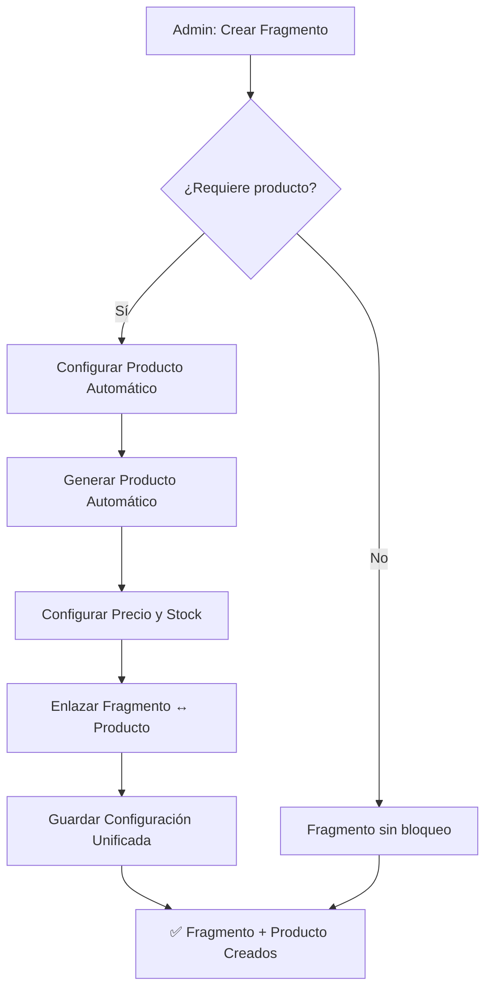
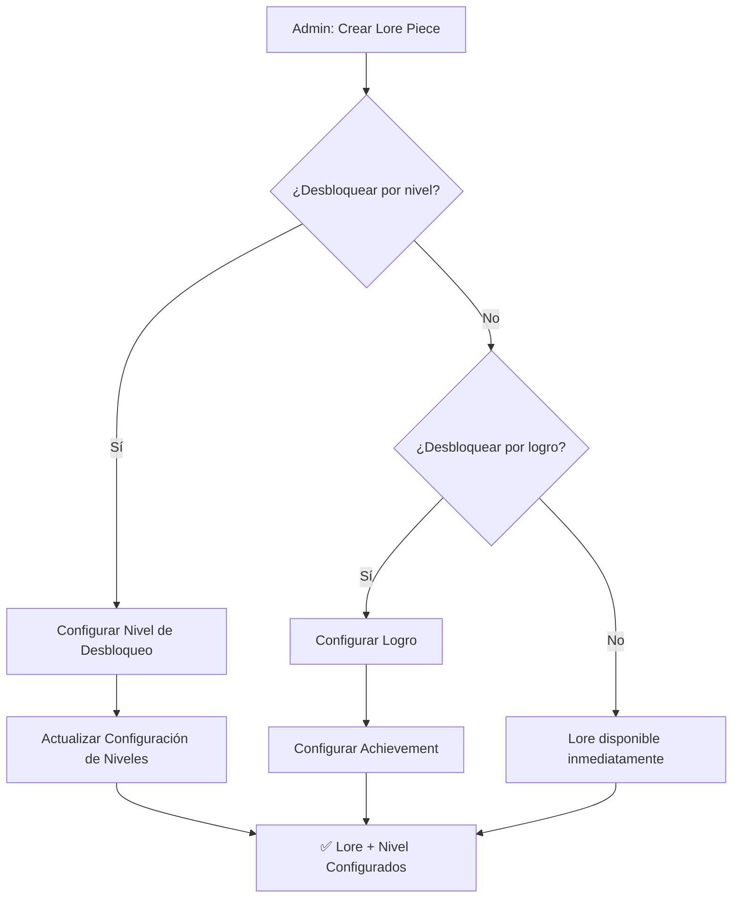

# 🎯 DISEÑO: PANEL WEB DE ADMINISTRACIÓN UNIFICADO

## 📋 RESUMEN EJECUTIVO

**Objetivo:** Crear un panel web unificado que elimine los pasos manuales actuales y automatice la configuración del ecosistema completo, integrando narrativa, tienda, lore y gamificación en una interfaz cohesiva.

**Problema Actual:** Para configurar un fragmento narrativo que se desbloquea con un producto, el proceso manual es propenso a errores y requiere:
1. Ir a la sección de tienda para crear un producto
2. Copiar el ID del nuevo producto
3. Ir a la sección de narrativa para crear o editar el fragmento
4. Pegar manualmente el ID del producto en la configuración del fragmento

**Solución:** Un panel web donde todo el flujo esté conectado con disposición automática.

---

## 🏗️ ARQUITECTURA DEL SISTEMA

### **Componentes Principales**

```
┌─────────────────────────────────────────────────────────────┐
│                    FRONTEND WEB (React)                     │
│  • Dashboard Principal                                      │
│  • Editor de Narrativa Unificado                           │
│  • Gestor de Tienda Integrado                               │
│  • Panel de Configuración de Lore                           │
│  • Monitor de Estadísticas                                  │
└─────────────────────────────────────────────────────────────┘
                              │
┌─────────────────────────────────────────────────────────────┐
│                    BACKEND API (FastAPI)                    │
│  • API de Narrativa Unificada                               │
│  • API de Tienda Automatizada                               │
│  • API de Gestión de Lore                                   │
│  • API de Configuración del Sistema                         │
└─────────────────────────────────────────────────────────────┘
                              │
┌─────────────────────────────────────────────────────────────┐
│                    SERVICIOS EXISTENTES                     │
│  • NarrativeService                                         │
│  • ShopService                                              │
│  • PointService                                             │
│  • LevelService                                             │
│  • AchievementService                                       │
└─────────────────────────────────────────────────────────────┘
                              │
┌─────────────────────────────────────────────────────────────┐
│                    BASE DE DATOS                            │
│  • story_fragments                                          │
│  • shop_items                                               │
│  • lore_pieces                                              │
│  • narrative_choices                                        │
│  • user_narrative_states                                    │
└─────────────────────────────────────────────────────────────┘
```

---

## 📊 MODELOS DE DATOS Y RELACIONES

### **Relaciones Actuales Identificadas**

```sql
-- RELACIONES EXISTENTES QUE SE MANTENDRÁN
StoryFragment (fragmentos narrativos)
├── id (PK)
├── key (unique)
├── text
├── min_besitos
├── required_role
├── unlocks_achievement_id (FK → achievements.id)
└── auto_next_fragment_key

ShopItem (productos de tienda)
├── id (PK)
├── name
├── price
├── is_vip_only
├── unlocks_lore_piece_id (FK → lore_pieces.id)
├── unlocks_fragment_key (FK → story_fragments.key)
└── unlock_requirements (JSON)

LorePiece (piezas de lore)
├── id (PK)
├── code_name (unique)
├── title
├── description
├── content
├── unlock_condition_type
└── unlock_condition_value

NarrativeChoice (decisiones)
├── id (PK)
├── source_fragment_id (FK → story_fragments.id)
├── destination_fragment_key
├── text
├── required_besitos
└── required_role
```

### **Nuevos Modelos Propuestos**

```python
import enum

class ContentTypeEnum(enum.Enum):
    FRAGMENT = "fragment"
    SHOP_ITEM = "shop_item"
    LORE_PIECE = "lore_piece"

class UnifiedContentConfig(Base):
    """Configuración unificada para contenido interconectado"""
    __tablename__ = "unified_content_configs"
    
    id = Column(Integer, primary_key=True)
    name = Column(String, nullable=False)  # Nombre descriptivo
    content_type = Column(Enum(ContentTypeEnum), nullable=False)
    
    # Referencias a entidades existentes
    fragment_key = Column(String, ForeignKey("story_fragments.key"), nullable=True)
    shop_item_id = Column(Integer, ForeignKey("shop_items.id"), nullable=True)
    lore_piece_id = Column(Integer, ForeignKey("lore_pieces.id"), nullable=True)
    
    # Configuración automática
    auto_create_shop_item = Column(Boolean, default=False)
    auto_create_lore_piece = Column(Boolean, default=False)
    
    # Metadatos de configuración
    config_data = Column(JSON, nullable=True)
    created_at = Column(DateTime, default=func.now())
    updated_at = Column(DateTime, default=func.now(), onupdate=func.now())
```

---

## 🎮 FLUJOS DE CONFIGURACIÓN AUTOMATIZADA

### **1. Flujo: Crear Fragmento Narrativo con Desbloqueo por Producto**



**Pasos Automatizados:**
1. Admin crea fragmento narrativo
2. Marca "requiere producto para desbloquear"
3. Sistema genera automáticamente:
   - Producto en tienda con nombre derivado del fragmento
   - Precio sugerido basado en complejidad del fragmento
   - Enlace bidireccional fragmento ↔ producto

### **2. Flujo: Configurar Lore Piece con Desbloqueo Automático**



---

## 🔧 SERVICIOS NUEVOS Y MODIFICACIONES

### **Servicios Nuevos**

#### **1. UnifiedContentService**
```python
class UnifiedContentService:
    """Servicio principal para gestión unificada de contenido"""
    
    async def create_fragment_with_shop_item(
        self, 
        fragment_data: dict, 
        shop_item_data: dict = None
    ) -> UnifiedContentConfig:
        """Crea fragmento narrativo con producto asociado automático"""
        
    async def create_lore_with_unlock_condition(
        self,
        lore_data: dict,
        unlock_type: str,  # "level", "achievement", "purchase"
        unlock_value: Any
    ) -> UnifiedContentConfig:
        """Crea lore piece con condición de desbloqueo automática"""
        
    async def get_interconnected_content(self, content_id: int) -> dict:
        """Obtiene contenido y todas sus conexiones"""
```

#### **2. WebAdminAPIService**
```python
class WebAdminAPIService:
    """Servicio para la API del panel web"""
    
    async def get_dashboard_data(self) -> dict:
        """Datos para el dashboard principal"""
        
    async def create_unified_content(self, content_data: dict) -> dict:
        """Endpoint principal para creación unificada"""
        
    async def validate_content_connections(self, config: dict) -> list:
        """Valida que todas las conexiones sean válidas"""
```

### **Servicios Modificados**

#### **1. NarrativeService**
- **Agregar:** Métodos para gestión automática de fragmentos
- **Modificar:** Integración con UnifiedContentService

#### **2. ShopService**  
- **Agregar:** Creación automática de productos
- **Modificar:** Enlace automático con fragmentos narrativos

#### **3. LevelService & AchievementService**
- **Agregar:** Configuración automática de desbloqueos

---

## 🎨 INTERFAZ DE USUARIO (UI/UX)

### **Pantallas Principales**

#### **1. Dashboard Principal**
```
┌─────────────────────────────────────────────────────────────┐
│                    DASHBOARD PRINCIPAL                      │
├─────────────────────────────────────────────────────────────┤
│  📊 Estadísticas Rápidas                                   │
│  • Fragmentos: 150 | Productos: 45 | Lore: 89              │
│  • Usuarios Activos: 1,234 | Ingresos: $2,450              │
│                                                             │
│  🚀 Acciones Rápidas                                       │
│  [➕ Nuevo Fragmento] [🛍️ Nuevo Producto] [📖 Nuevo Lore]  │
│  [⚙️ Configuración] [📈 Reportes]                          │
│                                                             │
│  🔄 Contenido Reciente                                     │
│  • Fragmento "Encuentro Secreto" (hace 2h)                 │
│  • Producto "Llave Antigua" (hace 4h)                      │
│  • Lore "Diario de Diana" (hace 1d)                        │
└─────────────────────────────────────────────────────────────┘
```

#### **2. Editor de Narrativa Unificado**
```
┌─────────────────────────────────────────────────────────────┐
│                EDITOR DE NARRATIVA UNIFICADO                │
├─────────────────────────────────────────────────────────────┤
│  📝 Contenido del Fragmento                                │
│  Título: [Encuentro en el Bosque_________]                 │
│  Texto: [________________________________________________] │
│  [________________________________________________________] │
│  [________________________________________________________] │
│                                                             │
│  🔒 Configuración de Desbloqueo                            │
│  [ ] Disponible inmediatamente                             │
│  [✓] Requiere producto de tienda                           │
│      → Producto: [Llave del Bosque_________] $[50___]      │
│  [ ] Requiere nivel mínimo: [3_____]                       │
│  [ ] Requiere logro: [Explorador_________]                 │
│                                                             │
│  🎯 Decisiones                                             │
│  1. [Seguir el camino_____] → [bosque_profundo___]         │
│  2. [Regresar al pueblo___] → [pueblo_central___]          │
│  [➕ Agregar Decisión]                                     │
│                                                             │
│  [💾 Guardar Configuración Completa]                       │
└─────────────────────────────────────────────────────────────┘
```

#### **3. Vista de Conexiones**
```
┌─────────────────────────────────────────────────────────────┐
│                    VISTA DE CONEXIONES                      │
├─────────────────────────────────────────────────────────────┤
│  Fragmento: "Encuentro en el Bosque"                        │
│                                                             │
│  🔗 Conexiones:                                             │
│  • 🛍️ Producto: "Llave del Bosque" ($50)                   │
│    └── Stock: Ilimitado | VIP: No                           │
│  • 📖 Lore: "Historia del Guardián"                         │
│    └── Desbloqueado por: Nivel 3                            │
│  • 🎯 Decisiones: 2                                        │
│    ├── "Seguir camino" → "Bosque Profundo"                 │
│    └── "Regresar" → "Pueblo Central"                       │
│                                                             │
│  👥 Estadísticas de Uso:                                   │
│  • Visitado por: 234 usuarios                              │
│  • Producto comprado: 45 veces                             │
│  • Lore desbloqueado: 89 usuarios                          │
└─────────────────────────────────────────────────────────────┘
```

---

## 🔄 API ENDPOINTS

### **Endpoints Principales**

```python
# Dashboard y Estadísticas
GET /api/dashboard
GET /api/statistics

# Gestión Unificada de Contenido
POST /api/unified-content
GET  /api/unified-content/{id}
PUT  /api/unified-content/{id}
DELETE /api/unified-content/{id}

# Contenido Específico
GET /api/fragments
GET /api/shop-items  
GET /api/lore-pieces

# Validación y Configuración
POST /api/validate-connections
GET /api/content-graph
```

### **Ejemplo de Payload para Creación Unificada**

```json
{
  "content_type": "fragment_with_shop_item",
  "fragment": {
    "key": "encuentro_bosque",
    "text": "Te encuentras en un bosque misterioso...",
    "character": "Lucien",
    "level": 2
  },
  "shop_item": {
    "auto_create": true,
    "name": "Llave del Bosque",
    "price": 50,
    "is_vip_only": false
  },
  "lore_piece": {
    "auto_create": false
  },
  "fragment_unlock_conditions": {
    "type": "level",
    "min_level": 3
  }
}
```

---

## 🚀 PLAN DE IMPLEMENTACIÓN

### **Fase 1: Arquitectura Base (Semanas 1-2)**
1. **Backend API**
   - Configurar FastAPI con autenticación
   - Crear modelos de datos unificados
   - Implementar servicios base

2. **Base de Datos**
   - Migraciones para nuevos modelos
   - Índices para consultas eficientes

### **Fase 2: Servicios de Integración (Semanas 3-4)**
1. **UnifiedContentService**
   - Lógica de creación automática
   - Validación de conexiones
   - Gestión de errores

2. **Integración con Servicios Existentes**
   - Modificar NarrativeService
   - Modificar ShopService
   - Actualizar middlewares

### **Fase 3: Frontend (Semanas 5-6)**
1. **React Application**
   - Dashboard principal
   - Editor unificado
   - Vista de conexiones

2. **UI/UX**
   - Diseño responsivo
   - Experiencia de usuario fluida
   - Validaciones en tiempo real

### **Fase 4: Testing y Despliegue (Semanas 7-8)**
1. **Testing**
   - Pruebas de integración
   - Pruebas de carga
   - Validación de flujos complejos

2. **Despliegue**
   - Configuración de producción
   - Monitoreo y logs
   - Documentación final

---

## 🔍 CONSIDERACIONES TÉCNICAS

### **Seguridad**
- Autenticación JWT
- Validación de permisos por rol
- Sanitización de inputs
- Rate limiting

### **Performance**
- Cache de consultas frecuentes
- Paginación para listas largas
- Indexación optimizada
- Lazy loading de relaciones

### **Mantenibilidad**
- Código modular y testeable
- Documentación completa
- Logging estructurado
- Monitoreo de métricas

### **Compatibilidad**
- Mantener compatibilidad con bot existente
- Migraciones reversibles
- Fallbacks para servicios legacy

---

## 📈 MÉTRICAS DE ÉXITO

### **Métricas Cuantitativas**
- ⏱️ **Tiempo de configuración**: Reducción del 70% en tiempo
- 🔄 **Pasos manuales**: Eliminación del 80% de pasos
- 🎯 **Errores de configuración**: Reducción del 90%
- 📊 **Uso del sistema**: 95% de admins usando panel web

### **Métricas Cualitativas**
- ✅ **Experiencia de usuario**: Flujo intuitivo y cohesivo
- 🔗 **Integridad de datos**: Conexiones validadas automáticamente
- 🚀 **Productividad**: Configuración más rápida y confiable
- 📖 **Documentación**: Autodocumentación del ecosistema

---

## 🎯 CONCLUSIÓN

Este panel web unificado transformará la experiencia de administración del ecosistema, eliminando la complejidad actual y proporcionando una interfaz cohesiva donde la narrativa, tienda, lore y gamificación trabajen en perfecta sincronía.

La **disposición automática** y las **conexiones validadas** garantizarán que el contenido esté siempre correctamente configurado, mientras que la **vista unificada** proporcionará visibilidad completa del ecosistema interconectado.